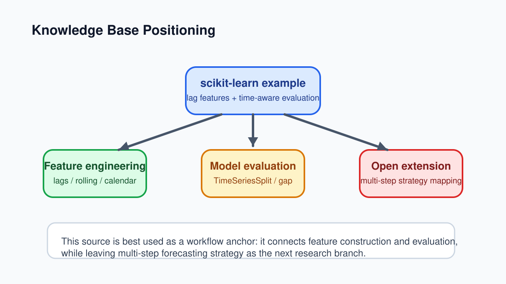
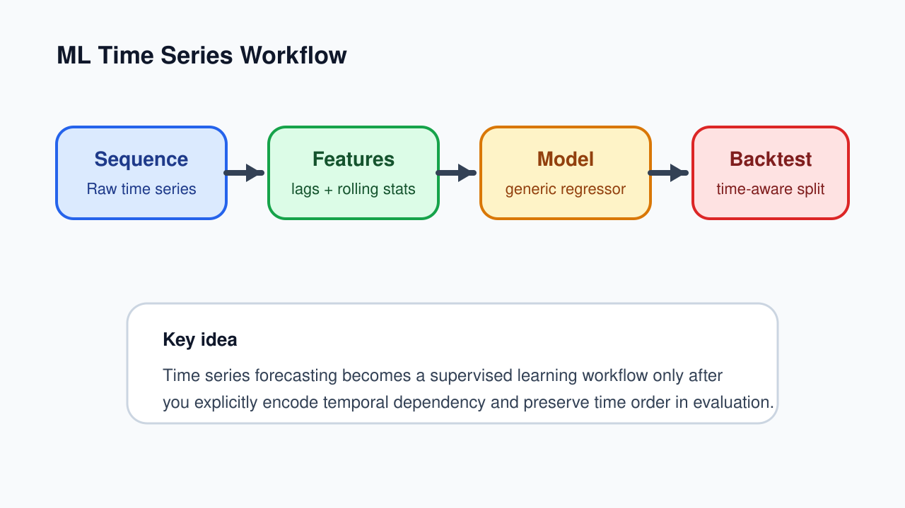
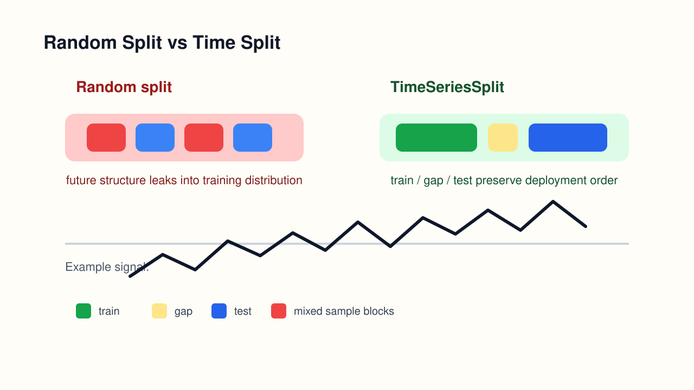
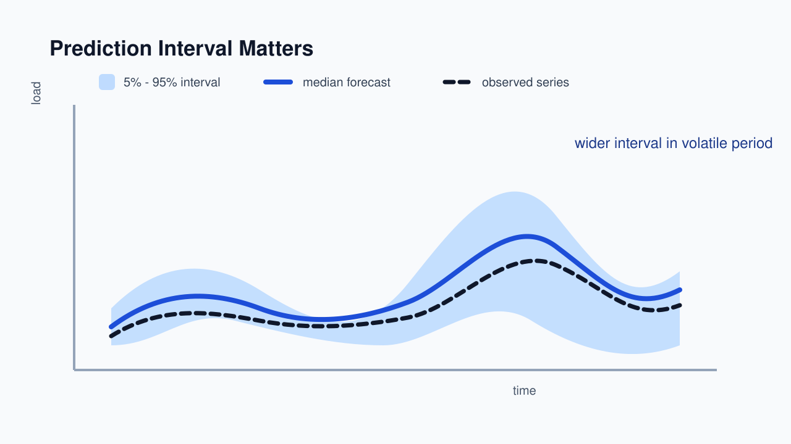

<!-- _class: lead -->

# scikit-learn 机器学习时间序列预测实践解读

研究型演示稿：把一个官方示例放回知识库结构里看

- 源结果页：[`2026-04-05-scikit-learn-机器学习时间序列预测实践解读.md`](../answers/2026-04-05-scikit-learn-机器学习时间序列预测实践解读.md)
- 对照版本：[`2026-04-05-scikit-learn-机器学习时间序列预测实践解读-演示稿.md`](./2026-04-05-scikit-learn-机器学习时间序列预测实践解读-演示稿.md)
- 目的：保留方法链路、知识库定位与后续研究问题

---

## 研究问题

- 这篇 scikit-learn 官方示例，真正值得沉淀的是什么？
- 它在当前知识库里处于哪一层？
- 它补上了哪些方法规范？
- 它又留下了哪些还没展开的问题？

这份研究型 slide 不是复述 API，而是回答：

**为什么这页来源值得长期留在库里。**

---

## 来源定位

<!-- _class: small -->

- 来源卡：[[2026-04-05-scikit-learn-滞后特征预测示例]]
- 来源类型：官方示例页，不是论文，不是业务复盘
- 最适合的用途：**方法规范来源**
- 最不适合的用途：业务效果上限证明

它提供的不是“最强模型案例”，而是一个高度标准化的最小工作流：

1. 滞后特征构造
2. 通用回归模型训练
3. 时间保序评估
4. 预测区间表达

---

## 它在知识库中的位置

- 它直接连接 [[预测特征工程]]
- 它直接连接 [[预测模型评估]]
- 它是 [[机器学习时间序列预测]] 的典型落地案例
- 它还没有真正展开 [[机器学习时间序列多步预测策略]]

研究角度看，这篇材料的价值是：

**把两个概念页之间的空白桥接起来。**

---

## 方法链路：从序列到监督学习

- 原始序列本身不能直接喂给普通表格回归器
- 需要先做滞后项、滚动统计和时间索引特征
- 这样才把“时间序列预测”改写成“监督学习回归”

这里最值得保留的不是模型名，而是这条重写链路：

**sequence → features → regressor → time-aware backtest**

---

## 与特征工程概念页的对应关系

- [[预测特征工程]] 强调：
  - 时间特征
  - 滞后特征
  - 统计特征
- 这篇示例恰好给了一个最小可运行实例

可以把它理解成：

- 概念页负责说“有哪些特征类型”
- 这篇来源负责说“这些特征如何进入一个真实的 ML 预测流程”

因此它不是特征工程总论，而是 **特征工程落地样例**。

---

## 与评估概念页的对应关系

- [[预测模型评估]] 强调保序切分和回测
- 这篇示例把问题具体化成：
  - 随机切分会高估效果
  - `TimeSeriesSplit` 更接近真实部署
  - `gap`、训练窗口、测试窗口都是设计变量

对研究来说，最关键的证据不是某个绝对分数，而是：

**随机切分与时间切分的误差差异，直接暴露了时间泄漏。**

---

## 这篇来源覆盖了什么，没覆盖什么

### 已覆盖

- 单步预测
- 表格化特征组织
- 保序评估
- 分位数预测

### 未覆盖

- 多步直接预测
- 多步递归预测
- 多变量输入组织
- 工程化训练预测闭环

所以它适合作为：

**机器学习时序预测的规范入门页，而不是完整工程总论。**

---

## 区间预测为什么值得单独保留

- 这篇示例没有停在点预测
- 而是继续走到了 `loss="quantile"`
- 这让结果从“一个值”升级成“一个分布区间”

研究角度看，这一点很关键，因为它把“预测是否准确”扩展成：

- 预测值是多少
- 不确定性有多大
- 波动时段是否更难预测

---

## 它为什么还没有闭环

<!-- _class: compact -->

这篇来源补齐了“单步监督学习预测”的规范做法，但还没有把自己接到更大的方法体系里：

1. 单步监督学习预测如何映射到多步预测？
2. 递归、直接、混合策略分别怎样复用这套特征与评估框架？
3. `tsproj_ml` 这类工程仓库里，哪些环节已经落实，哪些还没有？

所以它最自然的下一跳是：

- [[2024-09-10-机器学习预测方式]]
- [[机器学习时间序列多步预测策略]]
- [[2026-04-05-tsproj-ml-训练测试预测闭环]]

---

## 作为研究材料，后续最值得追问什么

1. 单步表格化预测与多步策略的映射关系
2. `gap` 在不同业务时滞下应该怎样设
3. pinball loss 与区间宽度应如何联合解读
4. 官方示例能否迁移到 `tsproj_ml` 的训练与评估流程

如果继续深挖，这页最适合派生出两类后续输出：

- 方法对照页
- 工程检查清单

---

## 结论

- 这篇示例最重要的价值，不是模型演示
- 而是把 **特征工程** 和 **保序评估** 用一个最小案例接起来
- 它是当前知识库里一张很好的“方法规范来源卡”
- 它的下一步，不是继续堆模型，而是接上多步策略与工程闭环
