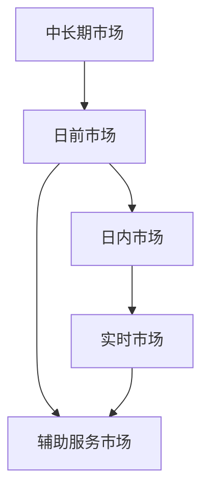

# 电力市场交易 / 电力交易调研文档（V5 完整整合增强版）

> 适用对象：算法工程师、业务分析人员、产品经理、售电/交易从业者、能源数字化研究者  
> 文档目标：在同一份文档中，同时提供 **业务视角、市场机制视角、算法建模视角、工程实现视角** 的完整解释。  
> 文档特点：**尽量详细、结构化强、公式规范、公式后均附自然语言解释与符号说明、包含工程落地建议**。

---

# 目录

- [1. 为什么要理解电力市场交易](#1-为什么要理解电力市场交易)
- [2. 电力市场交易的本质：从业务到算法的统一理解](#2-电力市场交易的本质从业务到算法的统一理解)
- [3. 电力市场的基本结构与主要参与者](#3-电力市场的基本结构与主要参与者)
- [4. 电力市场中的核心交易品种](#4-电力市场中的核心交易品种)
- [5. 电价是如何形成的](#5-电价是如何形成的)
- [6. 电力市场出清背后的核心数学问题](#6-电力市场出清背后的核心数学问题)
- [7. 算法工程师需要掌握的算法体系](#7-算法工程师需要掌握的算法体系)
- [8. 新能源参与市场交易的核心难点](#8-新能源参与市场交易的核心难点)
- [9. 风电建模：从资源到市场申报](#9-风电建模从资源到市场申报)
- [10. 光伏建模：从辐照到交易收益](#10-光伏建模从辐照到交易收益)
- [11. 储能建模：时序耦合资产的核心表达](#11-储能建模时序耦合资产的核心表达)
- [12. 风光储联合建模与联合交易](#12-风光储联合建模与联合交易)
- [13. 风险建模：随机优化、鲁棒优化、CVaR](#13-风险建模随机优化鲁棒优化cvar)
- [14. 多市场联合优化：能量 + 备用 + 调频](#14-多市场联合优化能量--备用--调频)
- [15. 节点电价、拥塞与储能套利](#15-节点电价拥塞与储能套利)
- [16. 大规模优化与分解算法](#16-大规模优化与分解算法)
- [17. 滚动优化与 MPC：从日计划到实时执行](#17-滚动优化与-mpc从日计划到实时执行)
- [18. 工程实现：数据、系统架构、代码框架](#18-工程实现数据系统架构代码框架)
- [19. Python / Pyomo / Gurobi 建模骨架](#19-python--pyomogurobi-建模骨架)
- [20. 面向非算法工程师的理解总结](#20-面向非算法工程师的理解总结)
- [21. 面向算法工程师的学习与落地路线](#21-面向算法工程师的学习与落地路线)
- [22. 参考文献](#22-参考文献)
- [23. 工程落地终极版（系统架构 + Two-stage 实现 + 可运行代码）](#23-工程落地终极版系统架构--two-stage-实现--可运行代码)

---

# 1. 为什么要理解电力市场交易

如果你来自能源行业、售电公司、发电企业、储能公司、虚拟电厂平台，或者你本身就是算法工程师，那么理解电力市场交易并不是一件“可选项”，而是一个非常核心的能力。

原因很简单：

1. **电力系统正在从“计划”走向“计划 + 市场”并存**。  
   过去电力生产和消费更多通过行政计划来安排，而随着现货市场、辅助服务市场、绿电交易、容量机制逐步推进，越来越多的电力行为要通过价格信号和市场规则来决定。

2. **新能源渗透率提升后，不确定性成为主旋律**。  
   风电和光伏本身并不稳定，预测误差、偏差考核、备用需求、储能协同调度等，都使电力交易从一个“简单结算问题”变成一个“预测 + 优化 + 控制 + 风险管理”的系统工程问题。

3. **电力市场直接决定资产价值**。  
   同样一套储能系统，接在哪个节点、参加哪个市场、采用什么调度策略，收益可能完全不同。  
   同样一座风电场，是否配储、如何申报、如何规避偏差，也会显著影响实际回报。

因此，理解电力市场交易，本质上是在理解：

- 电是如何被定价的；
- 灵活性为什么值钱；
- 不确定性如何被转化为成本；
- 算法如何从中创造价值。

---

# 2. 电力市场交易的本质：从业务到算法的统一理解

## 2.1 面向非算法读者的通俗解释

可以先用一句不那么技术化的话来概括：

> 电力市场交易，就是在保证电网安全运行的前提下，决定“谁来发电、什么时候发、发多少、在哪里发、卖给谁、按什么价格结算”的一整套规则与执行系统。

对于普通商品，比如钢铁、水泥、粮食，商品可以先生产出来，再运输、再存储、再卖出。  
但电力不一样：

- 电几乎必须实时生产、实时消费；
- 电通过电网传输，受网络约束；
- 电网必须始终保持平衡，否则会影响频率、电压甚至系统安全；
- 不同位置、不同时间的电价值不同。

所以电力市场不是一个简单的“交易平台”，而更像一个：

> 带有强物理约束、强时序约束和强安全约束的实时资源优化系统。

## 2.2 面向算法工程师的技术抽象

对算法工程师而言，可以把电力交易系统统一抽象为如下闭环：

$$
\text{预测} \rightarrow \text{场景生成} \rightarrow \text{优化决策} \rightarrow \text{实时执行} \rightarrow \text{结算反馈} \rightarrow \text{模型修正}
$$

### 自然语言解释

这个公式不是在表达某个数学等式，而是在表达电力交易系统的工作流程：

1. 先做预测，例如负荷预测、风光出力预测、电价预测；
2. 再把不确定性转成场景或概率分布；
3. 再求解最优申报和调度策略；
4. 到实时阶段根据实际情况执行；
5. 事后根据市场规则结算收益或成本；
6. 再用结算结果和执行偏差去修正下一轮模型。

这意味着，电力交易不是一次性的优化问题，而是一个**持续滚动、持续反馈、持续修正**的系统。

---

# 3. 电力市场的基本结构与主要参与者

## 3.1 市场分层



### 解释

这张图表示一个典型电力市场的时间层次结构：

- **中长期市场**：提前锁定部分电量和价格，用来降低风险；
- **日前市场**：在运行日前一天形成次日的基础发电计划和价格；
- **日内市场**：在更接近运行时刻时，对计划进行修正；
- **实时市场**：在真正运行时，根据实际情况纠偏；
- **辅助服务市场**：采购系统稳定运行所需的备用、调频等服务。

## 3.2 主要参与者

典型参与者包括：

- 发电企业（火电、水电、风电、光伏、核电等）
- 储能运营商
- 售电公司
- 大工业用户
- 电网公司 / 调度机构
- 聚合商 / 虚拟电厂运营商
- 市场运营机构（ISO / RTO / 交易中心）

### 面向非算法读者的解释

可以把电力市场想象成一个复杂版的“供需协调系统”：

- 发电企业负责供给；
- 用户和售电公司代表需求；
- 调度机构负责确保系统安全；
- 市场运营机构负责出清和结算；
- 储能和虚拟电厂提供灵活性；
- 价格机制则告诉大家：当前什么资源最值钱。

---

# 4. 电力市场中的核心交易品种

电力市场交易不只是“买卖电量”。从业务角度，市场上真正交易的对象是多维的。

## 4.1 电能量（Energy）

这是最直观的交易对象，单位通常是 MWh。  
它表示某个时段交付多少电能。

## 4.2 容量（Capacity）

容量市场或容量补偿，强调的不是“你现在发了多少电”，而是“你在需要的时候有没有能力发得出来”。

## 4.3 辅助服务（Ancillary Services）

包括：

- 调频
- 旋转备用
- 非旋转备用
- 调压 / 无功支持
- 黑启动

这些产品的价值在于，它们帮助系统应对负荷波动、风光波动和故障扰动。

## 4.4 绿色属性

随着新能源交易发展，很多地区的电力交易还包含：

- 绿证
- 绿电属性
- 可再生能源权益
- 碳减排收益

## 4.5 灵活性

这是未来非常关键的一类价值。  
比如储能、可中断负荷、空调聚合、电动汽车充放电能力，本质上都在提供“灵活性”。

### 面向非算法读者的解释

如果把电力系统类比成一个城市交通系统，那么：

- 电能量像是“车辆运输量”；
- 容量像是“道路在高峰时是否足够宽”；
- 辅助服务像是“交警、信号灯、应急通道”；
- 灵活性像是“可逆车道、弹性交通方案”。

所以市场不是只在买电，而是在买“安全、灵活、可交付的电”。

---

# 5. 电价是如何形成的

## 5.1 最基础的边际出清思想

最简单的市场出清逻辑是：

- 供给侧按报价从低到高排序；
- 需求侧按支付意愿从高到低排序；
- 供需曲线交点决定成交电量和边际价格。

这是最经典的“边际定价”思想。

但在真实电力市场中，电价形成比这复杂得多，因为它必须同时考虑：

- 输电网络约束
- 机组爬坡约束
- 启停约束
- 备用约束
- 损耗
- 安全校核

因此，真实电价通常来自带约束优化模型的结果，而不是简单供需曲线交点。

## 5.2 节点电价（LMP）

带网络约束的市场中，一个非常核心的价格概念是节点电价（LMP, Locational Marginal Price）。

$$
\mathrm{LMP}_i = \lambda^{\mathrm{energy}} + \lambda_i^{\mathrm{cong}} + \lambda_i^{\mathrm{loss}}
$$

### 自然语言解释

这个公式表示：节点 $i$ 的电价通常由三部分组成：

1. **能量部分**：系统整体再多供 1 单位电能的边际成本；
2. **拥塞部分**：因为输电线路容量有限，导致某些节点供电更困难，价格上升；
3. **损耗部分**：电在传输过程中会损耗，因此不同位置的边际供电成本不同。

换句话说，LMP 反映的是：

> 在某个节点上，如果现在额外增加 1 MW 用电，系统为了满足它，成本会增加多少。

### 符号说明

| 符号 | 含义 |
|---|---|
| $\mathrm{LMP}_i$ | 节点 $i$ 的节点电价 |
| $\lambda^{\mathrm{energy}}$ | 系统统一的能量边际成本 |
| $\lambda_i^{\mathrm{cong}}$ | 节点 $i$ 的拥塞边际成本 |
| $\lambda_i^{\mathrm{loss}}$ | 节点 $i$ 的损耗边际成本 |

### 为什么这对储能很重要

因为储能赚的钱，很多时候并不是简单的“低买高卖”，而是：

- 在**高价节点**放电；
- 在**低价节点**充电；
- 利用拥塞带来的价差套利；
- 在需要灵活性的节点提供辅助服务。

因此节点电价预测和节点价值评估，是储能商业化的关键能力之一。

---

# 6. 电力市场出清背后的核心数学问题

## 6.1 经济调度（Economic Dispatch, ED）

经济调度是最基础的调度问题，其目标是：

> 在满足系统负荷的前提下，让总发电成本最小。

基本形式为：

$$
\min \sum_{g \in G} C_g(P_g)
$$

约束为：

$$
\sum_{g \in G} P_g = D
$$

$$
P_g^{\min} \le P_g \le P_g^{\max}, \quad \forall g \in G
$$

### 自然语言解释

第一个公式表示：把所有机组的发电成本加起来，希望总成本最低。  
第二个公式表示：所有机组总共发出来的电，必须正好等于系统负荷。  
第三个公式表示：每台机组都不能低于最小出力，也不能超过最大出力。

也就是说，这个模型解决的是：

> 在系统需要这么多电的情况下，应该让哪些机组多发一点、哪些机组少发一点，才能最便宜。

### 符号说明

| 符号 | 含义 |
|---|---|
| $G$ | 发电机组集合 |
| $g$ | 某一台发电机组索引 |
| $P_g$ | 机组 $g$ 的出力 |
| $C_g(P_g)$ | 机组 $g$ 的成本函数 |
| $D$ | 系统总负荷 |
| $P_g^{\min}$ | 机组 $g$ 的最小出力 |
| $P_g^{\max}$ | 机组 $g$ 的最大出力 |

## 6.2 机组组合（Unit Commitment, UC）

经济调度默认机组已经开着，但现实中还存在一个更重要的问题：

> 哪些机组应该开机，哪些机组应该停机？

这就是机组组合问题。其典型形式为：

$$
\min \sum_{t \in T} \sum_{g \in G}
\left[
C_g(P_{g,t}) + C_g^{\mathrm{su}} v_{g,t} + C_g^{\mathrm{sd}} w_{g,t}
\right]
$$

并满足：

$$
u_{g,t} P_g^{\min} \le P_{g,t} \le u_{g,t} P_g^{\max}, \quad \forall g,t
$$

$$
u_{g,t} - u_{g,t-1} = v_{g,t} - w_{g,t}, \quad \forall g,t
$$

### 自然语言解释

这个模型中不仅要决定“发多少”，还要决定“开不开机”。

- 目标函数里第一项是发电成本；
- 第二项是启机成本；
- 第三项是停机成本。

第二个公式表示：

- 如果机组没开机，那么出力必须是 0；
- 如果机组开机，那么出力必须在最小出力和最大出力之间。

第三个公式表示启停逻辑：

- 当前时刻开机状态减去上一时刻开机状态，等于“新启机”减去“新停机”。

也就是说，这个模型把“是否开机”和“发多少电”联动起来了。

### 符号说明

| 符号 | 含义 |
|---|---|
| $T$ | 时间集合 |
| $t$ | 时间索引 |
| $u_{g,t}$ | 机组 $g$ 在时刻 $t$ 是否开机，二进制变量 |
| $v_{g,t}$ | 机组 $g$ 在时刻 $t$ 是否启机，二进制变量 |
| $w_{g,t}$ | 机组 $g$ 在时刻 $t$ 是否停机，二进制变量 |
| $P_{g,t}$ | 机组 $g$ 在时刻 $t$ 的出力 |
| $C_g^{\mathrm{su}}$ | 启机成本 |
| $C_g^{\mathrm{sd}}$ | 停机成本 |

## 6.3 安全约束经济调度（SCED）

在实时市场中，系统不仅要满足总负荷，还要满足网络和安全约束，因此常见模型是安全约束经济调度：

$$
\min \sum_{t \in T} \sum_{g \in G} C_g(P_{g,t}) + \sum_{t \in T} \Pi_t^{\mathrm{pen}}
$$

其中，$\Pi_t^{\mathrm{pen}}$ 表示违反某些柔性约束时的惩罚项，例如负荷损失惩罚、备用不足惩罚等。

### 自然语言解释

SCED 比普通经济调度更贴近真实运行。  
它在“总成本最小”之外，还会考虑：

- 某条线路会不会超载；
- 某些机组爬坡太快会不会不现实；
- 备用够不够；
- 是否存在需要惩罚的违约情况。

从业务角度看，SCED 是：

> 在保证系统安全的前提下，做一个最便宜的实时纠偏方案。

## 6.4 最优潮流（OPF）

如果要把电网网络结构写进模型，就进入最优潮流问题。市场中常用的是 DC-OPF 的线性近似。一个简化潮流关系可写为：

$$
F_{l,t} = \sum_{i \in N} \mathrm{PTDF}_{l,i} \cdot P_{i,t}^{\mathrm{inj}}
$$

并要求：

$$
- F_l^{\max} \le F_{l,t} \le F_l^{\max}, \quad \forall l,t
$$

### 自然语言解释

这个公式表示：线路 $l$ 上的潮流，等于各个节点注入功率通过 PTDF 系数映射后的结果。

直观理解：

- 某个节点多发一点电，可能会让某几条线路更拥堵；
- 另一个节点多发一点电，对同一条线路影响可能更小；
- 这就是位置价值和节点电价出现的根源。

### 符号说明

| 符号 | 含义 |
|---|---|
| $N$ | 节点集合 |
| $l$ | 线路索引 |
| $F_{l,t}$ | 时刻 $t$ 线路 $l$ 上的潮流 |
| $\mathrm{PTDF}_{l,i}$ | 节点 $i$ 注入对线路 $l$ 潮流影响的分布因子 |
| $P_{i,t}^{\mathrm{inj}}$ | 节点 $i$ 在时刻 $t$ 的净注入功率 |
| $F_l^{\max}$ | 线路 $l$ 的潮流上限 |

---

# 7. 算法工程师需要掌握的算法体系

对于算法工程师，电力交易并不是单一算法问题，而是多个算法模块协同工作的问题。可以按四层来理解。

## 7.1 预测层

预测层回答的是：

- 明天系统负荷大概是多少？
- 风电和光伏会发多少？
- 电价会怎么波动？
- 哪些节点可能拥塞？

常见预测对象：

- 系统负荷预测
- 用户负荷预测
- 风电功率预测
- 光伏功率预测
- 日前电价预测
- 实时电价预测
- 节点电价预测
- 拥塞预测

常见方法：

- 统计方法：ARIMA、SARIMA、状态空间模型、指数平滑、GARCH
- 机器学习：LightGBM、XGBoost、CatBoost、随机森林、SVR
- 深度学习：LSTM、GRU、TCN、Transformer、Informer、PatchTST、iTransformer
- 概率预测：分位数回归、概率分布预测、Copula、场景生成

## 7.2 优化层

优化层回答的是：

- 应该报多少电？
- 储能该怎么充放？
- 风光储联合后怎样收益最高？
- 在有风险的情况下，策略应该多保守？

典型优化方法：

- LP / QP
- MILP / MIQP
- 随机规划
- 鲁棒优化
- 机会约束优化
- 分布鲁棒优化

## 7.3 控制层

控制层回答的是：

- 实际偏差出现后怎么办？
- 储能要如何实时修正？
- 日前计划如何滚动更新？

典型方法：

- 滚动优化
- 模型预测控制（MPC）
- 在线优化
- 反馈控制

## 7.4 博弈层

博弈层关注：

- 如果我会影响市场价格，该怎么报？
- 多个主体竞争时，策略如何演化？

典型方法：

- 双层优化
- MPEC
- Stackelberg 博弈
- Agent-based Simulation
- 多智能体强化学习

---

# 8. 新能源参与市场交易的核心难点

## 8.1 不确定性强

风电和光伏最核心的问题，不是均值，而是不确定性。

业务上，这意味着：

- 你昨天申报 100 MW，今天可能只发出 70 MW；
- 也可能申报 100 MW，结果突然发出 120 MW；
- 这两种偏差都会触发平衡成本、偏差考核或实时修正。

算法上，这意味着：

- 点预测不够；
- 必须做区间预测、概率预测、场景生成；
- 必须把风险写入优化模型。

## 8.2 边际成本低但系统成本不一定低

风光边际发电成本低，并不等于整个系统成本低。  
因为系统为了消纳新能源，还要额外承担：

- 调峰成本
- 备用成本
- 网络扩容成本
- 频率稳定成本
- 弃风弃光损失
- 平衡成本

这意味着新能源的市场价值不只是“发多少电”，而是：

> 在不确定性存在时，它对系统造成的额外平衡压力有多大，以及它能否通过储能和更优策略降低这种压力。

## 8.3 收益结构更加复杂

新能源收益往往由多个部分组成：

- 中长期合同收入
- 日前电量收入
- 实时平衡收入或偏差惩罚
- 辅助服务收入
- 绿证 / 碳收益
- 配储协同收益

所以新能源项目不能只做单一能量市场优化，而应该做多收益流联合建模。

---

# 9. 风电建模：从资源到市场申报

风电建模建议拆成四层：

1. 资源层：风速、风向、NWP
2. 物理转换层：风速到功率曲线
3. 不确定性层：误差分布与场景
4. 市场层：申报与收益优化

## 9.1 风速到功率建模

一个简化功率模型是：

$$
P_t^{\mathrm{wind}} = f(v_t)
$$

### 自然语言解释

这个公式表示：风电功率由风速决定。  
但真实场景下，这个函数并不是简单线性关系，而是风机功率曲线：

- 风速太低，风机不发电；
- 风速升高时，功率快速上升；
- 达到额定风速后，功率接近额定上限；
- 风速过高时，出于安全保护可能停机。

### 符号说明

| 符号 | 含义 |
|---|---|
| $P_t^{\mathrm{wind}}$ | 时刻 $t$ 的风电功率 |
| $v_t$ | 时刻 $t$ 的风速 |
| $f(\cdot)$ | 风机功率曲线或其近似函数 |

更完整地，可以写成：

$$
P_t^{\mathrm{wind}} = f(v_t, \rho_t, \theta_t, a_t, c_t)
$$

### 自然语言解释

这个更完整的式子表示，风电功率不仅取决于风速，还取决于：

- 空气密度 $\rho_t$；
- 风向等几何信息 $\theta_t$；
- 风机可利用率 $a_t$；
- 限电或调度约束 $c_t$。

也就是说，真实风电建模不能只看风速，而要考虑设备状态和电网调度环境。

## 9.2 风电概率建模

为了表达不确定性，常用分位数预测：

$$
\hat P_{t}^{(\tau)} , \quad \tau \in (0,1)
$$

例如：

- $\tau = 0.1$ 表示 10% 分位预测；
- $\tau = 0.5$ 表示中位数预测；
- $\tau = 0.9$ 表示 90% 分位预测。

### 自然语言解释

分位数预测不是只告诉你“明天大概发多少”，而是告诉你：

- 在偏保守的情况下可能发多少；
- 在典型情况下可能发多少；
- 在偏乐观情况下可能发多少。

这对市场申报很重要，因为申报过多会有偏差风险，申报过少又会损失收益机会。

## 9.3 风电市场收益模型

设日前申报功率为 $q_t$，实际风电出力为 $w_t$，则简化收益可写为：

$$
R = \sum_{t \in T} \pi_t^{\mathrm{DA}} q_t
- \sum_{t \in T} \pi_t^{+}(q_t - w_t)^{+}
- \sum_{t \in T} \pi_t^{-}(w_t - q_t)^{+}
$$

其中：

$$
(x)^{+} = \max(x, 0)
$$

### 自然语言解释

第一项表示：你按日前电价把申报电量卖出去所得到的收入。  
第二项表示：如果你申报得比实际发得多，也就是“报多了”，那么会承担向上偏差成本。  
第三项表示：如果你实际发得比申报更多，也就是“报少了”，也可能带来另一类偏差结算成本或机会损失。

所以这个模型的核心不是“预测尽量准”这么简单，而是：

> 在预测误差不可避免的前提下，找到收益和风险之间最优的申报策略。

### 符号说明

| 符号 | 含义 |
|---|---|
| $R$ | 总收益 |
| $q_t$ | 时刻 $t$ 的日前申报功率 |
| $w_t$ | 时刻 $t$ 的实际风电出力 |
| $\pi_t^{\mathrm{DA}}$ | 日前市场电价 |
| $\pi_t^{+}$ | 上偏差惩罚或平衡结算价格 |
| $\pi_t^{-}$ | 下偏差惩罚或平衡结算价格 |

---

# 10. 光伏建模：从辐照到交易收益

光伏建模和风电类似，但光伏更强依赖辐照度和天气状态，日内周期特征更明显。

## 10.1 光伏功率模型

简化表达：

$$
P_t^{\mathrm{pv}} = \eta_t A I_t
$$

### 自然语言解释

这个公式表示：

- 太阳辐照越强，光伏出力通常越大；
- 组件面积越大，可接收的太阳能越多；
- 转换效率越高，转化成电能的比例越高。

这是一个最基础的物理近似模型。

### 符号说明

| 符号 | 含义 |
|---|---|
| $P_t^{\mathrm{pv}}$ | 时刻 $t$ 的光伏输出功率 |
| $\eta_t$ | 时刻 $t$ 的转换效率 |
| $A$ | 光伏组件等效面积 |
| $I_t$ | 时刻 $t$ 的有效辐照度 |

更完整的工程表达可写为：

$$
P_t^{\mathrm{pv}} = f(I_t, T_t, \alpha_t, s_t, a_t, c_t)
$$

### 自然语言解释

这个公式表示真实光伏出力还会受以下因素影响：

- 温度 $T_t$：温度过高会影响效率；
- 组件角度 $\alpha_t$：倾角、跟踪角会影响受光效果；
- 污损状态 $s_t$：灰尘、遮挡等会减少有效辐照；
- 可利用率 $a_t$：设备是否正常可用；
- 限电约束 $c_t$：是否被调度限制出力。

## 10.2 光伏误差建模

光伏误差很大程度上受天气状态驱动，因此常见方法是：

- 天气分类 + 分类内建模；
- 分位数预测；
- 场景生成；
- 云团短临预测。

### 面向非算法读者的解释

光伏出力在晴天时通常很稳定，但在多云天气下会剧烈波动。  
这意味着，光伏交易建模不仅要关心“平均能发多少”，更要关心“天气突变时会不会造成大偏差”。

## 10.3 光伏市场收益

光伏的收益模型与风电类似，也依赖：

- 日前申报量；
- 实际出力；
- 偏差考核；
- 是否有储能协同。

因此，单独做一个光伏功率预测模型还不够，真正有价值的是：

> 把光伏预测模型和市场收益模型直接连接起来。

---

# 11. 储能建模：时序耦合资产的核心表达

储能是电力交易里最值得算法工程师深入的对象之一，因为它天然具有强时序耦合。

## 11.1 SOC 状态方程

储能最核心的状态变量是 SOC（State of Charge，荷电状态）：

$$
SOC_t = SOC_{t-1} + \eta^{\mathrm{ch}} P_t^{\mathrm{ch}} \Delta t - \frac{1}{\eta^{\mathrm{dis}}} P_t^{\mathrm{dis}} \Delta t
$$

### 自然语言解释

这个公式表示：

- 当前时刻的储能电量 = 上一时刻的储能电量  
  + 充电增加的电量  
  - 放电减少的电量。

其中，充电和放电都有效率损失：

- 充电时，并不是充进去多少电都能存进去；
- 放电时，也不是电池里减少多少就都能输出到电网。

这就是为什么公式中会有充电效率和放电效率。

### 符号说明

| 符号 | 含义 |
|---|---|
| $SOC_t$ | 时刻 $t$ 的储能荷电状态 |
| $SOC_{t-1}$ | 时刻 $t-1$ 的储能荷电状态 |
| $P_t^{\mathrm{ch}}$ | 时刻 $t$ 的充电功率 |
| $P_t^{\mathrm{dis}}$ | 时刻 $t$ 的放电功率 |
| $\eta^{\mathrm{ch}}$ | 充电效率 |
| $\eta^{\mathrm{dis}}$ | 放电效率 |
| $\Delta t$ | 时间步长 |

储能还需要上下界约束：

$$
SOC^{\min} \le SOC_t \le SOC^{\max}
$$

### 自然语言解释

这个约束表示：

- 电池不能被充得过满；
- 也不能被放得过空；
- 否则会伤害寿命或违反安全约束。

## 11.2 充放电功率约束

$$
0 \le P_t^{\mathrm{ch}} \le P^{\mathrm{ch,max}}
$$

$$
0 \le P_t^{\mathrm{dis}} \le P^{\mathrm{dis,max}}
$$

### 自然语言解释

这两个约束表示：

- 充电功率不能为负，也不能超过最大充电能力；
- 放电功率不能为负，也不能超过最大放电能力。

## 11.3 充放电互斥约束

常见的二进制表达为：

$$
 u_t^{\mathrm{ch}} + u_t^{\mathrm{dis}} \le 1
$$

$$
P_t^{\mathrm{ch}} \le u_t^{\mathrm{ch}} P^{\mathrm{ch,max}}
$$

$$
P_t^{\mathrm{dis}} \le u_t^{\mathrm{dis}} P^{\mathrm{dis,max}}
$$

### 自然语言解释

这组约束表示：

- 储能在同一个时刻不能同时大规模充电和放电；
- 如果当前被标记为“充电状态”，那么放电功率必须为 0；
- 如果当前被标记为“放电状态”，那么充电功率必须为 0。

### 符号说明

| 符号 | 含义 |
|---|---|
| $u_t^{\mathrm{ch}}$ | 时刻 $t$ 是否处于充电状态的二进制变量 |
| $u_t^{\mathrm{dis}}$ | 时刻 $t$ 是否处于放电状态的二进制变量 |
| $P^{\mathrm{ch,max}}$ | 最大充电功率 |
| $P^{\mathrm{dis,max}}$ | 最大放电功率 |

## 11.4 储能单市场收益模型

如果只考虑能量市场套利，收益可写为：

$$
R^{\mathrm{energy}} = \sum_{t \in T} \pi_t \left(P_t^{\mathrm{dis}} - P_t^{\mathrm{ch}}\right) \Delta t - C^{\mathrm{deg}}
$$

### 自然语言解释

这个公式表示：

- 放电时按电价卖电赚钱；
- 充电时按电价买电花钱；
- 还要扣除储能退化成本。

因此储能套利的本质，不是简单“低价买高价卖”，而是：

> 在考虑效率损失和电池寿命损耗后，仍然找到最优的跨时段能量搬移策略。

### 符号说明

| 符号 | 含义 |
|---|---|
| $R^{\mathrm{energy}}$ | 能量市场收益 |
| $\pi_t$ | 时刻 $t$ 的电价 |
| $C^{\mathrm{deg}}$ | 储能退化成本 |

## 11.5 退化成本建模

一个常见简化形式为：

$$
C^{\mathrm{deg}} = c^{\mathrm{deg}} \sum_{t \in T} \left(P_t^{\mathrm{ch}} + P_t^{\mathrm{dis}}\right) \Delta t
$$

### 自然语言解释

这个公式用一个较简化的方法表示：

- 充得越多、放得越多，电池磨损越大；
- 因此总的充放电量可以近似映射成退化成本。

虽然真实电池寿命与温度、倍率、循环深度等更复杂因素有关，但这个线性近似在工程优化里非常常见，因为它易于求解。

---

# 12. 风光储联合建模与联合交易

风、光、储联合优化，是新能源市场交易里最有工程价值的方向之一。

## 12.1 为什么要联合建模

风、光、储三者具有天然互补性：

- 光伏白天强，夜间为零；
- 风电可能夜间更强，季节性更明显；
- 储能可以跨时间搬运电能；
- 风光组合可降低整体波动；
- 储能可以降低偏差成本，提高可交付性。

因此，把风光储作为一个整体来建模，通常比单资产分别建模收益更高、风险更低。

## 12.2 联合功率平衡模型

设联合体对市场申报功率为 $q_t$，则可写成：

$$
q_t = p_t^{\mathrm{wind}} + p_t^{\mathrm{pv}} + P_t^{\mathrm{dis}} - P_t^{\mathrm{ch}}
$$

并满足：

$$
0 \le p_t^{\mathrm{wind}} \le w_t
$$

$$
0 \le p_t^{\mathrm{pv}} \le s_t
$$

### 自然语言解释

这个模型表示：联合体最终对外可交付的功率，来源于四部分：

1. 风电实际送出的功率；
2. 光伏实际送出的功率；
3. 储能放出来的功率；
4. 减去储能充进去的功率。

也就是说，储能在这里起到“把波动重新整形成更稳定交付曲线”的作用。

### 符号说明

| 符号 | 含义 |
|---|---|
| $q_t$ | 联合体在时刻 $t$ 的市场申报或交付功率 |
| $p_t^{\mathrm{wind}}$ | 风电实际送出功率 |
| $p_t^{\mathrm{pv}}$ | 光伏实际送出功率 |
| $w_t$ | 风电可用功率 |
| $s_t$ | 光伏可用功率 |
| $P_t^{\mathrm{ch}}$ | 储能充电功率 |
| $P_t^{\mathrm{dis}}$ | 储能放电功率 |

## 12.3 联合收益优化模型

一个常见目标函数为：

$$
\max \; \sum_{t \in T} \pi_t^{\mathrm{DA}} q_t - C^{\mathrm{dev}} - C^{\mathrm{curt}} - C^{\mathrm{deg}}
$$

### 自然语言解释

这个目标函数表示：

- 希望从日前市场卖电中赚最多的钱；
- 但要扣掉偏差成本；
- 扣掉弃风弃光造成的机会损失；
- 扣掉储能退化成本。

因此这个模型的真正含义是：

> 在收益最大化的同时，尽量降低不确定性导致的损失。

### 符号说明

| 符号 | 含义 |
|---|---|
| $\pi_t^{\mathrm{DA}}$ | 日前市场电价 |
| $C^{\mathrm{dev}}$ | 偏差成本 |
| $C^{\mathrm{curt}}$ | 弃电成本或弃电机会损失 |
| $C^{\mathrm{deg}}$ | 储能退化成本 |

---

# 13. 风险建模：随机优化、鲁棒优化、CVaR

新能源交易最核心的问题不是有没有模型，而是：

> 当预测不准时，模型如何仍然可用。

## 13.1 两阶段随机规划

新能源交易最常见的形式之一是两阶段随机规划：

$$
\max_{x} \; \mathbb{E}_{\omega}[R(x, \omega)]
$$

其中：

- 第一阶段决策 $x$：例如日前申报、储能预留；
- 第二阶段情景 $\omega$：例如实际风光出力、实时价格、偏差结算等。

### 自然语言解释

这个模型表示：

- 你先在不知道未来真实情况时做一个“先验决策”；
- 未来真实情况出现后，再根据情景计算这个决策的收益；
- 最终希望你的策略在所有可能情况上的平均收益最高。

### 符号说明

| 符号 | 含义 |
|---|---|
| $x$ | 第一阶段决策变量 |
| $\omega$ | 不确定性情景 |
| $R(x,\omega)$ | 决策 $x$ 在情景 $\omega$ 下的收益 |
| $\mathbb{E}[\cdot]$ | 期望算子 |

## 13.2 鲁棒优化

如果不想过度依赖概率分布，可以采用鲁棒优化：

$$
\max_x \min_{\xi \in \mathcal{U}} R(x, \xi)
$$

### 自然语言解释

这个模型的意思是：

- 假设未来不确定量 $\xi$ 会落在某个不确定集合 $\mathcal{U}$ 中；
- 我们不追求“平均情况下最好”，而追求“最坏情况下也不要太差”。

它本质上是一种更保守的策略。

### 符号说明

| 符号 | 含义 |
|---|---|
| $\xi$ | 不确定参数 |
| $\mathcal{U}$ | 不确定集合 |
| $\min_{\xi \in \mathcal{U}}$ | 在最不利情形下取值 |

## 13.3 CVaR 风险度量

一个在新能源交易里很常见的风险目标是 CVaR（条件在险价值）：

$$
\max \; \mathbb{E}[R] - \lambda \cdot \mathrm{CVaR}_{\alpha}(-R)
$$

### 自然语言解释

这个目标函数表示：

- 一方面想让平均收益高；
- 另一方面又不希望遇到极端差的情形时亏得太多。

其中 $\mathrm{CVaR}_{\alpha}(-R)$ 可以理解为：

> 在最差的那一部分情形中，平均亏损有多大。

因此，这个模型非常适合新能源市场，因为新能源的风险通常集中在尾部：

- 大风突然消失；
- 云层遮挡导致光伏骤降；
- 实时电价剧烈波动；
- 偏差惩罚放大。

### 符号说明

| 符号 | 含义 |
|---|---|
| $\mathbb{E}[R]$ | 期望收益 |
| $\lambda$ | 风险厌恶系数 |
| $\mathrm{CVaR}_{\alpha}(-R)$ | 收益损失在尾部置信水平 $\alpha$ 下的条件在险价值 |
| $\alpha$ | 置信水平，例如 0.95 |

---

# 14. 多市场联合优化：能量 + 备用 + 调频

真实市场中，资源往往不是只参加一个市场，而是同时参加多个市场。

## 14.1 联合收益模型

储能同时参加能量市场、调频市场和备用市场时，一个简化收益模型可以写为：

$$
R = \sum_{t \in T} \pi_t^{E}(P_t^{\mathrm{dis}} - P_t^{\mathrm{ch}})\Delta t
+ \sum_{t \in T} \pi_t^{\mathrm{reg}} R_t^{\mathrm{reg}}
+ \sum_{t \in T} \pi_t^{\mathrm{res}} R_t^{\mathrm{res}}
- C^{\mathrm{deg}}
$$

### 自然语言解释

这个模型表示：

- 第一项：做能量套利的收益；
- 第二项：提供调频容量获得的收入；
- 第三项：提供备用容量获得的收入；
- 最后一项：扣掉退化成本。

这说明储能不是只能“低买高卖”，还可以靠“提供灵活性能力”赚钱。

### 符号说明

| 符号 | 含义 |
|---|---|
| $\pi_t^{E}$ | 能量市场价格 |
| $\pi_t^{\mathrm{reg}}$ | 调频市场价格 |
| $\pi_t^{\mathrm{res}}$ | 备用市场价格 |
| $R_t^{\mathrm{reg}}$ | 调频容量或调频服务量 |
| $R_t^{\mathrm{res}}$ | 备用容量 |

## 14.2 容量复用约束

因为资源能力有限，所以还要满足类似以下约束：

$$
P_t^{\mathrm{dis}} + R_t^{\mathrm{up}} \le P^{\max}
$$

$$
P_t^{\mathrm{ch}} + R_t^{\mathrm{down}} \le P^{\max}
$$

### 自然语言解释

这两个约束表示：

- 储能如果已经在大量放电，就不能再承诺过多上调备用；
- 储能如果已经在大量充电，也不能再承诺过多下调能力；
- 同一份物理能力不能被无限次重复售卖。

这就是所谓的“容量复用约束”。

---

# 15. 节点电价、拥塞与储能套利

## 15.1 为什么储能会和节点强相关

储能价值不仅来自时间价差，也来自空间价差。  
同样一套储能：

- 接在普通节点，收益可能一般；
- 接在高拥塞、高波动、高灵活性稀缺节点，收益可能显著更高。

## 15.2 储能选址和节点套利问题

如果将储能接入节点 $i$，其收益可以简化表示为：

$$
R_i = \sum_{t \in T} \mathrm{LMP}_{i,t}(P_{i,t}^{\mathrm{dis}} - P_{i,t}^{\mathrm{ch}})\Delta t - C_i^{\mathrm{deg}}
$$

### 自然语言解释

这个公式表示：

- 储能在节点 $i$ 放电时，按照节点电价获得收益；
- 储能在节点 $i$ 充电时，按照节点电价支付成本；
- 再扣除退化成本。

因此：

- 节点价格越高，放电越值钱；
- 节点价格越低，充电越划算；
- 价差越大，储能套利空间越大。

所以做储能项目时，节点研究和价格预测非常关键。

---

# 16. 大规模优化与分解算法

随着模型变复杂，直接求解可能变得困难。  
例如：

- 时间尺度长；
- 场景数多；
- 变量中有整数；
- 网络节点多；
- 多市场联合建模导致耦合严重。

这时常见的分解算法包括：

## 16.1 Benders 分解

适合：

- 两阶段随机规划；
- 主问题和子问题结构清晰；
- 第一阶段变量较少，第二阶段情景较多。

### 通俗解释

Benders 的思想是：

- 先粗略决定“主决策”；
- 再针对每个情景分别求子问题；
- 子问题把信息反馈回来，修正主问题；
- 重复迭代直到收敛。

## 16.2 拉格朗日松弛

适合：

- 某些耦合约束太难处理；
- 通过给约束加罚，把问题拆成多个较小问题。

## 16.3 ADMM

适合：

- 分布式求解；
- 多资源、多主体协同优化；
- 需要并行计算的场景。

### 面向工程的解释

当你把虚拟电厂、多个储能、多个场站都放在一个模型里时，往往单机求解会很慢。  
这时分解算法的意义就在于：

> 把大问题拆成很多小问题并行算，再逐步协调一致。

---

# 17. 滚动优化与 MPC：从日计划到实时执行

市场策略不能只停留在日前计划层面，因为预测会更新，实际会偏离。

## 17.1 滚动优化思想

滚动优化的核心流程是：

1. 用当前时刻最新信息预测未来一段时间；
2. 计算未来若干步最优调度；
3. 只执行当前一步；
4. 到下一时刻重新预测、重新优化。

## 17.2 MPC 数学形式

一个典型模型预测控制问题可写为：

$$
\min_{u_{t:t+H-1}} \sum_{k=t}^{t+H-1} \ell(x_k, u_k)
$$

并满足状态转移：

$$
x_{k+1} = f(x_k, u_k, d_k)
$$

### 自然语言解释

这个模型表示：

- 在当前时刻 $t$，向前看 $H$ 个时段；
- 优化未来这段时间内的总成本或总收益；
- 系统状态会按照动态方程演化；
- 但最终只执行当前一步控制量，后面步骤留到下一轮重新计算。

这非常适合储能和风光储联合调度，因为现实中：

- 预测会不断变；
- 电价会更新；
- 风光出力会修正；
- 如果提前把全天都固定死，往往不够灵活。

### 符号说明

| 符号 | 含义 |
|---|---|
| $u_k$ | 时刻 $k$ 的控制决策 |
| $x_k$ | 时刻 $k$ 的系统状态 |
| $d_k$ | 外部扰动，如价格、天气、负荷等 |
| $H$ | 预测时域长度 |
| $\ell(x_k,u_k)$ | 阶段成本或阶段收益函数 |
| $f(\cdot)$ | 系统动态方程 |

---

# 18. 工程实现：数据、系统架构、代码框架

## 18.1 工程系统全链路


### 解释

这是一个比较完整的交易算法系统架构：

- **数据采集**：拿到 SCADA、气象、市场、设备数据；
- **特征处理**：做清洗、对齐、特征生成；
- **预测模型**：预测负荷、风光、电价；
- **场景生成**：生成不确定性输入；
- **优化求解**：输出申报和调度策略；
- **策略下发**：发送至执行系统；
- **实时执行**：根据实际情况运行；
- **结算评估**：计算收益、偏差、退化等；
- **模型迭代**：根据反馈更新模型。

## 18.2 数据层建议

关键数据包括：

- 历史风速、辐照度、温度、云量、NWP
- 历史负荷曲线
- 历史日前 / 实时 / 节点价格
- 历史出清结果与偏差结算
- 储能 SOC、充放电记录、告警、寿命数据
- 网络节点和线路数据（若涉及节点级建模）

## 18.3 模型层建议

建议拆成三个相对独立模块：

1. **预测模块**：负责点预测和概率预测；
2. **优化模块**：负责申报和调度；
3. **评估模块**：负责回测、收益分解、策略比较。

这样做的好处是：

- 便于替换单个模块；
- 便于做 A/B 测试；
- 便于团队分工。

---

# 19. Python / Pyomo / Gurobi 建模骨架

下面给出一个面向工程的简化骨架，展示如何把储能套利问题写成 Pyomo 模型。

```python
from pyomo.environ import *

model = ConcreteModel()

T = range(24)
price = {t: 0.0 for t in T}
dt = 1.0
eta_ch = 0.95
eta_dis = 0.95
soc_min, soc_max = 0.1, 1.0
p_ch_max, p_dis_max = 1.0, 1.0
soc0 = 0.5
c_deg = 0.01

model.T = Set(initialize=T)

model.p_ch = Var(model.T, domain=NonNegativeReals)
model.p_dis = Var(model.T, domain=NonNegativeReals)
model.soc = Var(model.T, bounds=(soc_min, soc_max))
model.u_ch = Var(model.T, domain=Binary)
model.u_dis = Var(model.T, domain=Binary)

def soc_rule(m, t):
    if t == 0:
        return m.soc[t] == soc0 + eta_ch * m.p_ch[t] * dt - (m.p_dis[t] * dt) / eta_dis
    return m.soc[t] == m.soc[t-1] + eta_ch * m.p_ch[t] * dt - (m.p_dis[t] * dt) / eta_dis
model.soc_cons = Constraint(model.T, rule=soc_rule)

model.mutex1 = Constraint(model.T, rule=lambda m, t: m.u_ch[t] + m.u_dis[t] <= 1)
model.ch_limit = Constraint(model.T, rule=lambda m, t: m.p_ch[t] <= m.u_ch[t] * p_ch_max)
model.dis_limit = Constraint(model.T, rule=lambda m, t: m.p_dis[t] <= m.u_dis[t] * p_dis_max)

model.obj = Objective(
    expr=sum(price[t] * (model.p_dis[t] - model.p_ch[t]) * dt - c_deg * (model.p_ch[t] + model.p_dis[t]) * dt for t in model.T),
    sense=maximize
)
```

### 自然语言解释

这个代码骨架做了几件事：

1. 定义每个时段的充电功率、放电功率和 SOC；
2. 用递推公式把前后时刻的 SOC 连起来；
3. 用二进制变量保证同一时刻不能同时充放电；
4. 用目标函数最大化收益；
5. 收益里同时考虑买电、卖电和退化成本。

如果要扩展到工程级版本，可以继续增加：

- 多市场收益项；
- 风光出力场景；
- 偏差成本；
- 节点价格；
- 备用持续时间约束；
- 多储能协同约束。

## 19.1 Two-stage 随机优化实现思路

若做两阶段随机规划，建议结构如下：

- 第一阶段变量：日前申报量、备用预留量；
- 第二阶段变量：每个情景下的实时修正、储能充放电、偏差量；
- 目标：最大化期望收益或均值-CVaR 收益；
- 求解：场景数不大可直接求，场景数大可用 Benders 或 Progressive Hedging。

## 19.2 建议的工程代码结构

```text
project/
├── data/
│   ├── raw/
│   ├── processed/
│   └── scenarios/
├── forecasting/
│   ├── load_forecast.py
│   ├── wind_forecast.py
│   ├── pv_forecast.py
│   └── price_forecast.py
├── optimization/
│   ├── storage_arbitrage.py
│   ├── wind_bidding.py
│   ├── pv_bidding.py
│   ├── hybrid_dispatch.py
│   └── stochastic_program.py
├── control/
│   └── mpc_dispatch.py
├── evaluation/
│   ├── backtest.py
│   ├── settlement.py
│   └── risk_analysis.py
└── app/
    └── run_pipeline.py
```

### 自然语言解释

这个目录结构把系统拆成：

- 数据
- 预测
- 优化
- 控制
- 评估
- 主流程

这样既适合个人研究，也适合团队协作。

---

# 20. 面向非算法工程师的理解总结

如果你不是算法工程师，而是业务、产品、运营、销售或管理角色，可以把整份文档浓缩为以下理解：

## 20.1 电力市场不是单纯卖电

它卖的是：

- 电量
- 稳定性
- 灵活性
- 可交付性
- 风险承担能力

## 20.2 新能源的核心问题不是“能不能发”，而是“能不能稳定兑现”

风电和光伏不确定，所以市场真正关心的是：

- 你申报的电量能不能兑现；
- 出现偏差时谁来承担成本；
- 有没有储能帮你平滑波动；
- 你能否提供系统需要的灵活性。

## 20.3 储能的本质不是发电，而是搬运时间价值

储能自己不创造能量，它创造的是：

- 跨时段套利能力；
- 偏差管理能力；
- 灵活性供给能力；
- 与风光结合后的价值提升能力。

## 20.4 算法的价值

算法在这里的价值主要体现在三点：

1. 预测更准，减少偏差；
2. 优化更好，提高收益；
3. 控制更灵活，降低实时损失。

---

# 21. 面向算法工程师的学习与落地路线

结合你已有的时间序列和数学规划背景，建议路线如下：

## 21.1 第一阶段：把市场机制彻底吃透

重点理解：

- 中长期 / 日前 / 日内 / 实时 / 辅助服务的区别
- 节点电价和拥塞的含义
- 偏差结算和不平衡成本
- 储能和灵活性资源为什么能赚钱

## 21.2 第二阶段：把风光储建模做扎实

重点做：

- 风光概率预测
- 场景生成
- 储能 SOC / 退化建模
- 风光储联合收益模型
- CVaR 风险控制

## 21.3 第三阶段：做工程闭环

重点做：

- 日前申报优化
- 日内滚动修正
- 实时 MPC 调度
- 回测评估与收益拆解

## 21.4 第四阶段：走向复杂市场与节点级问题

重点做：

- LMP 预测
- 储能节点选址
- 多市场联合优化
- 双层报价与策略建模
- 大规模分解求解

---

# 22. 参考文献

以下文献与公开资料可作为进一步学习与引用基础。正文中涉及的概念、市场结构和建模方法可结合这些资料进一步深化。

## 22.1 市场机制与规则

1. FERC. *Electric Power Markets*.  
2. FERC. *Introductory Guide to Electricity Markets*.  
3. CAISO. *Market Operations and Pricing Documentation*.  
4. PJM. *Manuals on Energy & Ancillary Service Markets*.  
5. 各区域现货市场试运行规则、辅助服务市场规则、调频调峰规则等公开文件。

## 22.2 新能源预测与不确定性

6. IEA Wind Task 36. *Recommended Practice on Wind Power Forecasting*.  
7. NREL. *Wind Power Forecasting and Uncertainty Quantification Reports*.  
8. NREL. *Solar Forecasting and Irradiance Modeling Reports*.  

## 22.3 储能与市场

9. FERC Order No. 841. *Electric Storage Participation in Markets Operated by RTOs/ISOs*.  
10. NREL. *Energy Storage Valuation and Revenue Stacking Reports*.  

## 22.4 优化与控制

11. Conejo, Carrion, Morales. *Decision Making Under Uncertainty in Electricity Markets*.  
12. Wood, Wollenberg, Sheble. *Power Generation, Operation, and Control*.  
13. Bertsimas, Sim. *The Price of Robustness*.  
14. Rockafellar, Uryasev. *Optimization of Conditional Value-at-Risk*.  
15. Rawlings, Mayne. *Model Predictive Control: Theory and Design*.

---

# 23. 工程落地终极版（系统架构 + Two-stage 实现 + 可运行代码）

## 23.1 一个可落地的电力交易算法系统，应该长什么样

从工程角度，一个最小可用系统通常不是一个脚本，而是一个闭环流水线：


### 自然语言解释

这条链路表示：

1. 先采集原始数据；
2. 再做清洗、对齐、构造特征；
3. 再做负荷、风光、电价预测；
4. 如果有不确定性，就生成场景；
5. 场景进入优化模型，输出日前申报与调度计划；
6. 到实时运行时，MPC 或滚动优化做修正；
7. 最后用实际执行结果和市场结算规则计算收益；
8. 再用回测和误差分析反向修正模型。

这才是一个真正有生命力的交易算法系统，而不是“只会跑一次优化”的离线模型。

## 23.2 工程模块拆分建议

建议至少拆成以下六类模块。

### 1. 数据模块（data）

负责：

- SCADA / EMS / BMS / PCS 数据接入
- 气象与 NWP 数据接入
- 市场价格与出清结果接入
- 设备参数、约束参数接入
- 数据存储与版本管理

### 2. 预测模块（forecasting）

负责：

- 负荷预测
- 风电预测
- 光伏预测
- 电价预测
- 节点电价预测
- 概率预测与分位数预测

### 3. 场景模块（scenario）

负责：

- 误差分布建模
- Monte Carlo / Bootstrap / Copula 场景生成
- 场景削减
- 场景一致性检查

### 4. 优化模块（optimization）

负责：

- 日前申报优化
- 风光储联合调度
- 多市场联合优化
- CVaR / 鲁棒优化 / Two-stage 随机规划

### 5. 控制模块（control）

负责：

- 日内滚动优化
- 实时 MPC
- 储能纠偏控制
- 风光出力偏差修正策略

### 6. 评估模块（evaluation）

负责：

- 收益分解
- 偏差成本分析
- 风险指标计算
- 回测系统
- 策略对比与 A/B 测试

## 23.3 Two-stage stochastic programming 的工程实现结构

### 23.3.1 数学结构回顾

Two-stage 随机优化的一个常见表达是：

$$
\max_{x} \; \sum_{\omega \in \Omega} p_{\omega} R(x, y_{\omega}; \omega)
$$

其中第一阶段变量为：

$$
x = \{q_t, r_t, u_t, \ldots\}
$$

第二阶段变量为：

$$
y_{\omega} = \{P_{t,\omega}^{\mathrm{ch}}, P_{t,\omega}^{\mathrm{dis}}, SOC_{t,\omega}, dev_{t,\omega}, \ldots\}
$$

### 自然语言解释

- 第一阶段变量 $x$ 是在不知道未来真实情况时先做的承诺，比如日前申报量、备用预留量；
- 第二阶段变量 $y_{\omega}$ 是未来某个具体场景发生后，可以做的修正动作，比如储能充放电、偏差平衡、弃风弃光等；
- 目标是考虑所有场景后的平均收益，或者风险调整后的收益。

### 23.3.2 工程上的实现建议

不要一上来就做“完整大一统模型”，而应按下列顺序实现。

#### 阶段 A：确定性版本

先做：

- 单场景
- 单市场
- 不考虑风险
- 只做储能能量套利或风电单场申报

#### 阶段 B：多场景期望收益版本

增加：

- 多场景风光出力
- 多场景电价
- 期望收益目标函数

#### 阶段 C：加入 CVaR 风险版本

增加：

- $\eta$
- $z_\omega$
- 风险厌恶参数 $\lambda$

#### 阶段 D：加入滚动优化 / MPC

增加：

- 每小时 / 每 15 分钟重新预测
- 窗口内重求解
- 实时执行与日前偏差修正联动

## 23.4 建议的工程项目目录（升级版）

```text
power_trading_project/
├── README.md
├── requirements.txt
├── configs/
│   ├── market.yaml
│   ├── storage.yaml
│   ├── forecasting.yaml
│   └── scenario.yaml
├── data/
│   ├── raw/
│   ├── interim/
│   ├── processed/
│   └── backtest/
├── notebooks/
│   ├── 01_data_check.ipynb
│   ├── 02_forecast.ipynb
│   ├── 03_optimization.ipynb
│   └── 04_backtest.ipynb
├── src/
│   ├── data/
│   │   ├── loader.py
│   │   ├── cleaner.py
│   │   └── features.py
│   ├── forecasting/
│   │   ├── load_model.py
│   │   ├── wind_model.py
│   │   ├── pv_model.py
│   │   └── price_model.py
│   ├── scenario/
│   │   ├── sampler.py
│   │   ├── copula.py
│   │   └── reduction.py
│   ├── optimization/
│   │   ├── storage_arbitrage.py
│   │   ├── wind_bidding.py
│   │   ├── hybrid_dispatch.py
│   │   ├── stochastic_cvar.py
│   │   └── market_coopt.py
│   ├── control/
│   │   ├── mpc_storage.py
│   │   └── rolling_dispatch.py
│   ├── evaluation/
│   │   ├── settlement.py
│   │   ├── metrics.py
│   │   └── risk_report.py
│   └── utils/
│       ├── logger.py
│       └── io.py
└── app/
    ├── run_day_ahead.py
    ├── run_intraday.py
    ├── run_realtime.py
    └── run_backtest.py
```

## 23.5 可运行代码 1：储能单市场套利（PuLP 版本）

```python
from pulp import LpProblem, LpVariable, LpMaximize, lpSum, LpBinary, value, PULP_CBC_CMD

def solve_storage_arbitrage(
    prices,
    soc0=5.0,
    soc_min=1.0,
    soc_max=10.0,
    p_ch_max=3.0,
    p_dis_max=3.0,
    eta_ch=0.95,
    eta_dis=0.95,
    deg_cost=0.01,
    dt=1.0,
    enforce_terminal_soc=False,
):
    T = range(len(prices))
    m = LpProblem("storage_arbitrage", LpMaximize)

    p_ch = {t: LpVariable(f"p_ch_{t}", lowBound=0, upBound=p_ch_max) for t in T}
    p_dis = {t: LpVariable(f"p_dis_{t}", lowBound=0, upBound=p_dis_max) for t in T}
    soc = {t: LpVariable(f"soc_{t}", lowBound=soc_min, upBound=soc_max) for t in T}
    u_ch = {t: LpVariable(f"u_ch_{t}", cat=LpBinary) for t in T}
    u_dis = {t: LpVariable(f"u_dis_{t}", cat=LpBinary) for t in T}

    for t in T:
        m += u_ch[t] + u_dis[t] <= 1
        m += p_ch[t] <= p_ch_max * u_ch[t]
        m += p_dis[t] <= p_dis_max * u_dis[t]

        if t == 0:
            m += soc[t] == soc0 + eta_ch * p_ch[t] * dt - (p_dis[t] * dt) / eta_dis
        else:
            m += soc[t] == soc[t - 1] + eta_ch * p_ch[t] * dt - (p_dis[t] * dt) / eta_dis

    if enforce_terminal_soc:
        m += soc[len(prices) - 1] == soc0

    m += lpSum(
        prices[t] * (p_dis[t] - p_ch[t]) * dt
        - deg_cost * (p_ch[t] + p_dis[t]) * dt
        for t in T
    )

    m.solve(PULP_CBC_CMD(msg=False))

    return {
        "objective": value(m.objective),
        "p_ch": [value(p_ch[t]) for t in T],
        "p_dis": [value(p_dis[t]) for t in T],
        "soc": [value(soc[t]) for t in T],
    }
```

## 23.6 可运行代码 2：储能 MPC 滚动优化（PuLP 版本）

```python
from pulp import LpProblem, LpVariable, LpMaximize, lpSum, LpBinary, value, PULP_CBC_CMD

def solve_one_mpc_window(
    prices_window,
    soc0,
    horizon,
    soc_min=1.0,
    soc_max=10.0,
    p_ch_max=3.0,
    p_dis_max=3.0,
    eta_ch=0.95,
    eta_dis=0.95,
    deg_cost=0.01,
    dt=1.0,
):
    T = range(horizon)
    m = LpProblem("storage_mpc_window", LpMaximize)

    p_ch = {t: LpVariable(f"p_ch_{t}", lowBound=0, upBound=p_ch_max) for t in T}
    p_dis = {t: LpVariable(f"p_dis_{t}", lowBound=0, upBound=p_dis_max) for t in T}
    soc = {t: LpVariable(f"soc_{t}", lowBound=soc_min, upBound=soc_max) for t in T}
    u_ch = {t: LpVariable(f"u_ch_{t}", cat=LpBinary) for t in T}
    u_dis = {t: LpVariable(f"u_dis_{t}", cat=LpBinary) for t in T}

    for t in T:
        m += u_ch[t] + u_dis[t] <= 1
        m += p_ch[t] <= p_ch_max * u_ch[t]
        m += p_dis[t] <= p_dis_max * u_dis[t]

        if t == 0:
            m += soc[t] == soc0 + eta_ch * p_ch[t] * dt - (p_dis[t] * dt) / eta_dis
        else:
            m += soc[t] == soc[t-1] + eta_ch * p_ch[t] * dt - (p_dis[t] * dt) / eta_dis

    m += lpSum(
        prices_window[t] * (p_dis[t] - p_ch[t]) * dt
        - deg_cost * (p_ch[t] + p_dis[t]) * dt
        for t in T
    )

    m.solve(PULP_CBC_CMD(msg=False))

    return {
        "p_ch": value(p_ch[0]),
        "p_dis": value(p_dis[0]),
        "soc_next": value(soc[0]),
        "obj": value(m.objective),
    }
```

## 23.7 Pyomo 版 Two-stage + CVaR 建模骨架

```python
from pyomo.environ import *

def build_two_stage_cvar_model(T, OMEGA, p_omega, alpha=0.95, lam=1.0):
    m = ConcreteModel()

    m.T = Set(initialize=T)
    m.OMEGA = Set(initialize=OMEGA)

    m.q = Var(m.T, domain=NonNegativeReals)

    m.p_ch = Var(m.T, m.OMEGA, domain=NonNegativeReals)
    m.p_dis = Var(m.T, m.OMEGA, domain=NonNegativeReals)
    m.soc = Var(m.T, m.OMEGA, domain=NonNegativeReals)
    m.dev_pos = Var(m.T, m.OMEGA, domain=NonNegativeReals)
    m.dev_neg = Var(m.T, m.OMEGA, domain=NonNegativeReals)

    m.R = Var(m.OMEGA)

    m.eta = Var(domain=Reals)
    m.z = Var(m.OMEGA, domain=NonNegativeReals)

    def cvar_rule(mm, w):
        return mm.z[w] >= mm.eta - mm.R[w]
    m.cvar_cons = Constraint(m.OMEGA, rule=cvar_rule)

    m.obj = Objective(
        expr=sum(p_omega[w] * m.R[w] for w in m.OMEGA)
        - lam * (m.eta + 1.0 / (1 - alpha) * sum(p_omega[w] * m.z[w] for w in m.OMEGA)),
        sense=maximize,
    )

    return m
```

## 23.8 中国现货市场下的工程落地建议

### 23.8.1 中国市场中最值得先做的三个项目

#### 项目 A：储能电价套利 + 滚动优化

建议顺序：

1. 日前价格驱动的静态套利；
2. 加入日内滚动修正；
3. 再升级为实时 MPC。

#### 项目 B：新能源偏差考核优化

建议顺序：

1. 风电 / 光伏概率预测；
2. 偏差成本显式入模；
3. 配储后联合申报；
4. 比较“有储能”和“无储能”的偏差成本差异。

#### 项目 C：风光储联合收益优化

建议顺序：

1. 先做单市场；
2. 再做偏差 + 调频；
3. 再做多市场联合。

### 23.8.2 中国市场中的重要认知

在中国市场里，常见现实现象是：

1. **偏差成本很可能比纯价差套利更重要**；
2. **预测能力往往直接决定收益上限**；
3. **储能很多时候首先是风险控制工具，其次才是套利工具**；
4. **工程系统是否稳定，比模型是否复杂更关键**。

这意味着，如果你从项目落地角度出发，优先级应该是：

$$
\text{数据质量} > \text{预测稳定性} > \text{优化复杂度} > \text{花哨模型}
$$

## 23.9 回测系统应该如何设计

一个成熟的交易算法项目，必须有回测系统。没有回测，就无法证明模型真的创造了价值。

### 23.9.1 回测至少要回答四个问题

1. 总收益是多少？
2. 收益来自哪里？
3. 风险有多大？
4. 策略是否稳定？

### 23.9.2 建议输出的核心指标

| 指标 | 含义 |
|---|---|
| Total Revenue | 总收益 |
| Energy Arbitrage Revenue | 套利收益 |
| Deviation Cost | 偏差成本 |
| Degradation Cost | 退化成本 |
| Curtailment Loss | 弃电损失 |
| VaR / CVaR | 风险指标 |
| Max Drawdown | 极端损失 |
| Forecast Error Metrics | 预测误差指标 |

## 23.10 你现在最值得优先写的三个代码模块

### 模块 1：风光概率预测模块

输出：

- 点预测
- 分位数预测
- 场景样本

### 模块 2：储能滚动优化模块

输出：

- 日前策略
- MPC 策略
- 收益拆解

### 模块 3：风光储联合调度模块

输出：

- 联合申报量
- 偏差成本
- 配储收益提升

## 23.11 本章总结

### 1. 研究模型要变成工程系统，必须补上五个东西

- 数据流
- 场景流
- 优化流
- 控制流
- 回测流

### 2. 储能真正有用的不是一次性最优，而是滚动可执行

所以 MPC 和滚动优化非常关键。

### 3. 中国市场项目里，偏差管理的重要性非常高

很多时候：

> 少亏一点偏差成本，比多赚一点套利收益更重要。

### 4. 工程实现上，应该采用先简单、再复杂的路线

先做：

- 单市场
- 单场景
- 单资源

再逐步升级到：

- 多场景
- 风险控制
- 多市场联合
- 动态滚动控制

---

# 结语

如果用一句话概括整份文档，可以写成：

> 电力市场交易，是在电网物理约束和市场规则共同作用下，对能量、灵活性与风险进行定价、配置和优化的系统工程。

对非算法读者，这意味着你需要理解市场价值如何形成。  
对算法工程师，这意味着你需要把：

$$
\text{预测} \rightarrow \text{场景} \rightarrow \text{优化} \rightarrow \text{控制} \rightarrow \text{结算} \rightarrow \text{反馈}
$$

真正做成一个闭环系统。

而在新能源时代，真正决定收益上限的，往往不是平均发电量，而是：

- 不确定性描述是否准确；
- 偏差成本控制是否有效；
- 储能协同是否合理；
- 多市场联合优化是否成熟；
- 工程系统是否能持续滚动迭代。

这也是电力交易算法真正有价值的地方。
