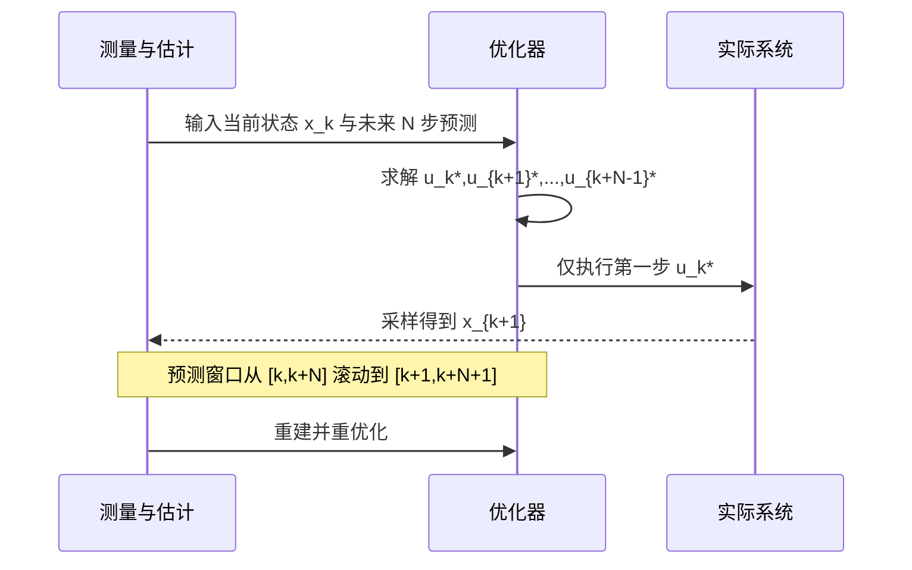
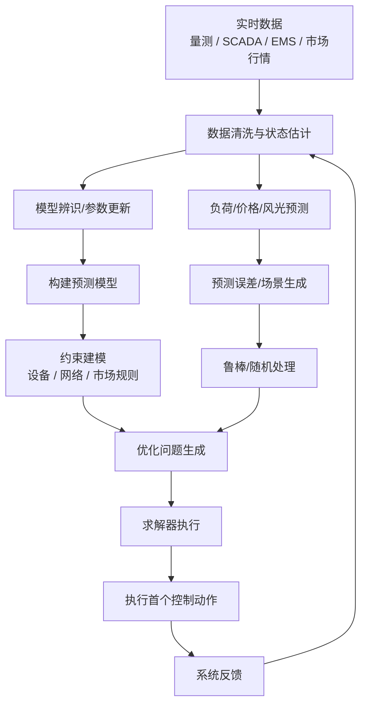

# 面向虚拟电厂与电力市场交易算法工程师的MPC调研文档

## 执行摘要

模型预测控制（MPC）本质上是一类“基于模型、显式处理约束、在线滚动重优化”的控制与优化框架：在每个采样时刻，控制器利用当前状态、未来预测信息和约束条件，求解一个有限时域优化问题，只执行第一步控制，再在下一时刻重复这一过程。它与经典 PID/LQR 的关键差异，不在于“是否最优”，而在于它把**模型、约束、预测、反馈**统一进了一个在线优化闭环，因此特别适合源网荷储耦合、价格与负荷不确定、设备受严格运行边界约束的复杂系统。对虚拟电厂与电力交易而言，这种范式天然匹配“负荷/价格/风光预测 + 设备状态更新 + 市场规则 + 滚动决策”的业务流程。

从算法工程师视角看，MPC最重要的不是“控制理论名词”，而是它背后的工程分层：上层是预测模型与场景生成，下层是约束优化求解，中间通过滚动时域把预测误差纳入闭环修正。在线上，MPC要面对的核心矛盾永远是**模型精度、约束保守性、求解速度、部署复杂度**之间的权衡。线性 MPC 通常可落成凸 QP，易于 warm-start、结构化求解与嵌入式部署；非线性 MPC 则能更真实地表达储能、电化学、潮流或热工过程，但会把问题推向 NLP 甚至 MINLP，实时性与鲁棒性设计难度显著上升。

面向虚拟电厂与电力市场交易，本文给出的主结论是：**若目标是快速工程落地，建议先从线性/凸经济 MPC 做主干，再把最关键的不确定性通过场景化、软约束和滚动重优化吸收；若必须显式建模强非线性或高保真储能老化，再引入 CasADi/GEKKO/do-mpc 这类 NMPC 工具栈；若涉及启停、充放互斥、市场报量等离散规则，则应优先把问题整理成 MILP/QP，再使用 Gurobi/CPLEX 等商用求解器。**以 Python 生态看，CVXPY 适合快速原型与凸问题，CasADi 适合 NMPC 与自动微分，Pyomo 适合调度/MILP，do-mpc 适合研究性鲁棒 NMPC 原型，GEKKO 适合动态优化一体化建模，MPCPy 更偏楼宇/FMU 工作流且生态更新相对慢。

## MPC的核心概念与数学原理

MPC 的标准离散时间表述可写为：

$$
x_{k+1}=f(x_k,u_k,d_k,\theta), \qquad y_k=h(x_k,u_k)
$$

在时刻 $k$ 解决如下有限时域最优控制问题：

$$
\min_{\{u_{k|k},\dots,u_{k+N-1|k}\}}
\sum_{i=0}^{N-1}\ell(x_{k+i|k},u_{k+i|k}) + V_f(x_{k+N|k})
$$

满足

$$
x_{k+i+1|k}=f(x_{k+i|k},u_{k+i|k},d_{k+i|k},\theta),\;
(x_{k+i|k},u_{k+i|k})\in \mathcal Z,\;
x_{k+N|k}\in \mathcal X_f
$$

求得整段最优控制序列后，只把第一步 $u_{k|k}^\*$ 下发到真实系统。下一采样时刻获得新状态与新预测后，再把问题重建并求解。这就是“滚动时域”或“重优化”思想。MPC 的理论优势在于：它把系统动态、目标函数、路径约束、终端约束放进同一个优化框架；工程优势在于：它允许预测误差在下一轮闭环中纠正，而不是一次计划走到黑。

预测模型是 MPC 的“地基”。工程上常见三类：其一是机理模型，例如质量守恒、能量守恒、SOC 动力学、线性化潮流与热力学模型；其二是辨识模型，如 ARX/状态空间/子空间辨识；其三是灰箱或数据驱动混合模型，即用机理结构保证可解释性，用学习模块补偿残差。对算法工程师而言，关键不是追求“最真实的模型”，而是追求**在当前采样周期内可稳定求解、能覆盖主要约束、对关键状态有足够预测能力**的模型。对连续系统，还要先把 ODE/DAE 离散化，常见方式包括 Euler、Runge–Kutta、multiple shooting 与 orthogonal collocation。

下图根据经典 receding-horizon 描述与工程实现流程重绘，强调“估计—预测—优化—执行—反馈”的闭环。图示思想可对应 Rawlings 教材、工程综述与 do-mpc 的理论页面。

```mermaid
flowchart LR
    A["状态估计 / 实时测量
x_k"] --> B["更新预测信息
负荷 / 价格 / 风光 / 扰动"]
    B --> C["构造有限时域 OCP
目标 + 动力学 + 约束"]
    C --> D[求解 QP / NLP / MILP]
    D --> E[仅执行第一步 u_k*]
    E --> F[真实系统演化到 x_{k+1}]
    F --> A
```

MPC 的另一核心是显式约束处理。与 PID/LQR 常常通过饱和、抗积分饱和、启发式裁剪去“补丁式”处理约束不同，MPC 可以把输入限幅、状态边界、坡度约束、终端区域、网络潮流约束、市场报量规则等直接写进优化问题。约束大致可分为：**硬约束**（必须满足，例如温度上限、SOC 上下界、并网功率上限）、**软约束**（允许短时违反，但要付出惩罚）、**耦合约束**（例如功率平衡、联络线功率、聚合器总容量）、**终端约束**（保证稳定性或经济可行性）。在能源系统里，软约束尤其重要，因为它能将“不可行”转化为“代价很高但可恢复”，这比在线死锁更符合工程现实。

对线性跟踪型 MPC，若模型为 LTI，目标函数是二次型，约束为线性不等式，则问题可整理为标准凸 QP：

$$
\min_z \frac12 z^\top H z + g^\top z
\quad
\text{s.t. } Gz\le h,\; Az=b
$$

这也是线性 MPC 在工业界最易规模化的原因。若进一步做 condensed form，只保留控制序列作为决策变量，可减少变量数但会让 Hessian 更密；若保持 sparse stage-wise 结构，则变量多一些，但更容易利用块带状结构、Riccati 递推和稀疏 KKT 求解。

稳定性分析是 MPC 从“滚动优化器”变成“控制器”的分水岭。经典结论表明，适当的终端成本与终端集合可以保证**递归可行性**与闭环稳定；对鲁棒 MPC，还要保证在扰动集内约束不被破坏，常用做法是 tube-based 约束收缩、鲁棒正不变集、min-max 或多场景树。随机 MPC 则把不确定性建模为随机变量，通过机会约束、场景优化或分布假设来换取较低保守性；经济 MPC 则不再以追踪固定设定值为唯一目标，而直接优化运行收益/成本，此时稳定性往往借助 dissipativity、rotated cost 或周期终端条件分析。自适应 MPC 则把在线辨识或参数集合收缩与 MPC 合并，以减少模型不确定性带来的保守性。

下图重绘了滚动时域窗口的时间关系：窗口始终向前滑动一格，计划总是“看得更远，但只执行一步”。这也是 MPC 能借助不断到来的新测量来纠正预测偏差的根本原因。



计算复杂度与实时性，是算法工程师最需要提早“算账”的部分。Rawlings 教材明确指出：在 MPC 中，不宜执着于把每一次有限时域问题都“解得极其精确”，因为反馈延迟和 CPU 开销本身就会损害闭环性能；应围绕“足够好 + 足够快”设计在线求解。对结构化线性二次问题，利用带状 KKT 或 Riccati 结构，可以把复杂度做到对时域长度 $N$ 近似线性增长；对参数化 QP，OSQP 支持 factorization caching 与 warm start，因此连续时刻重复求解通常很高效。对 NLP，IPOPT 提供 warm-start 选项，但内点法对初值与尺度更敏感，工程上常要通过初值平移、状态缩放、变量归一化、约束软化以及求解超时策略来保住实时性。

## MPC算法家族与工程选型

下面的比较表按“模型类型—目标函数—不确定性处理—求解方法—实时性特征”整理了 MPC 的常见技术路线。表中结论主要综合自经典教材、近年综述以及对应子领域代表性综述。

| 类型 | 典型数学形式 | 目标函数 | 约束/不确定性处理 | 常用求解方法 | 优点 | 局限 | 典型场景 | 实时性 |
|---|---|---|---|---|---|---|---|---|
| 线性 MPC | LTI/LTV + 二次型代价 | 跟踪、平滑、能耗惩罚 | 线性输入/状态约束 | QP，ADMM，active-set，IPM | 最成熟、易调试、可解释性强 | 模型失配较敏感，强非线性时误差大 | 储能调度、AGC、柔性负荷、报价跟踪 | 高 |
| 非线性 MPC | 非线性动力学/约束 | 跟踪或经济目标 | 非线性约束、DAE、路径约束 | IPOPT、SQP、multiple shooting、collocation | 表达能力强，适合高保真模型 | NLP 重、调参复杂、可行性脆弱 | 电化学储能、非线性热系统、复杂设备控制 | 中到低 |
| 鲁棒 MPC | 有界扰动、集合不确定性 | 最坏情形或名义代价 + 收缩 | tube、min-max、约束收缩、不变集 | QP/NLP，多面体运算，场景树 | 保证型强，适合硬约束系统 | 保守，离线集合计算复杂 | 储能安全边界、网络限额、可靠性优先场景 | 中 |
| 随机 MPC | 随机扰动/预测分布 | 期望成本、风险加权 | chance constraints、scenario MPC | 场景优化、采样近似、随机规划 | 较鲁棒 MPC 保守性低 | 依赖分布假设，场景数大时求解变重 | 价格/风光/负荷不确定交易 | 中 |
| 分布式 / 去中心化 MPC | 子系统局部模型 + 耦合约束 | 局部目标和全局协调 | 信息交换、邻域耦合、通信延迟 | ADMM、dual decomposition、协调迭代 | 适合大规模、分层自治 | 协调收敛与通信质量关键 | 多站储能、多微网、聚合器群控 | 中到高 |
| 经济 MPC | 模型可线性也可非线性 | 收益最大化/成本最小化 | 常配 terminal 条件或 dissipativity 设计 | QP/NLP/MILP | 最贴近市场收益目标 | 稳定性分析比跟踪 MPC 更细 | 电力交易、套利、综合能源运行 | 中 |
| 自适应 MPC | 模型参数在线更新 | 跟踪/经济/鲁棒目标 | 在线辨识、参数集合更新、LPV | QP/NLP + RLS/EKF/set-membership | 能减少模型失配与保守性 | 工程实现复杂，需兼顾辨识稳定性 | 时变负荷、设备老化、季节性系统 | 中 |

如果把这个表落到虚拟电厂与电力交易，工程上通常可以这样选：当你面对的是“功率平衡 + SOC + 线性设备约束 + 价格信号”的主问题，优先用**线性/经济 MPC**；当你关心的是“报价偏差、风光与负荷预测误差”，引入**场景化随机 MPC**或**tube-based 鲁棒 MPC**；当聚合器跨多个站点、多个边缘控制器协同工作时，再考虑**分布式 MPC**；当储能退化、热工动态或化学过程成为主导误差源时，转向**NMPC**。电池高保真模型进入市场控制后，常需要多时间尺度或分层设计，否则单一中央 NMPC 会很快失去实时性。

## Python工具库与求解器生态

从 Python 生态看，MPC 工具链大致分为三层：**建模语言**（CVXPY、Pyomo）、**最优控制/自动微分框架**（CasADi、do-mpc、GEKKO）、**领域化工作流平台**（MPCPy）。不同工具的差别，不仅是“能不能建模”，更在于是否能方便地表达动态系统、自动生成导数、复用 warm start、接入商业求解器，以及是否适合把原型推进到线上。下表主要依据官方文档与公开论文整理。

| 工具库 | 最适合的问题 | 优点 | 局限 | 与 OSQP / IPOPT / Gurobi / CPLEX 的接口情况 |
|---|---|---|---|---|
| CVXPY | 凸 LMPC、经济调度、QP/SOCP 原型 | 语义清晰、原型快、Parameter + warm-start 友好 | 仅适合 DCP 规则内的凸问题，NMPC 不适合 | 内置依赖 OSQP；官方支持 Gurobi、CPLEX；不面向 IPOPT 这类一般 NLP 解算器  |
| CasADi | NMPC、最优控制、自动微分、代码生成 | 自动微分强、multiple shooting/collocation 友好、可生成 C 代码 | 建模层偏底层，团队需要较强优化背景 | 官方常用为 IPOPT；插件/接口目录包含 OSQP、Gurobi、CPLEX 等；适合做高性能 OCP/NLP/QP 前端  |
| Pyomo | MILP、调度、随机规划、市场模型 | 代数建模成熟、和电力/运筹建模习惯一致 | 动态系统与自动微分体验不如 CasADi | 官方有 IPOPT 接口；官方/厂商文档支持 Gurobi、CPLEX；当前没有官方 OSQP 接口计划  |
| do-mpc | 研究型 NMPC / robust multi-stage MPC | 将 CasADi + MPC 流程封装得更完整，带 robust multi-stage、MHE | 生产级极限性能不如手写 CasADi/OCP；主流仍偏学术/原型 | 官方文档明确其 MPC/MHE 内核建立在 CasADi 和 IPOPT 之上；不以 OSQP/Gurobi/CPLEX 的用户级统一接口为卖点  |
| GEKKO | 动态优化、NMPC、RTO、DAE | 一体化程度高，动态仿真和优化联动方便 | 大规模稀疏 NMPC 的工程可控性通常不如 CasADi | 公共版本内置 APOPT/BPOPT/IPOPT；官方说明额外求解器需借助 AMPL 接口；不主打 OSQP/Gurobi/CPLEX 直连  |
| MPCPy | 楼宇/FMU/Modelica 工作流 | 预测—估计—控制工作流清晰，适合 FMU 生态 | 项目较老，偏楼宇领域，通用电力交易场景不占优 | 常见工作流依赖 JModelica/FMUs，并非统一的 OSQP/IPOPT/Gurobi/CPLEX 前端  |

对一个做虚拟电厂与交易的算法团队，最实用的经验是：**CVXPY/OSQP 用来快速试错与做凸主干；Pyomo/Gurobi 或 CPLEX 用来承接 MILP 级的市场约束；CasADi/IPOPT 用来处理 NMPC 与高保真设备模型。**如果你需要“论文到原型”的中间层，do-mpc 很有价值；如果你需要“动态优化 + 工业控制实验”一体化，GEKKO 很顺手。

下面给出每个库的**最小接口片段**，用于帮助团队快速判断 API 风格。它们不是完整示例，完整可运行示例在后文给出。接口风格依据各自官方文档。

**CVXPY**

```python
import cvxpy as cp

x = cp.Variable((nx, N+1))
u = cp.Variable((nu, N))
x0 = cp.Parameter(nx)

obj = cp.sum([cp.quad_form(x[:,k], Q) + cp.quad_form(u[:,k], R) for k in range(N)])
cons = [x[:,0] == x0]
for k in range(N):
    cons += [x[:,k+1] == A @ x[:,k] + B @ u[:,k], cp.abs(u[:,k]) <= umax]

prob = cp.Problem(cp.Minimize(obj), cons)
prob.solve(solver=cp.OSQP, warm_start=True)
```

**CasADi**

```python
import casadi as ca

opti = ca.Opti()
X = opti.variable(nx, N+1)
U = opti.variable(nu, N)
x0 = opti.parameter(nx)

opti.subject_to(X[:,0] == x0)
for k in range(N):
    opti.subject_to(X[:,k+1] == f(X[:,k], U[:,k]))
opti.minimize(sum1(sum2(X[:,:N]**2)) + 0.1 * sum1(sum2(U**2)))
opti.solver("ipopt")
```

**Pyomo**

```python
import pyomo.environ as pyo

m = pyo.ConcreteModel()
m.T = pyo.RangeSet(0, N-1)
m.u = pyo.Var(m.T, bounds=(-umax, umax))
# 省略状态与约束定义
m.obj = pyo.Objective(expr=sum(m.u[t]**2 for t in m.T))
solver = pyo.SolverFactory("gurobi")   # 也可 "cplex" / "ipopt"
solver.solve(m)
```

**do-mpc**

```python
import do_mpc

model = do_mpc.model.Model("discrete")
x = model.set_variable("_x", "x")
u = model.set_variable("_u", "u")
model.set_rhs("x", x + u)
model.setup()

mpc = do_mpc.controller.MPC(model)
mpc.set_param(n_horizon=20, t_step=1.0)
mpc.set_objective(mterm=x**2, lterm=x**2 + 0.1*u**2)
mpc.bounds["lower", "_u", "u"] = -1
mpc.bounds["upper", "_u", "u"] = 1
mpc.setup()
```

**GEKKO**

```python
from gekko import GEKKO
import numpy as np

m = GEKKO(remote=False)
m.time = np.linspace(0, 10, 21)
u = m.MV(lb=-1, ub=1); u.STATUS = 1
x = m.CV(value=2.0); x.STATUS = 1
m.Equation(x.dt() == -x + u)
m.options.IMODE = 6   # MPC
m.solve(disp=False)
```

**MPCPy**

```python
# 工作流片段（偏结构化 API，而非通用数学建模）
ctrl = MyMPCControl(
    state=state_estimator,
    prediction=predictor,
    parameters=params,
    horizon=24*3600,
    timestep=3600,
    receding=3600
)
u_plan = ctrl(starttime)
```

## 构建流程与三个Python示例

从工程实现角度，MPC 不只是“一个控制器”，而是一条数据与优化流水线：实时数据进入后，要先做清洗与状态估计，再进行模型更新、预测与误差建模，随后生成优化问题，求解出控制计划，只把第一步执行到设备，最后收集反馈进入下一轮。这个过程对 VPP、储能和交易系统尤为关键，因为预测、约束和可执行策略之间存在天然耦合。



### 示例一

这个示例是**线性定常系统的经典线性 MPC**。问题形式与 OSQP 官方 MPC 示例、CVXPY 论文与官方求解器接口非常一致：系统为线性离散状态空间模型，目标是把状态收敛到零点，同时惩罚控制量大小，输入和状态均有硬边界，因此问题是一个标准凸二次规划。对算法工程师而言，这类问题最适合作为 MPC 工程化起点。

```python
import numpy as np
import cvxpy as cp
import matplotlib.pyplot as plt

# =========================
# 线性系统: x_{k+1} = A x_k + B u_k
# 2维状态, 1维控制
# =========================
A = np.array([[1.0, 1.0],
              [0.0, 1.0]])
B = np.array([[0.5],
              [1.0]])

nx, nu = A.shape[0], B.shape[1]
N = 10           # 预测时域
Tsim = 25        # 仿真步数

Q = np.diag([1.0, 0.1])
R = np.diag([0.1])
P = Q.copy()     # 终端权重
xr = np.zeros(nx)

u_max = 1.0
x1_max = 5.0

# -------------------------
# 建立参数化 MPC 问题
# -------------------------
x = cp.Variable((nx, N + 1))
u = cp.Variable((nu, N))
x0_param = cp.Parameter(nx)

cost = 0
cons = [x[:, 0] == x0_param]

for k in range(N):
    cost += cp.quad_form(x[:, k] - xr, Q)
    cost += cp.quad_form(u[:, k], R)

    cons += [x[:, k + 1] == A @ x[:, k] + B @ u[:, k]]
    cons += [cp.abs(u[:, k]) <= u_max]
    cons += [cp.abs(x[0, k]) <= x1_max]

cost += cp.quad_form(x[:, N] - xr, P)
cons += [cp.abs(x[0, N]) <= x1_max]

prob = cp.Problem(cp.Minimize(cost), cons)

# -------------------------
# 闭环仿真
# -------------------------
x_now = np.array([4.0, 0.0])
x_hist = [x_now.copy()]
u_hist = []

for t in range(Tsim):
    x0_param.value = x_now
    prob.solve(solver=cp.OSQP, warm_start=True, verbose=False)

    if prob.status not in ("optimal", "optimal_inaccurate"):
        raise RuntimeError(f"MPC 求解失败, status = {prob.status}")

    u_now = float(u[:, 0].value)
    x_now = A @ x_now + B.flatten() * u_now

    u_hist.append(u_now)
    x_hist.append(x_now.copy())

x_hist = np.array(x_hist)
u_hist = np.array(u_hist)

# -------------------------
# 画图
# -------------------------
fig, ax = plt.subplots(2, 1, figsize=(8, 6), sharex=True)

ax[0].plot(x_hist[:, 0], label="x1")
ax[0].plot(x_hist[:, 1], label="x2")
ax[0].set_ylabel("state")
ax[0].legend()
ax[0].grid(True)

ax[1].step(range(len(u_hist)), u_hist, where="post", label="u")
ax[1].set_xlabel("time step")
ax[1].set_ylabel("control")
ax[1].legend()
ax[1].grid(True)

plt.tight_layout()
plt.show()
```

建模要点很直接：决策变量是 $x_{0:N},u_{0:N-1}$，目标函数是标准 tracking cost，控制步长就是采样周期，预测窗口为 $N=10$。若采用稀疏 stage-wise 形式，决策变量数量约为 $2(N+1)+N=32$ 个；若做 condensed，仅保留 10 个控制变量。在线复杂度主要取决于 QP 结构、是否复用矩阵分解、以及 warm-start 质量。OSQP 对参数化 QP 支持缓存分解和 warm start，因此重复求解通常非常高效；这也是线性 MPC 能在工业中广泛落地的根本原因。

下面给出一组按上述参数得到的闭环示意数据：**第二列为控制量 $u$，第三列为位置状态 $x_1$**。可见控制器先触发输入饱和，再逐步回到零附近，其行为与线性二次 MPC 的标准闭环特征一致。

| step | 控制量 $u$ | 状态 $x_1$ |
|---|---:|---:|
| 0 | -1.000 | 4.000 |
| 1 | -1.000 | 3.500 |
| 2 | 0.953 | 2.000 |
| 3 | 1.000 | 0.477 |
| 4 | 0.126 | -0.070 |
| 5 | -0.061 | -0.053 |
| 6 | -0.021 | -0.004 |
| 7 | 0.001 | 0.003 |
| 8 | 0.002 | 0.001 |
| 9-12 | 约 0 | 约 0 |

### 示例二

这个示例是**简单非线性动力学的 NMPC**。选用标量非线性系统
$$
x_{k+1}=x_k+\Delta t(-x_k^3+x_k+u_k)
$$
目标依然是把状态压回原点，但由于系统动态非线性，问题已经不再是 QP，而是一般 NLP。这里给出 CasADi + IPOPT 的直接多阶段建模方式。CasADi 的优势在于自动微分和 OCP 到 NLP 的转换，IPOPT 则提供成熟的内点法求解能力。

```python
import casadi as ca
import numpy as np
import matplotlib.pyplot as plt

# =========================
# 非线性系统
# x_{k+1} = x_k + dt * (-x_k^3 + x_k + u_k)
# =========================
dt = 0.2
N = 15
Tsim = 20
u_max = 1.5

def f_discrete(x, u):
    return x + dt * (-x**3 + x + u)

opti = ca.Opti()

X = opti.variable(1, N + 1)
U = opti.variable(1, N)
x0 = opti.parameter()

# 初值约束
opti.subject_to(X[:, 0] == x0)

# 目标函数
J = 0
for k in range(N):
    opti.subject_to(X[:, k + 1] == f_discrete(X[:, k], U[:, k]))
    opti.subject_to(opti.bounded(-u_max, U[:, k], u_max))
    J += X[:, k]**2 + 0.1 * U[:, k]**2
J += X[:, N]**2

opti.minimize(J)

# IPOPT 设置
p_opts = {"expand": True}
s_opts = {"print_level": 0, "sb": "yes", "max_iter": 200}
opti.solver("ipopt", p_opts, s_opts)

# -------------------------
# 闭环仿真 + warm start
# -------------------------
x_now = 1.8
x_hist = [x_now]
u_hist = []
sol_prev = None

for t in range(Tsim):
    opti.set_value(x0, x_now)

    if sol_prev is not None:
        X_prev = sol_prev.value(X)
        U_prev = sol_prev.value(U)

        # 常见 warm-start：把上一时刻解向前平移一格
        opti.set_initial(X, np.hstack([X_prev[:, 1:], X_prev[:, -1:]]))
        opti.set_initial(U, np.hstack([U_prev[:, 1:], U_prev[:, -1:]]))

    sol = opti.solve()

    u_now = float(sol.value(U[0, 0]))
    x_now = float(x_now + dt * (-x_now**3 + x_now + u_now))

    x_hist.append(x_now)
    u_hist.append(u_now)
    sol_prev = sol

x_hist = np.array(x_hist)
u_hist = np.array(u_hist)

# -------------------------
# 画图
# -------------------------
fig, ax = plt.subplots(2, 1, figsize=(8, 6), sharex=True)

ax[0].plot(x_hist, label="x")
ax[0].set_ylabel("state")
ax[0].legend()
ax[0].grid(True)

ax[1].step(range(len(u_hist)), u_hist, where="post", label="u")
ax[1].set_xlabel("time step")
ax[1].set_ylabel("control")
ax[1].legend()
ax[1].grid(True)

plt.tight_layout()
plt.show()
```

这个例子里，决策变量只显式包含 $U$ 与 $X$，预测窗口是 $N=15$，控制步长就是离散采样 $dt=0.2$。如果用 single shooting，决策变量主要是 $U$；如果用 multiple shooting/collocation，还会把中间状态和配点变量一起纳入 NLP。复杂度上，它不再取决于一次因式分解后的 QP 迭代，而取决于每轮 NLP 迭代中的稀疏 KKT 解线性系统、约束非线性程度、以及 warm-start 是否有效。Rawlings 与 CasADi 的材料都强调了：对 MPC 而言，关键不是“求到极致精确”，而是“在给定反馈周期内获得足够好的近似最优解”。

下面给出按上述参数得到的典型闭环示意数据：**第二列为控制量 $u$，第三列为状态 $x$**。可以看到 NMPC 初期把控制打到饱和，随后随着非线性项主导，控制逐步卸载。

| step | 控制量 $u$ | 状态 $x$ |
|---|---:|---:|
| 0 | -1.500 | 1.800 |
| 1 | -1.500 | 0.694 |
| 2 | -1.436 | 0.466 |
| 3 | -0.804 | 0.251 |
| 4 | -0.445 | 0.138 |
| 5 | -0.245 | 0.076 |
| 6 | -0.135 | 0.042 |
| 7 | -0.074 | 0.023 |
| 8 | -0.041 | 0.013 |
| 9-12 | 逐步趋近 0 | 逐步趋近 0 |

### 示例三

这个示例给出一个**有界扰动下的简化鲁棒 MPC**。为避免把例子推到复杂 min-max 或场景树，我们采用工程上很常见的**tube-based 约束收缩近似**。系统为
$$
x_{k+1}=x_k+u_k+w_k,\quad |w_k|\le w_{\max}
$$
选择辅助反馈 $u=v+Ke$，并用误差管半径 $r_k$ 预计算对名义状态和输入的收缩量。这样在线仍然解 QP，但约束已经对最坏扰动留出了安全裕度。这个思路来自鲁棒 MPC 与 tube MPC 的经典文献。

```python
import numpy as np
import cvxpy as cp
import matplotlib.pyplot as plt

# =========================
# 标量 tube-based 鲁棒 MPC
# 实际系统: x_{k+1} = x_k + u_k + w_k, |w_k| <= w_max
# 名义系统: z_{k+1} = z_k + v_k
# 控制律:   u_k = v_k + K e_k
# 由于每轮都用测量状态重置名义状态, 当前时刻 e_k = 0
# 在线问题仍是 QP，但约束做了收缩
# =========================
N = 8
Tsim = 20

x_max = 5.0
u_max = 1.0
w_max = 0.2
K = -0.5
Acl = 1.0 + K   # 误差闭环: e_{k+1} = Acl * e_k + w_k

Q = 1.0
R = 0.1
P = 1.0

# 预计算 tube 半径
r = np.zeros(N + 1)
for k in range(N):
    r[k + 1] = abs(Acl) * r[k] + w_max

# -------------------------
# 构建名义 QP
# -------------------------
z = cp.Variable(N + 1)
v = cp.Variable(N)
z0 = cp.Parameter()

cost = 0
cons = [z[0] == z0]

for k in range(N):
    # 名义动态
    cons += [z[k + 1] == z[k] + v[k]]

    # 收缩后的状态/输入约束
    cons += [z[k] <=  x_max - r[k],
             z[k] >= -x_max + r[k]]

    cons += [v[k] <=  u_max - abs(K) * r[k],
             v[k] >= -u_max + abs(K) * r[k]]

    cost += Q * cp.square(z[k]) + R * cp.square(v[k])

cons += [z[N] <=  x_max - r[N], z[N] >= -x_max + r[N]]
cost += P * cp.square(z[N])

prob = cp.Problem(cp.Minimize(cost), cons)

# -------------------------
# 闭环仿真（用朝着最坏方向的扰动）
# -------------------------
x_now = 3.0
x_hist = [x_now]
u_hist = []

for t in range(Tsim):
    z0.value = x_now  # 滚动时域: 每一步用实测状态重置名义初值
    prob.solve(solver=cp.OSQP, warm_start=True, verbose=False)

    if prob.status not in ("optimal", "optimal_inaccurate"):
        raise RuntimeError(f"鲁棒MPC求解失败, status = {prob.status}")

    v_now = float(v.value[0])

    # 当前时刻 e=0，因此 u=v；若保留内部名义轨迹，可写成 u=v+K*e
    u_now = v_now

    # 构造一个“最坏方向”的有界扰动
    w_now = w_max * np.sign(x_now) if abs(x_now) > 1e-9 else 0.0
    x_now = x_now + u_now + w_now

    x_hist.append(x_now)
    u_hist.append(u_now)

x_hist = np.array(x_hist)
u_hist = np.array(u_hist)

# -------------------------
# 画图
# -------------------------
fig, ax = plt.subplots(2, 1, figsize=(8, 6), sharex=True)

ax[0].plot(x_hist, label="actual x")
ax[0].axhline(x_max, linestyle="--")
ax[0].axhline(-x_max, linestyle="--")
ax[0].set_ylabel("state")
ax[0].legend()
ax[0].grid(True)

ax[1].step(range(len(u_hist)), u_hist, where="post", label="u")
ax[1].axhline(u_max, linestyle="--")
ax[1].axhline(-u_max, linestyle="--")
ax[1].set_xlabel("time step")
ax[1].set_ylabel("control")
ax[1].legend()
ax[1].grid(True)

plt.tight_layout()
plt.show()
```

这个例子里，在线变量仍然只有名义轨迹 $z,v$，所以在线复杂度仍接近普通 QP；真正增加的代价主要来自**离线管半径计算**和**保守性**。如果把这个例子换成场景树 SMPC，复杂度会大致随场景数 $S$ 线性到超线性增长；如果把几何不确定性放进 min-max NMPC，复杂度还会进一步上升。鲁棒 MPC 的主要收益，是为硬约束提供可证明的安全裕度；主要代价，是控制更保守，经济性可能下降。

下面给出按上述参数得到的一组典型闭环示意数据：**第二列为控制量 $u$，第三列为实际状态 $x$**。在持续最坏方向扰动下，控制器把系统压到一个安全的小邻域而不是执着逼近零点，这正是鲁棒设计的典型特征。

| step | 控制量 $u$ | 实际状态 $x$ |
|---|---:|---:|
| 0 | -1.000 | 3.000 |
| 1 | -1.000 | 2.200 |
| 2 | -1.000 | 1.400 |
| 3 | -0.550 | 0.600 |
| 4 | -0.229 | 0.250 |
| 5 | -0.202 | 0.221 |
| 6 | -0.200 | 0.219 |
| 7 | -0.200 | 0.218 |
| 8-12 | 约 -0.200 | 约 0.218 |

## 面向虚拟电厂与电力市场交易的MPC方案

对虚拟电厂而言，MPC 的价值不是“把调度写成控制问题”这么简单，而是把**设备物理状态、市场价格信号、交易偏差风险、网络约束、可再生不确定性**纳入一个持续闭环的决策器。中文综述普遍指出，虚拟电厂的核心难点集中在资源聚合建模、协同调控、市场参与和不确定性量化；面向市场的 VPP 模型则越来越关注不同市场品种之间的联动、场景化不确定性以及更真实的调度约束。

一个适合算法工程师落地的简化 VPP MPC 模型，可以把系统划分为四类资产：**可控发电机组、储能、柔性负荷、市场交易接口**。状态变量至少包括储能 SOC/能量、机组启停逻辑或简化出力状态、柔性负荷剩余可转移能量；控制变量至少包括机组出力 $P^{g}$、储能充电 $P^{ch}$、放电 $P^{dis}$、柔性负荷调整量 $P^{flex}$、市场买入 $P^{buy}$、卖出 $P^{sell}$。若采用价格接受者假设，可以直接把市场价格作为外部预测量；若考虑更复杂的出清耦合，则可进一步扩展为报价-出清联动或多阶段随机规划。已有 VPP 市场综述和多市场投标论文都表明，负荷、风光出力与价格不确定性是 VPP 交易优化的核心来源。

一个实用的经济 MPC 目标函数可以写成

$$
\max \sum_{t=k}^{k+N-1}
\Big(
\pi_t^{sell} P_t^{sell}
-
\pi_t^{buy} P_t^{buy}
-
C_g(P_t^g)
-
C_{deg}(P_t^{ch},P_t^{dis})
-
C_{flex}(P_t^{flex})
-
C_{dev}(\Delta_t)
\Big)\Delta t
$$

其中 $C_g$ 表示机组运行成本，$C_{deg}$ 表示储能退化近似代价，$C_{flex}$ 表示需求响应补偿，$\Delta_t$ 表示与日前计划、辅助服务响应或交易承诺之间的偏差惩罚。对工程实现而言，这个目标**不一定要一次性追求“经济学完美”**；更常见的路径是先做凸化：把发电成本写成二次或分段线性，把退化成本写成 throughput 近似，把偏差惩罚写成 L1/L2 罚函数，再逐步增加市场细节。已有储能市场 MPC 论文与多市场 VPP 随机规划研究都沿着这个思路发展。

约束集合通常至少包括以下几类。其一是**功率平衡**：
$$
P_t^g + P_t^{pv} + P_t^{wind} + P_t^{dis} + P_t^{buy} + P_t^{flex}
=
L_t + P_t^{ch} + P_t^{sell} + \Delta_t
$$
其二是**储能动态**：
$$
E_{t+1}=E_t+\eta_c P_t^{ch}\Delta t-\frac{1}{\eta_d}P_t^{dis}\Delta t
$$
及 $E_{\min}\le E_t\le E_{\max}$、$0\le P_t^{ch}\le \bar P^{ch}$、$0\le P_t^{dis}\le \bar P^{dis}$。其三是机组出力上下限、坡度与最小启停时间；其四是需求响应可调边界、舒适度或生产约束；其五是市场规则，如交易量上下界、偏差处罚、并网出力限制；其六是网络约束，在需要时可引入 DC 潮流、LinDistFlow 或灵敏度矩阵。中文并网调度示范文本与 VPP 综述都强调了储能并网、调度和聚合资源协同的技术约束基础。

预测层建议与业务层明确解耦。对你这样的时间序列算法工程师，最自然的做法是把**负荷、价格、风光出力**分别做成点预测 + 区间/分位数预测，然后在 MPC 层选择三种不确定性处理机制之一。第一种是**确定性滚动优化**：用最新点预测直接求解，靠每轮重优化消化误差，工程成本最低。第二种是**场景化随机 MPC**：把价格、风光、负荷生成若干联合场景，目标是期望收益或 CVaR 风险收益。第三种是**鲁棒 MPC**：用区间预测和 reserve margin 做约束收缩，牺牲部分收益换取更强安全性。储能市场 SMPC 与 VPP 多阶段随机规划文献都显示，这类场景/滚动方法能有效吸收价格与可再生波动。

滚动优化的上线实现，建议采用**两层时间尺度**。较慢层处理交易与经济调度，例如 15 分钟或 1 小时滚动一次，预测 horizon 覆盖 4–24 小时；较快层处理站内功率跟踪、频率响应或逆变器功率限额，可用更快的线性 MPC 或规则控制。多时间尺度 MPC 在电池参与市场的研究中已经显示出明显价值，因为它能够把短期市场收益和长期退化成本放到不同尺度上处理。对虚拟电厂而言，这一思想同样重要：**交易层不要背全部设备高速控制，设备层也不要直接承接市场级场景树。**

在求解器选择上，可以按问题类型切分。若模型经过凸化后是连续 QP 或 convex QP/SOCP，原型可用 CVXPY+OSQP，工业版可直接调用 Gurobi/CPLEX。若包含机组启停、买卖互斥、充放互斥、分段电价等离散逻辑，通常转为 MILP，更适合 Pyomo+Gurobi/CPLEX。若你显式加入高保真电池老化、非线性潮流或热工耦合，则问题会推向 NLP，需要 CasADi+IPOPT 或 GEKKO。核心原则不是“求解器越强越好”，而是**让问题形式与求解器长板一致**。

下面给出一个**可运行的简化 CVXPY 框架**。它采用 3 类设备：1 台可控机组、1 套储能、1 个柔性负荷聚合器；滚动 horizon 取 $H$ 步。该框架是小规模可运行版本，但变量组织方式已经接近中等规模工程实现。若把设备维度扩展到 8–12 个资源单元、horizon 扩展到 16–24 步，变量规模很快就会进入百维甚至千维。

```python
import numpy as np
import cvxpy as cp

# ==========================================
# 简化 VPP 经济 MPC (连续凸版本)
# 设备: 1 台可控机组 + 1 套储能 + 1 个柔性负荷聚合器
# 目标: 成本最小 / 收益最大
# ==========================================

def solve_vpp_mpc(
    load_hat, pv_hat, price_buy, price_sell,
    soc0,
    dt=1.0, eta_c=0.95, eta_d=0.95,
    g_max=3.0, g_ramp=1.0,
    ch_max=2.0, dis_max=2.0,
    soc_min=0.5, soc_max=8.0, soc_target=4.0,
    flex_max=1.0,
    c_gen_quad=0.05, c_gen_lin=0.40,
    c_deg=0.02, c_flex=0.10, c_soc_terminal=5.0
):
    H = len(load_hat)

    # 决策变量
    pg   = cp.Variable(H)          # 机组出力
    pch  = cp.Variable(H)          # 储能充电功率
    pdis = cp.Variable(H)          # 储能放电功率
    soc  = cp.Variable(H + 1)      # 储能能量/SOC
    pflex = cp.Variable(H)         # 柔性负荷向下调整（正值表示减少净负荷）
    pbuy = cp.Variable(H)          # 向市场/电网买电
    psell = cp.Variable(H)         # 向市场/电网卖电

    cons = [soc[0] == soc0]

    for t in range(H):
        # 储能状态更新
        cons += [
            soc[t + 1] == soc[t] + eta_c * pch[t] * dt - (pdis[t] / eta_d) * dt
        ]

        # 功率平衡
        cons += [
            pg[t] + pv_hat[t] + pdis[t] + pbuy[t] + pflex[t]
            == load_hat[t] + pch[t] + psell[t]
        ]

        # 机组、储能、柔性负荷、市场边界
        cons += [
            0 <= pg[t], pg[t] <= g_max,
            0 <= pch[t], pch[t] <= ch_max,
            0 <= pdis[t], pdis[t] <= dis_max,
            -flex_max <= pflex[t], pflex[t] <= flex_max,
            0 <= pbuy[t], 0 <= psell[t],
            soc_min <= soc[t], soc[t] <= soc_max
        ]

        # 机组爬坡（从 t=1 开始）
        if t >= 1:
            cons += [
                pg[t] - pg[t-1] <= g_ramp,
                pg[t-1] - pg[t] <= g_ramp
            ]

    cons += [soc_min <= soc[H], soc[H] <= soc_max]

    # 目标函数: 购电成本 - 售电收益 + 发电成本 + 储能退化 + 柔性补偿 + 终端SOC偏差
    obj = cp.sum(
        price_buy * pbuy - price_sell * psell
        + c_gen_quad * cp.square(pg) + c_gen_lin * pg
        + c_deg * (pch + pdis)
        + c_flex * cp.abs(pflex)
    ) + c_soc_terminal * cp.square(soc[H] - soc_target)

    prob = cp.Problem(cp.Minimize(obj), cons)
    prob.solve(solver=cp.OSQP, warm_start=True, verbose=False)

    if prob.status not in ("optimal", "optimal_inaccurate"):
        raise RuntimeError(f"VPP MPC 求解失败: {prob.status}")

    return {
        "pg": pg.value, "pch": pch.value, "pdis": pdis.value,
        "soc": soc.value, "pflex": pflex.value,
        "pbuy": pbuy.value, "psell": psell.value,
        "objective": prob.value
    }

# --------------------------
# 例子: 8 步 horizon
# --------------------------
H = 8
load_hat  = np.array([4.5, 4.2, 4.0, 4.8, 5.5, 6.2, 5.8, 5.0])
pv_hat    = np.array([0.2, 0.5, 1.0, 1.8, 2.2, 1.4, 0.5, 0.0])
price_buy = np.array([0.48, 0.45, 0.42, 0.50, 0.72, 0.90, 0.78, 0.55])
price_sell= np.array([0.40, 0.38, 0.35, 0.43, 0.65, 0.82, 0.70, 0.48])

sol = solve_vpp_mpc(load_hat, pv_hat, price_buy, price_sell, soc0=4.0)
for k, v in sol.items():
    print(k, np.round(v, 3) if isinstance(v, np.ndarray) else round(v, 3))
```

如果需要把它嵌入**滚动优化**，伪代码通常写成下面这样：

```python
soc_now = soc_measurement()
for k in range(current_time, end_time):
    # 1) 更新预测
    load_hat   = load_forecaster.predict(k, horizon=H)
    pv_hat     = pv_forecaster.predict(k, horizon=H)
    price_buy  = price_model.predict_buy(k, horizon=H)
    price_sell = price_model.predict_sell(k, horizon=H)

    # 2) 求解当前 horizon 的 MPC
    sol = solve_vpp_mpc(load_hat, pv_hat, price_buy, price_sell, soc_now)

    # 3) 只执行第一步
    dispatch_to_assets(
        pg=sol["pg"][0],
        pch=sol["pch"][0],
        pdis=sol["pdis"][0],
        pflex=sol["pflex"][0],
        pbuy=sol["pbuy"][0],
        psell=sol["psell"][0]
    )

    # 4) 等待下一个采样时刻并读取新状态
    soc_now = soc_measurement()
```

如果把市场规则进一步做实，建议按以下次序增强模型，而不是一开始就上全量复杂度：先加入**买卖互斥**，再加入**充放互斥**，然后加入**日前承诺偏差惩罚**，最后再考虑**启停二进制**和**网络潮流**。这样做的原因很简单：前两步会把连续凸问题推向 MILP，后两步又会进一步放大求解难度；只有当业务确实需要这些离散逻辑时，再为它们付出实时性的代价。

下面这张表给出虚拟电厂/交易场景下最常用的 MPC 调参与工程建议。它不是唯一标准，但很适合作为首版上线基线。表中建议综合了市场型储能 MPC、VPP 市场综述以及数值最优控制实时性的共识。

| 参数 | 建议初值 | 作用 | 调参建议 |
|---|---|---|---|
| 采样周期 $\Delta t$ | 5–15 分钟（交易/调度层） | 决定在线求解频率 | 与数据刷新频率、执行机构能力一致；快层控制另建下层控制器 |
| 预测时域 $H$ | 8–24 步 | 决定前瞻性 | 太短会“近视”，太长会放大预测误差和求解时间 |
| 终端 SOC 目标 | 日内中性或次日目标值 | 避免 horizon 末端透支储能 | 有跨日交易时一定要加终端项或终端区间 |
| 退化成本系数 | 从 throughput 近似开始 | 抑制无意义频繁充放 | 先粗后细，必要时再上更高保真模型 |
| 软约束罚系数 | 大于正常经济项 1–2 个数量级 | 保证“宁可贵，也别不可行” | 先让系统总能解，再逐步收紧 |
| 场景数 $S$ | 5–20 | 平衡风险与实时性 | 单机单站先小规模，线上逐步扩展 |
| 鲁棒裕度 / 保留容量 | 5%–15% 的可调容量起步 | 对抗预测误差 | 可根据分位数预测误差动态调整 |
| warm-start | 默认开启 | 缩短重复求解时间 | 线性 QP 几乎必开；NLP 推荐做解平移 |
| 变量缩放 | 必做 | 提高求解稳定性 | 功率、能量、价格统一到相近数量级 |
| 失败回退策略 | 最近可行解 / 规则库 | 保证线上鲁棒性 | 绝不能把“求解失败”直接下发到场站 |

## 参考资料

下面这份清单按“先建立理论骨架，再补工程实现，最后看能源应用”的顺序整理，适合在知识库中长期维护。默认采用“标题 + 链接 + 一句说明”的笔记风格，而不是严格学术排版。

### 基础理论与教材

- [Model Predictive Control: Theory, Computation, and Design](https://sites.engineering.ucsb.edu/~jbraw/mpc/)：Rawlings、Mayne、Diehl 的教材主页。适合系统补稳定性、递归可行性、数值最优控制与结构化求解。
- [Predictive Control for Linear and Hybrid Systems](https://www.cambridge.org/highereducation/books/predictive-control-for-linear-and-hybrid-systems/EF618BD7AFAF4D04B2044A0FD03D885A)：Borrelli、Bemporad、Morari 的教材页面。适合补线性、混杂系统和显式 MPC。
- [Model Predictive Control](https://link.springer.com/book/10.1007/978-0-85729-398-5)：Camacho、Bordons 的经典教材。工程直觉强，适合快速建立整体图谱。
- Model Predictive Control System Design and Implementation Using MATLAB：这本书适合作为工程实现补充阅读。当前文中未保留稳定官方链接，因此这里只保留书名，避免写入不可靠地址。
- [Constrained Model Predictive Control: Stability and Optimality](https://doi.org/10.1016/S0005-1098(99)00214-9)：Mayne、Rawlings、Rao、Scokaert 的经典综述论文，用来理解 MPC 为什么不只是“滚动优化”。
- [Stochastic Model Predictive Control: An Overview and Perspectives for Future Research](https://doi.org/10.1109/MCS.2016.2602087)：Mesbah 的随机 MPC 总览，适合把概率预测和机会约束接进控制问题。
- [Distributed Model Predictive Control: A Tutorial Review and Future Research Directions](https://doi.org/10.1016/j.compchemeng.2012.05.011)：Christofides 等的分布式 MPC 教程型综述。
- [Economic Model Predictive Control - A Review](https://doi.org/10.22260/ISARC2014/0006)：经济 MPC 的入门型综述，适合从“跟踪最优”切换到“收益最优”。
- [Adaptive Model Predictive Control with Robust Constraint Satisfaction](https://doi.org/10.1016/j.ifacol.2017.08.512)：一篇比较典型的自适应 MPC 参考文献，用来理解在线辨识和约束保证如何结合。

### Python 工具与官方文档

- [CasADi Documentation](https://web.casadi.org/docs/)：CasADi 官方文档，适合做自动微分、OCP/NLP 和 NMPC 原型。
- [CVXPY Documentation](https://www.cvxpy.org/)：CVXPY 官方文档，适合凸 MPC、QP/SOCP 快速原型。
- [Pyomo Documentation](https://pyomo.readthedocs.io/en/stable/)：Pyomo 文档入口，适合调度、MILP 和随机规划建模。
- [do-mpc Documentation](https://www.do-mpc.com/en/latest/)：do-mpc 官方文档，适合研究型 NMPC、MHE 和 multi-stage MPC。
- [do-mpc MPC Background](https://www.do-mpc.com/en/v4.1.0/theory_mpc.html)：do-mpc 的理论页面，适合配合本文中的滚动优化流程图阅读。
- [GEKKO Documentation](https://gekko.readthedocs.io/)：GEKKO 官方文档，适合动态优化、DAE 与 MPC 联动建模。
- [MPCPy on GitHub](https://github.com/lbl-srg/MPCPy)：MPCPy 项目主页，更偏楼宇/FMU 工作流。

### 虚拟电厂、电力市场与储能应用

- [从虚拟电厂到真实电量：虚拟电厂研究综述与展望](https://epjournal.csee.org.cn/zh/article/doi/10.12096/j.2096-4528.pgt.23102/)：中文综述，适合快速建立国内 VPP 的资源构成、运行模式与研究热点全景。
- [新型电力系统下虚拟电厂的技术演进研判与运营挑战分析](https://dgjsxb.ces-transaction.com/CN/abstract/abstract10515.shtml)：中文综述，适合从系统工程和市场运营视角理解 VPP 落地挑战。
- [虚拟电厂参与电力市场与调度控制技术研究综述](https://zjdl.cbpt.cnki.net/portal/journal/portal/client/paper/ZJDL_f2b155b3-7245-4678-bec0-78ada8e837fe)：中文综述，聚焦资源聚合、市场参与和调度控制。
- [基于模型预测控制的多微电网系统能量管理](https://academic.hep.com.cn/fitee/CN/10.1631/FITEE.1601826)：一个较贴近能源调度语境的中文应用论文。
- [基于预测控制的储能系统多时间尺度动态响应优化研究](https://www.gei-journal.com/cn/journalsDetailsCn/20211207/1468128728914726912.html)：多时间尺度储能 MPC 的中文应用文献，适合对照本文的交易层/设备层分层建议。
- VPP models and electricity markets review：适合建立“VPP × 多市场”模型视角。当前文中未保留稳定直链，因此保留标题供后续补链。
- 三阶段随机 VPP bidding 论文：适合理解日前—日内—实时偏差处理的建模套路。当前文中未保留稳定直链，因此保留标题供后续补链。
- 储能两阶段随机 MPC 参与能量与调频市场论文：适合理解储能市场型 MPC 的场景生成与收益风险平衡。当前文中未保留稳定直链，因此保留标题供后续补链。
- [基于模型预测控制的风光储微电网能量管理系统优化研究](https://zazhi.chinaet.net/cn/article/doi/10.19768/j.cnki.dgjs.2025.12.024)：与“风光储 + MPC + 经济运行”非常接近的中文应用文献。
