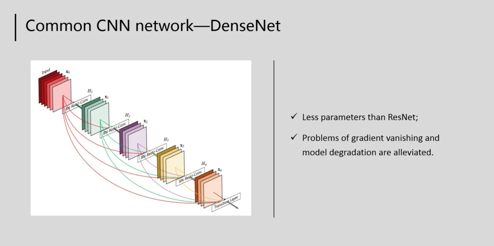

目录

- [DenseNet 简介](#densenet-简介)
- [DenseNet 网络结构](#densenet-网络结构)
  - [稠密块体](#稠密块体)

## DenseNet 简介

> 稠密链接网络，DenseNet

ResNet 极大地改变了如何参数化深层网络中函数的观点。DenseNet 在某种程度上

## DenseNet 网络结构

### 稠密块体

DenseNet 使用了 ResNet 改良版的 “批量规范化、激活和卷积” 架构

