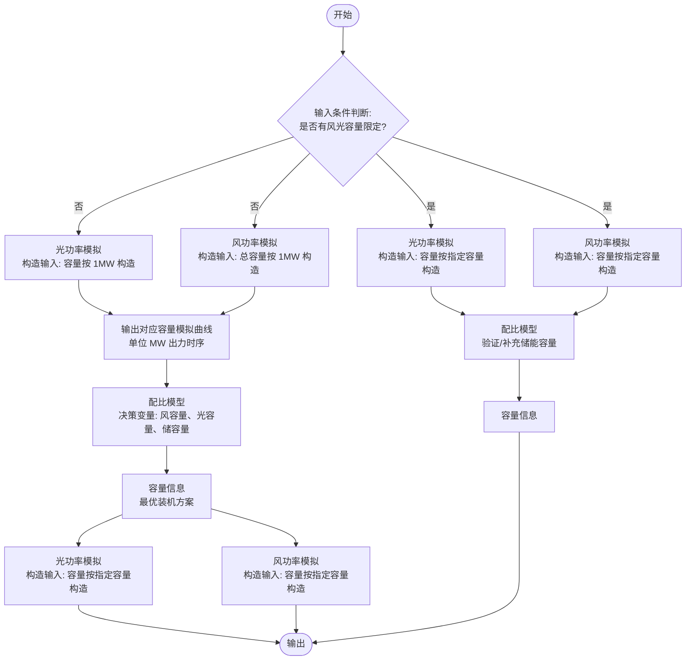
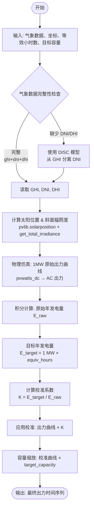
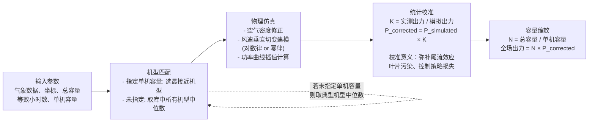
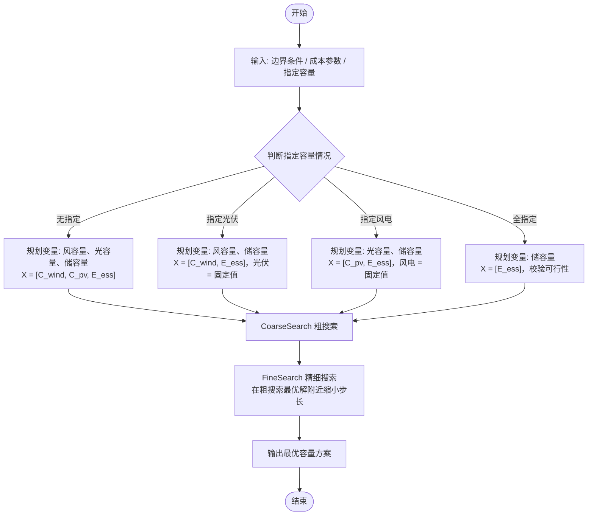

# 风光储测算算法方案 v2

## 一、项目背景与业务场景

### 1.1 绿电直连业务背景

**绿电直连**（又称"绿电直购"）是指工商业用电企业直接与风电、光伏等新能源电站签订中长期购电协议（PPA），绕过传统电网零售渠道，以协议价格直接使用新能源电力。相比通过电网购买"绿色电力证书"，绿电直连具有更高的绿电溯源可信度，能满足企业 RE100、碳中和目标的严格要求。

**典型业务场景**：
- 大型制造企业、数据中心、园区等高耗能主体，年用电量通常在 1 亿 kWh 以上
- 企业在自身厂区或附近建设/租用风光储系统，实现电力自产自用
- 多余电力可按协议上网，或通过储能平滑消纳以降低弃电率
- 绿电使用比例需满足内部碳中和目标（如 60%、80%）或监管要求

**政策驱动**：根据国家能源局相关政策，高耗能企业绿电消纳占比考核逐步趋严，部分省份已对新增高耗能项目要求配置一定比例的新能源自发自用容量。同时，绿电直连产生的绿证可与全国碳市场形成联动，降低企业碳配额缺口成本。

### 1.2 本方案适用边界

本方案聚焦于**容量规划阶段**的离线测算，有以下边界约束：

| 维度 | 约束说明 |
|------|---------|
| 余电上网 | 仅支持"余电不上网"或"余电上网但不计上网收益"两种模式 |
| 储能定位 | 储能作为满足边界约束（绿电比例、自发自用率）的辅助手段，不参与电力现货市场套利 |
| 模拟精度 | 出力模拟基于气象数据的物理仿真 + 等效小时数校准，属**粗评估**，不能替代专业气象咨询 |
| 时间尺度 | 以典型年（8760h 或 8784h）为仿真周期，按小时粒度建模 |
| 市场交易 | 不涉及日前竞价、实时平衡市场，与电力现货市场优化（项目其他模块）相互独立 |

### 1.3 与电力现货市场模块的关系

本项目整体架构遵循"预测 → 场景 → 优化 → 控制 → 评估"管线（见 `docs/architecture_notes.md`）。风光储容量规划模块位于**上游**，属于前期投资决策工具：

```
┌─────────────────────────────────────────────────────────┐
│           风光储容量规划（本方案）                         │
│   离线测算：最优装机容量 → 确定投资规模                    │
└─────────────────────┬───────────────────────────────────┘
                      │ 输出：风光装机容量、储能规格
                      ▼
┌─────────────────────────────────────────────────────────┐
│         电力现货市场运营（项目主线模块）                    │
│   预测 → 场景 → 两阶段优化 → 滚动调度 → 结算评估           │
└─────────────────────────────────────────────────────────┘
```

---

## 二、整体算法架构

### 2.1 系统设计原则

1. **先模拟，再规划**：基于气象数据仿真单位容量出力曲线，再通过优化算法求解最优容量配比
2. **等效小时数校准**：物理模型仿真结果通过当地统计数据（年等效利用小时数）校准，弥补模型与实际的系统偏差
3. **变量动态判定**：支持用户指定部分容量（如已确定光伏规模），算法自动缩减决策空间
4. **粗细两阶段搜索**：先粗粒度网格扫描缩小可行域，再精细化寻优，兼顾效率与精度

### 2.2 算法整体使用逻辑



> **说明**：若未指定风光容量，则先以 1MW 为基准单位模拟出力曲线，配比模型输出最优容量后，再以实际容量重新模拟得到最终曲线；若已指定容量则直接按指定容量模拟。

### 2.3 算法模块总览

| 模块 | 功能 | 核心依赖库 |
|------|------|----------|
| 光伏出力模拟 | 基于气象数据仿真光伏系统出力时序 | `pvlib` |
| 风电出力模拟 | 基于气象数据仿真风电场出力时序 | `windpowerlib` |
| 容量规划优化 | 外层搜索 + 内层时序仿真，求最优容量配比 | `scipy`, `numpy` |

---

## 三、核心算法模块

### 3.1 光伏出力模拟模块

**功能**：模拟单位容量（1 MW）或指定容量的光伏系统在特定气象条件下的出力时间序列。

#### 3.1.1 pvlib 核心调用链

```
pvlib.location.Location          # 初始化站点（纬度、经度、时区、海拔）
    ↓
pvlib.solarposition.get_solarposition()   # 计算太阳位置（天顶角、方位角）
    ↓
pvlib.irradiance.disc()          # GHI → DNI + DHI 分离（DISC 模型）
    ↓
pvlib.irradiance.get_total_irradiance()   # 水平面 → 斜面辐照度（Hay & Davies 模型）
    ↓
pvlib.temperature.sapm_cell()    # 组件温度计算
    ↓
pvlib.pvsystem.pvwatts_dc()      # DC 功率计算
    ↓
逆变器效率 × 线损 → AC 出力曲线
```

#### 3.1.2 算法设计流程



**GHI 分离方法说明**

| 方法 | 适用场景 | 说明 |
|------|---------|------|
| DISC 模型 (`pvlib.irradiance.disc`) | 仅有 GHI 时（最常见） | 基于晴空指数分离，误差约 ±15%，工程可用 |
| Erbs 模型 | 仅有 GHI 时（备选） | 基于 DHI/GHI 比例经验公式，精度略低于 DISC |
| 直接读取 | 有 ERA5 或气象站完整数据时 | 精度最高，优先使用 |

**等效利用小时数（FLH）区域参考值**

| 地区类型 | 光伏 FLH 参考范围 |
|----------|-----------------|
| 西北优质资源区（新疆、青海、甘肃） | 1400 ~ 1800 h/年 |
| 华北、东北 | 1200 ~ 1500 h/年 |
| 华东、华南 | 1000 ~ 1300 h/年 |
| 西南高海拔 | 1300 ~ 1600 h/年 |

#### 3.1.3 输入参数

| 参数类别 | 参数名称 | 说明 | 示例 / 单位 |
|----------|----------|------|------------|
| 基础地理 | `latitude`, `longitude` | 项目所在地经纬度 | 39.9, 116.4（度） |
| | `timezone` | 时区 | `'Asia/Shanghai'` |
| 气象数据 | `weather_df` | 时间序列 DataFrame | 含 `ghi`（W/m²）、`temp_air`（°C）、`wind_speed`（m/s） |
| 工程参数 | `target_capacity` | 目标装机容量（可变） | 10.5 MW；默认不输入即为 1 MW |
| | `equiv_hours` | 年等效发电小时数（约束值） | 1200 h |
| 可选参数 | `tilt` | 组件倾角 | 默认 `latitude × 0.9`（工程经验值） |
| | `azimuth` | 方位角 | 默认 180°（北半球正南） |

#### 3.1.4 输出

| 输出 | 类型 | 说明 |
|------|------|------|
| `output_df` | DataFrame | 与气象数据同频的出力时序（MW） |
| `total_generation` | float | 模拟年发电量（MWh） |
| `scale_factor` | float | 等效小时数校准系数 K |

#### 3.1.5 典型工程参数推荐值

| 参数 | 推荐值 | 说明 |
|------|--------|------|
| 组件效率 | 21% ~ 23% | 550W 单晶硅 PERC 典型值 |
| 温度系数 | -0.35%/°C | 功率温度系数（相对额定值） |
| 逆变器效率 | 98% | 集中式逆变器典型值 |
| 直流线损 | 1.5% | 汇流箱到逆变器 |
| 交流线损 | 1.0% | 逆变器到升压变压器 |
| 系统综合效率 PR | 80% ~ 85% | 含尘污、遮挡、失配等损耗 |

---

### 3.2 风电出力模拟模块

**功能**：模拟单位容量（1 MW）或指定容量的风电场在特定气象条件下的出力时间序列。

> **注意**：windpowerlib 库中最小风机型号约为 1.5 MW，以 1 MW 为基准模拟时采用最小机型缩放，存在一定误差，建议实际使用时以真实单机容量为单位。

#### 3.2.1 windpowerlib 核心调用链

```
windpowerlib.wind_turbine.WindTurbine   # 选择机型，加载功率曲线
    ↓
高度外推（对数律 / 幂律）              # 将气象数据风速外推至轮毂高度
    ↓
空气密度修正                          # 根据温度、气压修正功率曲线
    ↓
windpowerlib.modelchain.ModelChain     # 执行物理仿真，输出单台风机出力
    ↓
等效小时数校准（同光伏模块逻辑）
    ↓
台数 × 单机校准出力 → 全场出力时序
```

#### 3.2.2 算法设计流程



**风速垂直外推模型选择**

| 模型 | 公式 | 适用场景 |
|------|------|---------|
| 幂律模型（Power Law） | $v_{hub} = v_{ref} \cdot \left(\dfrac{h_{hub}}{h_{ref}}\right)^\alpha$ | 最常用，α 取 1/7（≈0.143）用于中性大气 |
| 对数律模型（Log Law） | $v_{hub} = v_{ref} \cdot \dfrac{\ln(h_{hub}/z_0)}{\ln(h_{ref}/z_0)}$ | 需要地表粗糙度长度 $z_0$，精度较高 |

**风切变指数 α 区域参考值**

| 地形类型 | α 参考值 |
|----------|---------|
| 近海 / 平坦海岸 | 0.10 ~ 0.12 |
| 平原农田 | 0.14 ~ 0.16 |
| 丘陵 / 稀疏植被 | 0.16 ~ 0.20 |
| 山地 / 复杂地形 | 0.20 ~ 0.30 |

**综合损耗折减参考**

| 损耗来源 | 典型折减比例 |
|----------|------------|
| 尾流损失 | 5% ~ 10% |
| 叶片污染 / 覆冰 | 1% ~ 3% |
| 可用率（计划 + 非计划停机） | 2% ~ 5% |
| 电气损耗（集电线路 + 升压变） | 1% ~ 2% |
| 控制策略 / 限功率 | 1% ~ 3% |
| **综合 P50 出力折减** | **约 10% ~ 20%** |

#### 3.2.3 输入参数

| 参数类别 | 参数名称 | 说明 | 默认值 / 单位 |
|----------|----------|------|--------------|
| 基础地理 | `latitude`, `longitude` | 项目所在地经纬度 | 度 |
| 气象数据 | `weather_df` | 时间序列 DataFrame | 含 `wind_speed`（m/s）、`temperature`（K）、`pressure`（Pa） |
| 工程参数 | `target_capacity_mw` | 风电场总装机容量 | 1.0 MW |
| | `single_turbine_capacity_mw` | 指定单机容量 | `None`（自动匹配） |
| | `hub_height` | 轮毂高度 | 100 m |
| 约束指标 | `equiv_hours` | 年等效发电小时数 | 2200 h |

#### 3.2.4 输出

| 输出 | 类型 | 说明 |
|------|------|------|
| `output_df` | DataFrame | 风电场出力时序（MW） |
| `selected_turbine` | str | 最终选用的风机型号 |
| `turbine_count` | int | 风机台数 |
| `scale_factor` | float | 等效小时数校准系数 K |

---

### 3.3 容量规划优化模型

**功能**：基于风光出力曲线和负荷曲线，在满足绿电比例、自发自用率等约束的前提下，以最小化建设成本为目标，求解最优风光储容量配置。

#### 3.3.1 决策变量动态判定



#### 3.3.2 优化问题建模

**目标函数（最小化建设成本）**

$$\min \; C_{total} = C_{wind} \cdot P_{wind} + C_{pv} \cdot P_{pv} + E_{ess} \cdot P_{ess\_E}$$

其中 $P_{wind}$、$P_{pv}$、$P_{ess\_E}$ 分别为风电、光伏、储能单位造价（元/MW 或 元/MWh）。

**约束条件**

$$\frac{\sum_t P_{used\_green}(t)}{\sum_t P_{load}(t)} \geq R_{green} \quad \text{（绿电使用率约束）}$$

$$\frac{\sum_t P_{used\_green}(t)}{\sum_t P_{gen}(t)} \geq R_{self} \quad \text{（自发自用率约束，等价于弃电率上限）}$$

$$SOC_{min} \leq SOC(t) \leq SOC_{max}, \quad \forall t \quad \text{（储能 SOC 约束）}$$

**内层时序仿真运行策略（伪代码）**

```
for t in time_series:
    P_gen(t) = C_wind * I_wind(t) + C_pv * I_pv(t)   # 发电功率
    net(t) = P_gen(t) - P_load(t)                      # 净功率

    if net(t) >= 0:   # 发电盈余
        charge = min(net(t), P_ch_max, (SOC_max - SOC(t-1)) / (eta_in * dt))
        SOC(t) = SOC(t-1) + charge * eta_in * dt
        P_curtail(t) = net(t) - charge                 # 弃电

    else:             # 发电不足
        discharge = min(-net(t), P_dis_max, (SOC(t-1) - SOC_min) * eta_out / dt)
        SOC(t) = SOC(t-1) - discharge / eta_out * dt
        P_grid(t) = max(0, -net(t) - discharge)        # 购网电（缺电）

    P_used_green(t) = min(P_gen(t) + discharge, P_load(t))

# 统计指标
green_ratio = sum(P_used_green) / sum(P_load)
self_use_ratio = sum(P_used_green) / sum(P_gen)
curtailment_ratio = sum(P_curtail) / sum(P_gen)
```

#### 3.3.3 混合搜索策略

| 阶段 | 搜索步长建议 | 目标 |
|------|------------|------|
| 粗搜索（CoarseSearch） | 风/光 10 MW，储 20 MWh | 快速定位可行域，排除大量无效组合 |
| 精细搜索（FineSearch） | 风/光 1 MW，储 2 MWh | 在粗搜索最优解 ±30% 范围内精确寻优 |

**搜索空间建议**

- 风/光容量上限：负荷峰值的 3~5 倍（避免搜索无意义的超大装机）
- 储能容量上限：`max(P_load) × 4 h`（对应 4 小时满载储能，工程上限）
- 储能功率由 `E_ess / duration` 推导（`duration` 建议取 2~4 h）

#### 3.3.4 输入参数

**边界信息**

| 参数 | 含义 | 示例 |
|------|------|------|
| $P_{load}(t)$ | 负荷曲线（8760 × 1 时序，MW） | 企业典型年逐小时用电 |
| $R_{green}$ | 绿电使用率下限 | 0.80（80%） |
| $R_{self}$ | 自发自用率下限（即弃电率上限 = 1 - R_self） | 0.90（90%） |
| $C_{wind}^{fix}$（可选） | 指定风电容量 | 50 MW |
| $C_{pv}^{fix}$（可选） | 指定光伏容量 | 100 MW |

**成本参数**

| 参数 | 含义 | 参考值（2024 年） |
|------|------|-----------------|
| $P_{wind}$ | 风电单位造价 | 4500 ~ 6000 元/kW |
| $P_{pv}$ | 光伏单位造价 | 2800 ~ 4000 元/kW |
| $P_{ess\_E}$ | 储能单位能量造价 | 1200 ~ 1800 元/kWh |

**储能参数**

| 参数 | 含义 | 推荐默认值 |
|------|------|----------|
| $C_{rate}$ | 充放电倍率 | 0.5C（即 2h 充满） |
| $DOD$ | 放电深度 | 0.90 |
| $SOC_{min}$ | 最小荷电状态 | 0.10 |
| $\eta_{in}$ | 充电效率 | 0.95 |
| $\eta_{out}$ | 放电效率 | 0.95 |

#### 3.3.5 算法输出

| 输出项 | 类型 | 说明 |
|--------|------|------|
| 风电装机容量 $C_{wind}^*$ | float（MW） | 最优风电规模 |
| 光伏装机容量 $C_{pv}^*$ | float（MW） | 最优光伏规模 |
| 储能容量 $E_{ess}^*$ | float（MWh） | 最优储能能量规模 |
| 储能功率 $P_{ess}^*$ | float（MW） | 由 E_ess / duration 推导 |
| 系统建设总成本 | float（万元） | 目标函数值 |
| 实际绿电使用率 | float（%） | 约束满足情况 |
| 实际自发自用率 | float（%） | 约束满足情况 |
| 弃电率 | float（%） | 系统盈余电量占比 |

#### 3.3.6 敏感性分析建议

规划结果对以下参数较为敏感，建议在输出最优方案时附带敏感性分析：

| 参数 | 敏感性说明 | 建议变化范围 |
|------|----------|------------|
| `equiv_hours`（风/光） | 直接影响出力曲线总量，进而影响装机容量 | ±20% |
| `Price_wind` / `Price_pv` | 影响风光容量比例（成本替代效应） | ±30% |
| `R_green`（绿电率要求） | 约束收紧会显著推高储能需求 | 60% ~ 100% |
| `P_load` 峰谷比 | 峰谷差越大，储能需求越高 | 根据实际负荷 |

---

## 四、代码实现方案

### 4.1 与现有项目架构的对接

项目现有主链路（`forecast → scenario → optimize → control → evaluate`）主要服务于**运营期**的实时调度与套利。风光储容量规划模块属于**规划期**工具，独立于主链路，作为新增旁路模块接入：

```
ele-trading/
├── src/ele_trading/
│   ├── forecasting/          ← 现有：运营期出力预测（stub）
│   ├── optimization/         ← 现有：套利/MPC/两阶段优化
│   ├── evaluation/           ← 现有：回测与指标
│   └── capacity_planning/    ← 新增：容量规划模块（本方案）
│       ├── __init__.py
│       ├── solar_simulation.py      # 光伏出力模拟
│       ├── wind_simulation.py       # 风电出力模拟
│       └── capacity_optimizer.py   # 容量规划优化器
└── configs/
    └── capacity_planning.yaml       # 新增：容量规划配置
```

### 4.2 各模块接口设计

#### `solar_simulation.py`

```python
class SolarSimulator:
    def __init__(self, latitude, longitude, timezone, tilt=None, azimuth=180):
        ...

    def simulate(
        self,
        weather_df: pd.DataFrame,   # 含 ghi, temp_air
        equiv_hours: float,          # 年等效小时数（校准用）
        target_capacity_mw: float = 1.0,
    ) -> tuple[pd.Series, float]:
        """返回 (出力时序 MW, 校准系数 K)"""
        ...
```

#### `wind_simulation.py`

```python
class WindSimulator:
    def __init__(self, hub_height=100, wind_shear_exp=0.143):
        ...

    def simulate(
        self,
        weather_df: pd.DataFrame,             # 含 wind_speed, temperature, pressure
        equiv_hours: float,                    # 年等效小时数（校准用）
        target_capacity_mw: float = 1.0,
        single_turbine_capacity_mw: float = None,
    ) -> tuple[pd.Series, str, int]:
        """返回 (出力时序 MW, 选用机型, 台数)"""
        ...
```

#### `capacity_optimizer.py`

```python
class CapacityOptimizer:
    def __init__(self, storage_params: dict, cost_params: dict):
        ...

    def optimize(
        self,
        load_series: pd.Series,       # 负荷曲线（MW）
        wind_unit_output: pd.Series,  # 单位风电出力（MW/MW）
        solar_unit_output: pd.Series, # 单位光伏出力（MW/MW）
        green_ratio_min: float,       # 绿电率下限
        self_use_ratio_min: float,    # 自发自用率下限
        fixed_wind_mw: float = None,  # 可选：固定风电容量
        fixed_pv_mw: float = None,    # 可选：固定光伏容量
    ) -> dict:
        """返回最优容量方案及运行指标"""
        ...
```

### 4.3 配置文件设计

**`configs/capacity_planning.yaml`**

```yaml
# 搜索策略
search:
  coarse_step_mw: 10        # 粗搜索步长（风/光，MW）
  coarse_step_mwh: 20       # 粗搜索步长（储能，MWh）
  fine_step_mw: 1           # 精细搜索步长
  fine_step_mwh: 2
  fine_range_ratio: 0.3     # 精细搜索范围（最优解 ±30%）

# 储能默认参数
storage:
  c_rate: 0.5               # 充放电倍率
  dod: 0.90                 # 放电深度
  soc_min: 0.10
  eta_charge: 0.95
  eta_discharge: 0.95
  duration_hours: 2.0       # 储能时长（用于从容量推算功率）

# 成本参数（元/kW 或 元/kWh）
cost:
  wind_yuan_per_kw: 5000
  pv_yuan_per_kw: 3500
  ess_yuan_per_kwh: 1500
```

### 4.4 依赖包说明

| 包 | 版本建议 | 用途 |
|----|---------|------|
| `pvlib` | ≥ 0.10 | 光伏物理仿真 |
| `windpowerlib` | ≥ 0.2 | 风电物理仿真 |
| `numpy` | ≥ 1.24 | 数值计算 |
| `pandas` | ≥ 2.0 | 时序数据处理 |
| `scipy` | ≥ 1.10 | 可选：差分进化等全局优化算法 |
| `pyyaml` | ≥ 6.0 | 配置文件读取 |

---

## 五、附录

### 5.1 关键参数参考值汇总

| 参数 | 光伏典型值 | 风电典型值 |
|------|----------|----------|
| 年等效利用小时数（优质资源区） | 1400 ~ 1800 h | 2000 ~ 2800 h |
| 年等效利用小时数（一般资源区） | 1000 ~ 1400 h | 1800 ~ 2200 h |
| 综合系统效率（PR） | 80% ~ 85% | — |
| 综合出力折减（尾流+损耗等） | — | 10% ~ 20% |
| 单位造价（2024 年参考） | 2800 ~ 4000 元/kW | 4500 ~ 6000 元/kW |

### 5.2 相关引用与工具库

| 资源 | 说明 |
|------|------|
| [pvlib 官方文档](https://pvlib-python.readthedocs.io/) | 光伏仿真库 |
| [windpowerlib 官方文档](https://windpowerlib.readthedocs.io/) | 风电仿真库 |
| Hay & Davies (1980) | 斜面辐照度转换模型 |
| DISC 模型（Maxwell, 1987） | GHI → DNI/DHI 分离 |
| 国家能源局《风电场工程可行性研究报告编制规程》 | 风资源评估规范 |
| IEC 61400-12-1 | 风机功率曲线测量标准 |

### 5.3 v1 → v2 变更说明

| 变更项 | v1 | v2 |
|--------|----|----|
| 图片引用 | 6 张飞书图片（本地 broken） | 全部转为 Mermaid 流程图 + Markdown 表格 |
| 业务背景 | 一句话介绍 | 补充绿电直连市场背景、政策驱动、与现货市场的关系 |
| 光伏算法 | 分步文字描述 | 补全 pvlib 调用链、典型参数推荐值、GHI 分离方法对比 |
| 风电算法 | 分步文字描述 | 补全 windpowerlib 调用链、α 区域参考值、综合损耗折减表 |
| 容量规划 | 原理描述 + 公式 | 增加储能运行策略伪代码、搜索参数建议、敏感性分析建议 |
| 实现方案 | 无 | 新增第四章：模块结构、接口设计、配置文件、依赖说明 |
