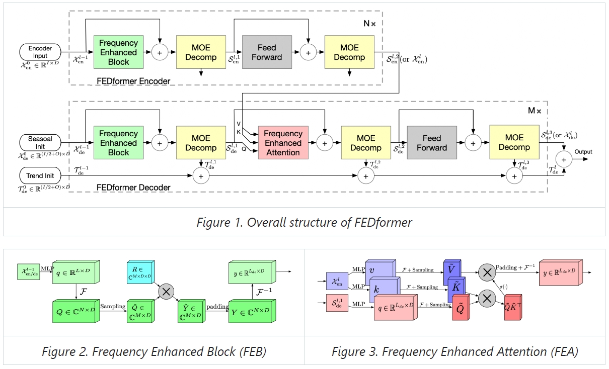
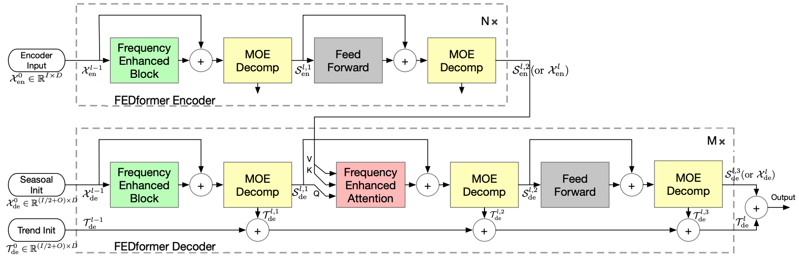

目录

- [论文简介](#论文简介)
- [历史研究和瓶颈](#历史研究和瓶颈)
- [论文贡献](#论文贡献)
- [问题定义](#问题定义)
- [模型定义](#模型定义)
- [实验结果](#实验结果)
- [总结](#总结)
- [资料](#资料)

## 论文简介

> * 论文名称：FEDformer: Frequency Enhanced Decomposed Transformer for Long-term Series Forecasting.
> * 论文地址：[https://proceedings.mlr.press/v162/zhou22g/zhou22g.pdf](https://proceedings.mlr.press/v162/zhou22g/zhou22g.pdf)
> * 模型代码：[https://github.com/MAZiqing/FEDformer](https://github.com/MAZiqing/FEDformer)

## 历史研究和瓶颈

## 论文贡献

## 问题定义

## 模型定义

<!--  -->

## 实验结果

## 总结

## 资料

