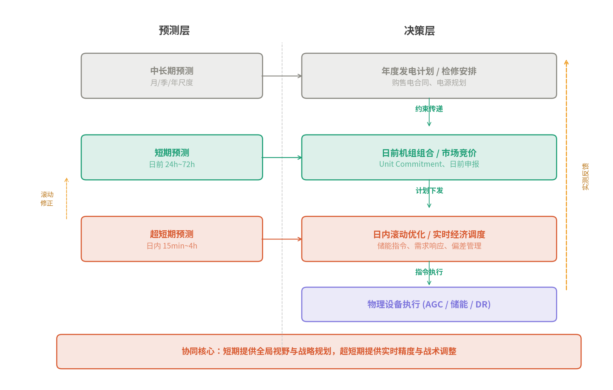
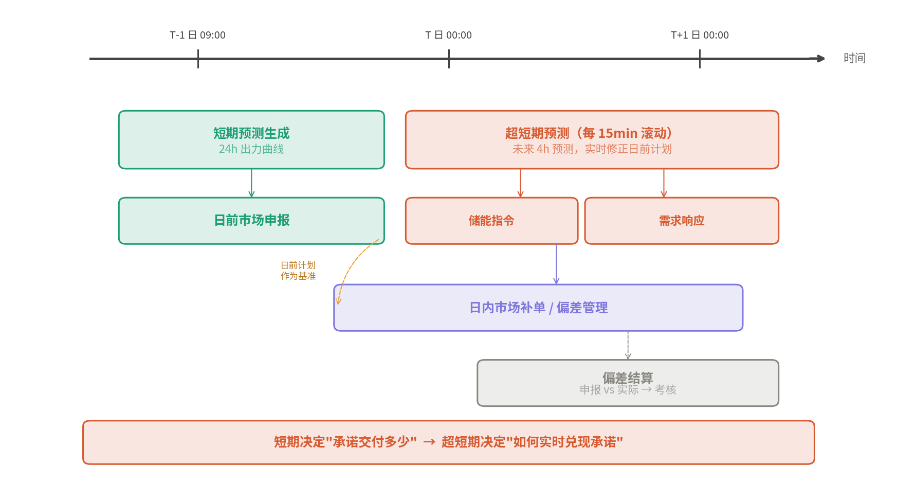
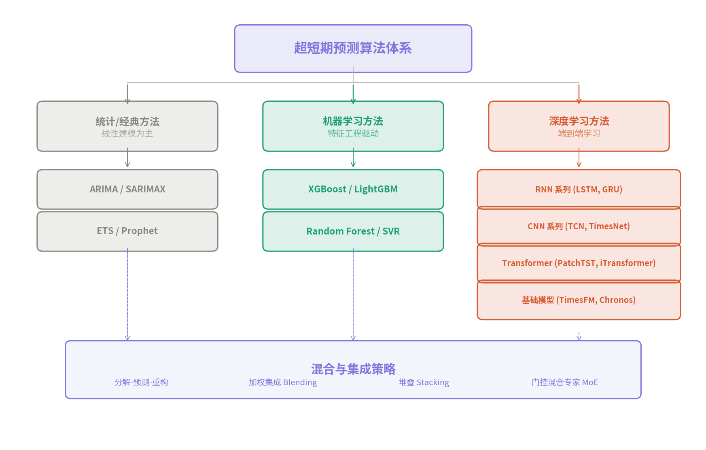
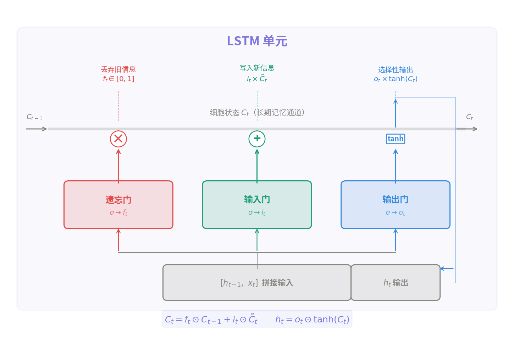
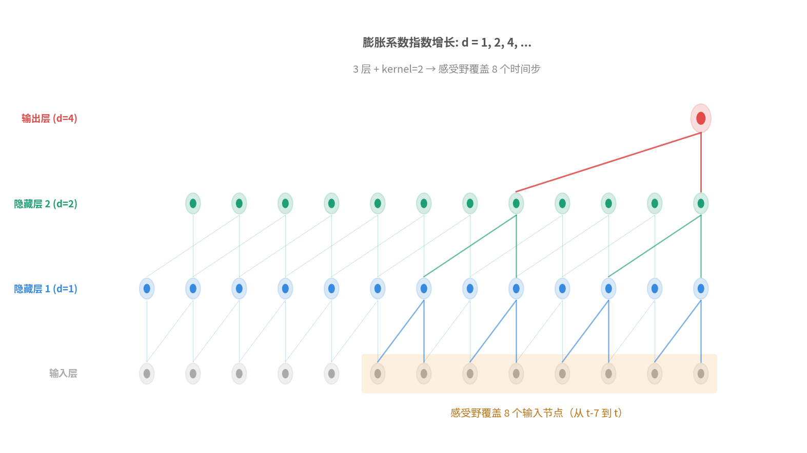
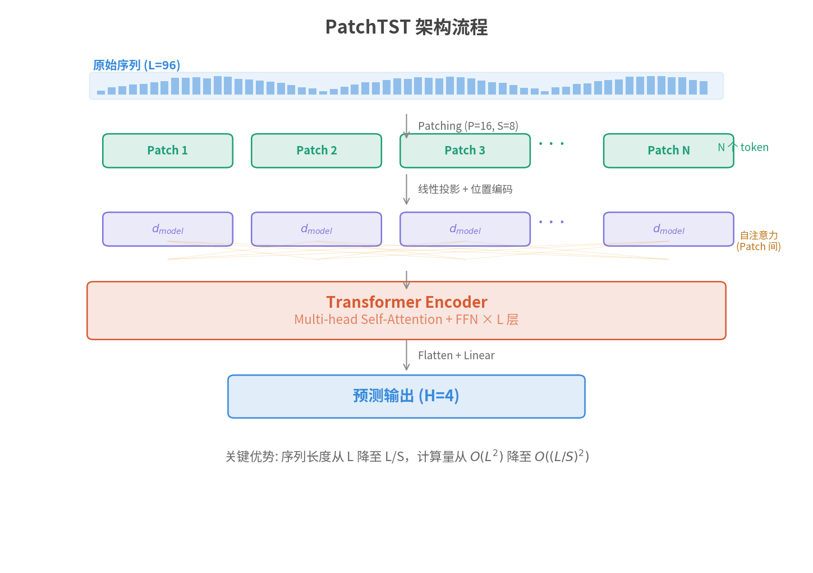

# 时间序列超短期预测技术调研报告

> **作者角色**：电力能源领域算法工程师  
> **业务背景**：虚拟电厂、电力市场交易、电力/电价预测、策略调度优化  
> **编写日期**：2026年5月

---

## 一、概述

### 1.1 什么是超短期预测

在电力系统领域，负荷与新能源出力预测按时间尺度通常划分为四个层级：

- **超短期预测（Ultra-Short-Term Forecasting）**：预测未来数秒至 4 小时（通常以 15 分钟为粒度），用于实时调度、AGC 调频、现货市场出清等场景。
- **短期预测（Short-Term Forecasting）**：预测未来 1～7 天，用于日前发电计划编排、日前市场竞价。
- **中期预测（Medium-Term Forecasting）**：预测未来数周至数月，用于检修计划、燃料采购。
- **长期预测（Long-Term Forecasting）**：预测未来数年，用于电源规划、输电网扩建。

超短期预测的核心目标是在极短的时间窗口内捕捉负荷或价格的快速变化趋势，对模型的实时性和精度要求最高。在虚拟电厂调度、现货市场 15 分钟出清价预测等业务中，超短期预测的准确性直接影响收益与安全约束。

### 1.2 超短期预测在电力领域的典型应用

| 应用场景 | 预测对象 | 典型粒度 | 预测步长 |
|---------|---------|---------|---------|
| 虚拟电厂实时调度 | 聚合负荷、分布式光伏出力 | 5min / 15min | 1～16步 |
| 电力现货市场 | 节点边际电价（LMP）、出清价 | 15min / 1h | 1～4步 |
| AGC/一次调频 | 系统频率、区域控制偏差 | 秒级～分钟级 | 1～10步 |
| 新能源功率预测 | 风电/光伏出力 | 15min | 1～16步 |
| 需求响应 | 用户可调负荷 | 15min | 1～4步 |

### 1.3 超短期预测的核心挑战

1. **强非平稳性**：电力负荷受温度、节假日、突发事件影响，分布随时间漂移。
2. **多尺度周期嵌套**：日周期（24h）、周周期（7d）、年周期叠加，且节假日会打断周期规律。
3. **实时性约束**：超短期模型需要在秒级完成推理，推理延迟直接影响调度质量。
4. **外生变量耦合**：气温、湿度、风速、电价信号等外生变量与预测目标高度耦合。
5. **异常与缺失**：传感器故障、通信中断导致的异常值和缺失值在工业数据中普遍存在。

---

## 二、超短期预测与其他尺度预测的对比分析

### 2.1 各时间尺度预测的核心差异

超短期预测并非短期预测的简单"缩短版"，二者在业务目标、数据特征、建模思路上存在本质差异。下表从多个维度做系统对比：

| 维度 | 超短期预测 | 短期预测 | 中长期预测 |
|------|-----------|---------|-----------|
| **时间跨度** | 未来 15min～4h | 未来 1～7 天 | 未来数周～数年 |
| **时间粒度** | 1min / 5min / 15min | 15min / 1h | 1h / 日 / 月 |
| **报送频率** | 每 15 分钟滚动报送 | 每日早 9 点前报送 | 每月/每季度更新 |
| **核心驱动力** | 惯性延续 + 近期趋势 | 天气预报 + 日历模式 | 气候统计 + 经济增长 + 政策 |
| **主要业务用途** | 实时调度、AGC 调频、现货出清 | 日前机组组合、日前市场竞价 | 检修计划、电源规划、输电投资 |
| **精度考核标准** | 极高（MAPE 通常 < 3%） | 高（MAPE 通常 < 5%） | 相对宽松（趋势准确即可） |
| **对实时性的要求** | 秒级推理，延迟敏感 | 分钟级，可离线批处理 | 无实时要求 |

### 2.2 为什么需要单独做超短期预测

一个常见的疑问是：既然已经有了短期预测（比如日前 24 小时预测），为什么还需要超短期预测？原因在于以下几点：

**（1）预测精度随步长衰减，远步预测无法替代近步预测**

短期预测在 T+0 时刻预测未来 24 小时的负荷或出力，到了 T+20h 时预测误差已经显著累积。而超短期预测在 T+20h 时刻会利用最新的实测数据重新预测未来 4 小时，本质上是用"更新鲜的信息"对远期预测进行实时修正。这种**滚动刷新**机制使得超短期预测在任意时刻的近步精度都远高于日前预测中对应时段的精度。

**（2）电力系统实时平衡的物理约束**

电力系统要求发用电实时平衡——发电量与用电量在任意时刻必须相等，否则系统频率偏移，严重时导致大面积停电。超短期预测直接服务于自动发电控制（AGC）和实时经济调度，负责在分钟级别指导机组出力调整、储能充放电切换、需求响应激活等操作。这些操作要求的反应速度远超日前计划所能覆盖的精度范围。

**（3）电力现货市场的结算粒度要求**

在日内现货市场和实时平衡市场中，出清周期通常为 15 分钟或 5 分钟。如果虚拟电厂在某个 15 分钟时段的实际出力与申报偏差过大，将面临偏差考核罚款。超短期预测为日内滚动竞价和实时偏差管理提供高频、高精度的预测基础。

**（4）新能源出力的快速波动性**

光伏受云层遮挡影响，出力可在几分钟内骤降 50% 以上；风电受阵风影响也存在分钟级的剧烈波动。日前预测无法捕捉这些快速变化，只有超短期预测通过实时气象数据和最新功率测量才能及时跟踪。

### 2.3 建模工程上的核心差异

虽然不同时间尺度的预测都是"用历史数据预测未来"，但在实际建模工程中，差异非常显著：

**（1）输入特征体系不同**

| 特征类别 | 超短期预测 | 短期预测 | 中长期预测 |
|---------|-----------|---------|-----------|
| 核心输入 | 最近数小时的实测值（SCADA/AMI 实时数据） | NWP 天气预报（温度、辐照、风速） | 气候统计值、GDP、人口、产业结构 |
| 时间编码 | hour-of-day, minute-of-hour | hour-of-day, day-of-week, is_holiday | month-of-year, 季节 |
| 滞后特征 | lag_1 到 lag_96（近1天） | lag_96 到 lag_672（近1天到1周） | 去年同期、近3年均值 |
| 外生变量 | 实时气象观测值 | 24h/72h 数值天气预报 | 气候模式输出、政策变量 |

超短期预测最关键的输入是**最近几个时刻的实测功率值**——模型在很大程度上是对当前状态的惯性外推加修正。而短期预测的核心输入是**数值天气预报（NWP）**，因为 24 小时后的负荷/出力已经不能从当前实测值外推，必须依赖天气预报提供的温度、风速等信息。

**（2）模型架构偏好不同**

超短期预测偏好能快速捕捉局部模式和短期动量的模型——LSTM/GRU 的短期记忆、TCN 的局部卷积、轻量 Transformer。模型复杂度不宜过高，因为必须满足秒级推理要求。

短期预测则需要建模更长距离的依赖关系（跨天/跨周的周期性），模型可以更大更深（PatchTST、TFT 等），因为日前批处理对推理延迟的容忍度高。

中长期预测往往使用统计回归、计量经济模型、或简单时序模型（如 Prophet），因为数据量少、不确定性大、复杂模型容易过拟合。

**（3）训练与更新策略不同**

| 策略 | 超短期预测 | 短期预测 | 中长期预测 |
|------|-----------|---------|-----------|
| 训练频率 | 高频（每日/每周重训练或增量学习） | 中频（每周/每月重训练） | 低频（每季度/每年） |
| 数据窗口 | 近 1～4 周的高频数据 | 近 1～12 个月数据 | 数年历史数据 |
| 在线/离线 | 在线推理 + 边缘部署 | 离线批处理为主 | 完全离线 |
| 模型大小 | 轻量（< 10M 参数） | 中等（10M～100M） | 不限 |
| 推理延迟 | < 1 秒 | < 1 分钟 | 无要求 |

超短期模型需要频繁更新的核心原因是**概念漂移**——负荷模式会随气温变化、季节转换、用户行为改变而漂移，距离训练集越远性能衰减越快。滚动重训练（如每天用最新 2 周数据重训练）能有效跟踪这种漂移。

**（4）评估方式不同**

超短期预测通常按**每个预测步长**分别评估（T+15min 精度、T+30min 精度、...、T+4h 精度），因为不同步长的难度差异很大。短期预测则通常评估日均精度或峰谷时段精度。此外，超短期预测更关注**尾部误差**（极端天气或突变工况下的最大偏差），因为一次大偏差就可能导致调度事故。

### 2.4 多尺度预测的协同工作机制

在实际电力系统项目中，超短期、短期、中长期预测并非各自独立运行，而是在"多时间尺度调度"框架下协同工作。这种协同体现在以下几个层面：

**（1）层级递进调度架构**

电力系统调度遵循"中长期 → 日前 → 日内 → 实时"的层级递进结构，每一层的预测服务于对应的调度决策：



```
中长期预测（月/年）  →  年度发电计划、检修安排、购售电合同
       ↓ 约束传递
短期预测（日前）     →  日前机组组合（Unit Commitment）、日前市场竞价
       ↓ 计划下发
超短期预测（日内）   →  日内滚动优化、实时经济调度（ED）、AGC 指令
```

上层决策为下层提供**边界约束**（如哪些机组在线、合同电量分解到日），下层在此约束内利用更精确的预测进行优化。超短期预测在最底层，是离实际运行最近的一环。

**（2）滚动修正机制**

实际运行中，各层预测通过**滚动修正（Rolling Correction）** 协同：

日前预测在前一天晚上生成 24 小时的负荷/出力预测曲线和调度计划。进入运行日后，每隔 15 分钟或 1 小时，超短期预测模块会利用最新的实测数据重新预测未来 4 小时，并将预测偏差反馈给日内调度优化器。日内优化器在日前计划的基础上，根据超短期预测的修正量调整机组出力、储能指令、需求响应信号。

这个过程可以用**模型预测控制（MPC）** 的框架来理解：日前计划是初始轨迹，超短期预测提供未来短时窗口内的状态预测，日内优化器在滑动窗口内求解修正量，每步执行后再用新的实测数据更新预测，形成闭环。

**（3）虚拟电厂场景下的典型协同流程**

以虚拟电厂参与电力市场为例，各尺度预测的协同流程如下：



```
T-1 日 09:00 ─── 短期预测 ──→ 日前市场申报（24h 出力曲线）
                                   │
T 日 全天  ─── 超短期预测 ──→ 日内滚动修正（每15min更新）
              （每15min执行）       │
                                   ├─→ 储能充放电指令调整
                                   ├─→ 可调负荷响应指令
                                   └─→ 偏差预警与日内市场补单
                                   │
T+1 日 ──── 偏差结算 ──────→ 日前申报 vs 实际执行 的偏差考核
```

在这个流程中，短期预测决定了"承诺交付多少电"，超短期预测决定了"如何实时调整资源来兑现承诺"。两者缺一不可：没有短期预测，无法参与日前市场；没有超短期预测，日前计划与实际运行的偏差会导致大额罚款。

**（4）为什么要做协同而非只用超短期**

一个自然的想法是：既然超短期预测更准，能不能只用超短期预测来做所有决策？答案是不行，原因是：

第一，**决策提前量不同**。机组启停需要数小时准备（燃气机组 2～4h，燃煤机组 6～12h），这些决策必须基于日前预测提前安排，超短期预测来不及。

第二，**市场规则约束**。日前市场要求提前一天申报出力计划，这在物理上就需要短期预测。超短期预测只能在日内市场做边际调整。

第三，**优化问题的时间耦合**。储能的充放电策略是一个跨时段耦合的优化问题——上午低谷充电是为了下午高峰放电赚取价差。这种跨数小时甚至跨天的策略需要短期预测提供的全局视野，超短期预测的 4 小时窗口太短，容易陷入局部最优。

因此，最优的工程实践是：**短期预测提供全局视野和战略规划，超短期预测提供实时精度和战术调整**，两者通过滚动修正机制紧密协同。

---

## 三、核心概念与原理

### 3.1 时间序列预测的数学形式化

设时间序列 $\{y_1, y_2, \ldots, y_T\}$，超短期预测的目标是利用历史观测窗口（lookback window）$L$ 内的信息，预测未来 $H$ 步：

$$
\hat{y}_{T+1}, \hat{y}_{T+2}, \ldots, \hat{y}_{T+H} = f(y_{T-L+1}, \ldots, y_T; \mathbf{X}_{T-L+1:T}; \theta)
$$

其中 $\mathbf{X}$ 为外生变量矩阵，$\theta$ 为模型参数，$f$ 为预测模型。

在多变量场景中，输入为 $\mathbf{Y} \in \mathbb{R}^{L \times M}$（$M$ 个变量），输出为 $\hat{\mathbf{Y}} \in \mathbb{R}^{H \times M'}$。

### 3.2 多步预测策略

超短期预测通常需要预测多个步长，常见策略包括：

**直接多输出（Direct Multi-Output, DMO）**：模型一次性输出 $H$ 个时刻的预测值。优点是避免误差累积，缺点是输出维度大时训练困难。这是当前深度学习方法的主流选择。

**递归策略（Recursive / Autoregressive）**：模型每次预测下一步，将预测结果作为输入继续预测。优点是模型结构简单，缺点是误差逐步累积，预测步数越多偏差越大。

**直接策略（Direct）**：为每个预测步长训练独立模型。精度可能更高但训练成本倍增，且无法利用各步之间的关联。

**混合策略（DIRMO / DirRec）**：结合以上方法，例如将 $H$ 步分成若干组，每组内用直接多输出，组间用递归。

在电力超短期场景中，直接多输出（DMO）是最常用的策略——预测未来 4 步（1 小时）或 16 步（4 小时）的 15 分钟数据，一次前向推理完成。

### 3.3 时间序列的关键特征

超短期预测需要捕捉的信号类型：

- **趋势（Trend）**：长期上升/下降方向，在超短期尺度上近似线性或局部平稳。
- **季节性（Seasonality）**：以固定周期重复的模式，如日内 24h 周期、周内 7d 周期。
- **自相关（Autocorrelation）**：当前值与历史值的线性相关性，是 AR 类模型的基础。
- **局部模式（Local Patterns）**：短时窗口内的形态特征——尖峰、斜坡、平台，卷积核擅长捕捉。
- **跨变量相关（Cross-variate Correlation）**：多个变量之间的协同变化，如温度上升→空调负荷上升。

### 3.4 评估指标

超短期预测常用的评估指标：

| 指标 | 公式 | 说明 |
|------|------|------|
| MAE | $\frac{1}{n}\sum \lvert y_i - \hat{y}_i \rvert$ | 平均绝对误差，物理单位直观 |
| RMSE | $\sqrt{\frac{1}{n}\sum(y_i - \hat{y}_i)^2}$ | 对大误差更敏感 |
| MAPE | $\frac{100\%}{n}\sum \left\lvert \frac{y_i - \hat{y}_i}{y_i} \right\rvert$ | 百分比误差，负荷接近0时不稳定 |
| R² | $1 - \frac{\sum(y_i-\hat{y}_i)^2}{\sum(y_i-\bar{y})^2}$ | 解释方差比例 |
| 合格率 | $\frac{1}{n}\sum \mathbb{1}(\lvert e_i \rvert < \epsilon)$ | 电网考核常用，如误差<3%即合格 |

---

## 四、常用算法技术

按方法论演进，超短期预测算法可分为三大类：



### 4.1 统计/经典方法

| 方法 | 核心思想 | 适用场景 | 局限性 |
|------|---------|---------|--------|
| ARIMA | 差分使序列平稳 → AR + MA 建模 | 单变量、线性、平稳序列 | 非线性捕捉能力弱 |
| 指数平滑 (ETS) | 对近期观测赋予更高权重 | 趋势+季节分解 | 无法建模复杂交互 |
| TBATS | 三角级数季节 + Box-Cox + ARMA误差 | 多季节性序列 | 计算开销大 |
| Prophet | 加法/乘法分解 + 节假日效应 | 快速基线、带节假日 | 精度通常低于深度学习 |

统计方法在超短期场景的价值主要是作为 **基线（baseline）** 和 **集成中的多样性来源**。

### 4.2 机器学习方法

| 方法 | 核心思想 | 优势 | 注意事项 |
|------|---------|------|---------|
| XGBoost / LightGBM | 梯度提升决策树 | 特征工程灵活、训练快、可解释性好 | 需手工构造时序特征（滞后、滚动统计量） |
| Random Forest | 随机特征子集 + Bagging | 对异常值鲁棒 | 外推能力弱 |
| SVR | 核映射 + ε-不敏感带 | 小样本效果好 | 大规模数据效率低 |
| KNN / GRNN | 基于相似历史模式 | 直觉简单 | 维度灾难 |

机器学习方法在超短期预测中的关键是**特征工程**：将原始时间序列转换为滞后特征（lag features）、滚动统计量（rolling mean/std）、时间编码（hour-of-day, day-of-week）、外生变量等表格化特征，再输入树模型。

**滞后特征构造示例**：对于 15 分钟粒度的负荷预测，常用滞后包括 lag_1（15分钟前）、lag_4（1小时前）、lag_96（1天前）、lag_672（1周前），以及过去 4/12/96 步的滚动均值和标准差。

### 4.3 深度学习方法

深度学习是当前超短期预测的主流方法，下面按架构分类详述。

#### 4.3.1 循环神经网络（RNN）系列

**LSTM（Long Short-Term Memory）** 通过门控机制（遗忘门、输入门、输出门）解决普通 RNN 的梯度消失问题，能记忆数十至数百步的历史信息。

LSTM 单元的核心计算：
- 遗忘门 $f_t = \sigma(W_f \cdot [h_{t-1}, x_t] + b_f)$，决定丢弃多少旧信息
- 输入门 $i_t = \sigma(W_i \cdot [h_{t-1}, x_t] + b_i)$，决定写入多少新信息
- 候选状态 $\tilde{C}_t = \tanh(W_C \cdot [h_{t-1}, x_t] + b_C)$
- 细胞状态更新 $C_t = f_t \odot C_{t-1} + i_t \odot \tilde{C}_t$
- 输出门 $o_t = \sigma(W_o \cdot [h_{t-1}, x_t] + b_o)$
- 隐藏状态 $h_t = o_t \odot \tanh(C_t)$



**GRU（Gated Recurrent Unit）** 是 LSTM 的简化版本，将遗忘门和输入门合并为更新门，参数更少、训练更快，在超短期预测中与 LSTM 精度相当。

**Seq2Seq（Encoder-Decoder）** 结构将编码器的历史序列压缩为上下文向量，解码器从上下文逐步生成预测序列。加入注意力（Attention）机制后，解码器可以在每个时间步动态关注编码器的不同位置，显著提升多步预测精度。

#### 4.3.2 卷积网络系列

**TCN（Temporal Convolutional Network）** 使用因果膨胀卷积（causal dilated convolution）建模时间依赖。其核心设计：

- **因果卷积**：确保时刻 $t$ 的输出只依赖于 $t$ 及其之前的输入，不发生信息泄露。
- **膨胀卷积**：膨胀系数按层指数增长（1, 2, 4, 8, ...），使感受野呈指数扩大，少量层即可覆盖很长历史。
- **残差连接**：每个 TCN block 包含残差分支，缓解深层网络退化。

感受野大小 = $1 + 2 \times (k-1) \times \sum_{i=0}^{n-1} d_i$，其中 $k$ 为核大小，$d_i$ 为第 $i$ 层膨胀系数。



TCN 的优势在于：并行计算（无 RNN 的序列依赖）、灵活控制感受野、梯度稳定。

**TimesNet** 利用 FFT 检测时间序列中的主要周期，将 1D 序列按周期长度 reshape 为 2D 张量，然后用 2D 卷积（Inception block）同时捕捉 **周期内变化（intra-period variation）** 和 **周期间变化（inter-period variation）**。

#### 4.3.3 Transformer 系列

**Vanilla Transformer** 通过自注意力机制（Self-Attention）计算序列中任意两个位置之间的关系权重，具有强大的全局依赖建模能力。但原始 Transformer 存在两个问题：二次计算复杂度 $O(L^2)$ 和逐点注意力可能导致时序语义丢失。

**PatchTST** 的核心改进：
- **分片（Patching）**：将长度为 $L$ 的序列分割为若干长度为 $P$ 的片段（patch），每个 patch 作为一个 token 输入 Transformer。这大幅缩短了序列长度（从 $L$ 降到 $L/P$），降低了计算量，同时每个 token 包含了局部语义信息（类似 NLP 中的子词）。
- **通道独立（Channel Independence）**：每个变量独立通过共享的 Transformer 主干，避免多变量之间的噪声干扰。



**iTransformer** 的创新在于"倒置"注意力维度：
- 传统 Transformer 在时间维度上做注意力（不同时间步之间）。
- iTransformer 在变量维度上做注意力——每个变量的完整时间序列被整体嵌入为一个 token，注意力机制捕捉的是不同变量之间的相关性。
- 时间维度的特征提取由前馈网络（FFN）完成。

**Informer** 通过 ProbSparse 注意力将复杂度从 $O(L^2)$ 降至 $O(L \log L)$，适合长序列输入。

#### 4.3.4 基础模型（Foundation Models）

近两年涌现的时序基础模型（Time Series Foundation Models）尝试像 LLM 一样实现零样本/少样本预测：

- **TimesFM**（Google, ICML 2024）：200M 参数的 decoder-only 模型，在 1000 亿真实时间点上预训练，零样本性能接近有监督 SOTA。
- **Chronos**（Amazon）：将时间序列量化为 token，用 T5 架构进行概率预测。
- **MOIRAI**：多任务多分辨率基础模型。

基础模型的价值在于无需针对每个数据集单独训练，但在电力行业特定场景下，精调（fine-tune）后的领域模型通常仍有优势。

### 4.4 混合与集成方法

在实际工程中，单一模型往往难以兼顾所有场景，常见的混合策略包括：

- **分解-预测-重构**：先用 STL/EMD 将序列分解为趋势、季节、残差，对各分量分别建模（如趋势用线性、残差用 LSTM），最后加和重构。
- **加权集成（Blending）**：多个模型预测结果按验证集表现加权平均。
- **堆叠（Stacking）**：将多个模型的预测作为元特征，训练第二层模型（如 Ridge 回归）进行最终预测。
- **门控混合专家（Mixture of Experts）**：门控网络根据输入动态选择或加权多个子模型。

---

## 五、常用 Python 工具库

### 5.1 数据处理与特征工程

| 库 | 用途 | 安装 |
|----|------|------|
| `pandas` | 时间序列数据读取、对齐、重采样、滚动窗口 | `pip install pandas` |
| `numpy` | 数值计算、数组操作 | `pip install numpy` |
| `scikit-learn` | 标准化/归一化、数据集划分、评估指标 | `pip install scikit-learn` |
| `tsfel` / `tsfresh` | 自动时序特征提取 | `pip install tsfel` |

### 5.2 统计与经典模型

| 库 | 用途 | 安装 |
|----|------|------|
| `statsmodels` | ARIMA, SARIMAX, ETS, STL 分解 | `pip install statsmodels` |
| `prophet` | Facebook Prophet 加法模型 | `pip install prophet` |
| `sktime` | 统一 API 的时序建模框架 | `pip install sktime` |

### 5.3 机器学习模型

| 库 | 用途 | 安装 |
|----|------|------|
| `xgboost` | XGBoost 梯度提升树 | `pip install xgboost` |
| `lightgbm` | LightGBM，大规模数据更快 | `pip install lightgbm` |
| `catboost` | 支持类别特征的提升树 | `pip install catboost` |

### 5.4 深度学习框架

| 库 | 用途 | 安装 |
|----|------|------|
| `pytorch` | 自定义深度学习模型（LSTM、TCN、Transformer） | `pip install torch` |
| `tensorflow` / `keras` | 快速搭建序列模型 | `pip install tensorflow` |
| `pytorch-lightning` | 简化 PyTorch 训练流程 | `pip install lightning` |

### 5.5 时序专用深度学习库

| 库 | 用途 | 安装 |
|----|------|------|
| `darts` | 统一接口封装 ARIMA/Prophet/LSTM/TCN/TFT 等 | `pip install darts` |
| `neuralforecast` | Nixtla 出品，封装 N-HiTS/PatchTST/iTransformer 等 SOTA 模型 | `pip install neuralforecast` |
| `tsai` | 基于 fastai 的时序深度学习工具包 | `pip install tsai` |
| `pytorch-forecasting` | 封装 TFT、DeepAR、N-Beats 等 | `pip install pytorch-forecasting` |
| `gluonts` | Amazon 出品，概率预测框架 | `pip install gluonts` |
| `timesfm` | Google TimesFM 基础模型 | `pip install timesfm` |

### 5.6 可视化与实验管理

| 库 | 用途 |
|----|------|
| `matplotlib` / `seaborn` | 预测结果可视化 |
| `plotly` | 交互式图表 |
| `wandb` / `mlflow` | 实验跟踪、超参数管理 |
| `optuna` | 贝叶斯超参数优化 |

---

## 六、算法构建流程

超短期预测的完整工程流程可分为以下阶段：

### 阶段 1：数据获取与探索

```
原始数据 → 数据质量检查 → 缺失值/异常值处理 → 时间对齐与重采样
```

关键操作：检查采集频率是否一致、识别异常值（3σ或IQR规则）、插值填充缺失（线性插值或前向填充）、按固定频率重采样。

### 阶段 2：特征工程

```
时间特征（hour, day_of_week, is_holiday）
+ 滞后特征（lag_1, lag_4, lag_96, lag_672）
+ 滚动统计量（rolling_mean_4, rolling_std_12）
+ 外生变量（温度、风速、电价）
+ 编码处理（周期编码 sin/cos、独热编码）
```

对于深度学习模型，滞后特征通常隐含在滑动窗口中，不需要显式构造；对于树模型，特征工程是核心竞争力。

### 阶段 3：数据集构建

将时间序列转换为监督学习样本：用滑动窗口（sliding window）方式将长序列切分为 (input, target) 对。

```
数据集划分：训练集 → 验证集 → 测试集（按时间顺序划分，禁止随机打乱）
```

注意：时间序列数据**必须按时间顺序划分**，不能随机打乱（防止未来信息泄露）。典型比例为 70/15/15 或 80/10/10。

### 阶段 4：模型训练与调优

```
选择模型架构 → 设置损失函数（MSE/MAE/Huber）
→ 训练（Early Stopping + LR Scheduler）
→ 超参数优化（Optuna/Grid Search）
→ 验证集评估
```

### 阶段 5：评估与部署

```
测试集评估 → 误差分析（按时段/天型/天气拆解）
→ 模型导出（ONNX/TorchScript）
→ 在线推理服务部署
→ 持续监控与模型更新
```

---

## 七、算法构建示例

以下三个示例均使用 PyTorch 实现，数据采用正弦波叠加噪声模拟 15 分钟粒度的电力负荷数据。

### 示例 1：基于 LSTM 的超短期负荷预测

#### 原理说明

LSTM 通过门控机制（遗忘门、输入门、输出门）控制信息在细胞状态中的流动，能有效记忆数十到数百步的历史模式。本示例使用双层 LSTM 作为编码器，输入过去 96 步（1天）的负荷数据，直接输出未来 4 步（1小时）的预测值。

关键设计：
- 使用 `MinMaxScaler` 将数据归一化到 [0, 1]，加速收敛；
- 滑动窗口方式构建 (input, target) 样本对；
- 最后一个时间步的隐藏状态经全连接层映射为多步输出。

```python
"""
示例 1：LSTM 超短期负荷预测
- 输入：过去 96 步（1天）的负荷值
- 输出：未来 4 步（1小时）的预测值
- 粒度：15 分钟
"""

import numpy as np
import torch
import torch.nn as nn
from torch.utils.data import Dataset, DataLoader
from sklearn.preprocessing import MinMaxScaler
import matplotlib.pyplot as plt

# ============ 1. 生成模拟数据 ============
np.random.seed(42)
T = 96 * 30  # 30天的15分钟数据，共2880个点
t = np.arange(T)
# 模拟日周期（96点=1天）+ 周周期 + 随机噪声
load = (
    500                                          # 基础负荷
    + 200 * np.sin(2 * np.pi * t / 96)           # 日内周期
    + 50 * np.sin(2 * np.pi * t / (96 * 7))      # 周周期
    + 30 * np.random.randn(T)                     # 高斯噪声
)

# ============ 2. 数据预处理 ============
scaler = MinMaxScaler()
load_scaled = scaler.fit_transform(load.reshape(-1, 1)).flatten()

LOOKBACK = 96   # 回看窗口：96步 = 1天
HORIZON = 4     # 预测步长：4步 = 1小时

class TimeSeriesDataset(Dataset):
    """滑动窗口数据集"""
    def __init__(self, data, lookback, horizon):
        self.X, self.y = [], []
        for i in range(len(data) - lookback - horizon + 1):
            self.X.append(data[i : i + lookback])
            self.y.append(data[i + lookback : i + lookback + horizon])
        self.X = torch.FloatTensor(np.array(self.X)).unsqueeze(-1)  # (N, L, 1)
        self.y = torch.FloatTensor(np.array(self.y))                # (N, H)

    def __len__(self):
        return len(self.X)

    def __getitem__(self, idx):
        return self.X[idx], self.y[idx]

# 按时间顺序划分：80% 训练，20% 测试
split = int(len(load_scaled) * 0.8)
train_ds = TimeSeriesDataset(load_scaled[:split], LOOKBACK, HORIZON)
test_ds = TimeSeriesDataset(load_scaled[split:], LOOKBACK, HORIZON)
train_loader = DataLoader(train_ds, batch_size=32, shuffle=True)
test_loader = DataLoader(test_ds, batch_size=32, shuffle=False)

# ============ 3. 定义 LSTM 模型 ============
class LSTMForecaster(nn.Module):
    def __init__(self, input_dim=1, hidden_dim=64, num_layers=2, horizon=4):
        super().__init__()
        self.lstm = nn.LSTM(
            input_size=input_dim,
            hidden_size=hidden_dim,
            num_layers=num_layers,
            batch_first=True,
            dropout=0.1
        )
        self.fc = nn.Linear(hidden_dim, horizon)

    def forward(self, x):
        # x: (batch, lookback, input_dim)
        lstm_out, (h_n, c_n) = self.lstm(x)
        # 取最后一个时间步的隐藏状态
        last_hidden = lstm_out[:, -1, :]  # (batch, hidden_dim)
        output = self.fc(last_hidden)     # (batch, horizon)
        return output

# ============ 4. 训练 ============
device = torch.device("cuda" if torch.cuda.is_available() else "cpu")
model = LSTMForecaster(hidden_dim=64, num_layers=2, horizon=HORIZON).to(device)
optimizer = torch.optim.Adam(model.parameters(), lr=1e-3)
criterion = nn.MSELoss()

EPOCHS = 30
for epoch in range(EPOCHS):
    model.train()
    total_loss = 0
    for X_batch, y_batch in train_loader:
        X_batch, y_batch = X_batch.to(device), y_batch.to(device)
        pred = model(X_batch)
        loss = criterion(pred, y_batch)
        optimizer.zero_grad()
        loss.backward()
        optimizer.step()
        total_loss += loss.item()
    if (epoch + 1) % 10 == 0:
        print(f"Epoch {epoch+1}/{EPOCHS}, Loss: {total_loss/len(train_loader):.6f}")

# ============ 5. 评估 ============
model.eval()
preds, actuals = [], []
with torch.no_grad():
    for X_batch, y_batch in test_loader:
        pred = model(X_batch.to(device)).cpu().numpy()
        preds.append(pred)
        actuals.append(y_batch.numpy())

preds = np.concatenate(preds, axis=0)
actuals = np.concatenate(actuals, axis=0)

# 反归一化
preds_inv = scaler.inverse_transform(preds.reshape(-1, 1)).reshape(preds.shape)
actuals_inv = scaler.inverse_transform(actuals.reshape(-1, 1)).reshape(actuals.shape)

mae = np.mean(np.abs(preds_inv - actuals_inv))
print(f"\n测试集 MAE: {mae:.2f} MW")

# 可视化最后100个样本的第1步预测
plt.figure(figsize=(12, 4))
plt.plot(actuals_inv[-100:, 0], label="实际值", alpha=0.8)
plt.plot(preds_inv[-100:, 0], label="LSTM 预测", alpha=0.8)
plt.title("LSTM 超短期负荷预测（15min 后）")
plt.xlabel("样本序号")
plt.ylabel("负荷 (MW)")
plt.legend()
plt.tight_layout()
plt.savefig("lstm_forecast.png", dpi=150)
plt.show()
```

---

### 示例 2：基于 TCN（时间卷积网络）的超短期预测

#### 原理说明

TCN 的核心思想是用因果膨胀卷积代替循环结构来建模时间依赖。"因果"意味着 $t$ 时刻的输出只能看到 $t$ 及之前的输入（防止信息泄露）；"膨胀"意味着每一层的卷积间隔按指数增长（dilation = 1, 2, 4, 8），使得少量层就能覆盖很长的历史窗口。

TCN 相比 LSTM 的优势：
- **并行计算**：卷积操作可以完全并行，训练速度显著快于 LSTM 的逐步递推；
- **稳定梯度**：残差连接 + 卷积结构不存在 RNN 的梯度消失/爆炸问题；
- **灵活感受野**：通过调整层数和膨胀系数精确控制回看范围。

```python
"""
示例 2：TCN（时间卷积网络）超短期预测
- 采用因果膨胀卷积 + 残差连接
- 输入/输出配置与示例 1 相同
"""

import numpy as np
import torch
import torch.nn as nn
from torch.utils.data import Dataset, DataLoader
from sklearn.preprocessing import MinMaxScaler

# ============ 1. 数据准备（复用示例 1 的数据生成逻辑） ============
np.random.seed(42)
T = 96 * 30
t = np.arange(T)
load = 500 + 200 * np.sin(2*np.pi*t/96) + 50*np.sin(2*np.pi*t/(96*7)) + 30*np.random.randn(T)

scaler = MinMaxScaler()
load_scaled = scaler.fit_transform(load.reshape(-1, 1)).flatten()
LOOKBACK, HORIZON = 96, 4

class TimeSeriesDataset(Dataset):
    def __init__(self, data, lookback, horizon):
        self.X, self.y = [], []
        for i in range(len(data) - lookback - horizon + 1):
            self.X.append(data[i : i + lookback])
            self.y.append(data[i + lookback : i + lookback + horizon])
        self.X = torch.FloatTensor(np.array(self.X)).unsqueeze(1)  # (N, 1, L) — Conv1d格式
        self.y = torch.FloatTensor(np.array(self.y))
    def __len__(self): return len(self.X)
    def __getitem__(self, idx): return self.X[idx], self.y[idx]

split = int(len(load_scaled) * 0.8)
train_loader = DataLoader(TimeSeriesDataset(load_scaled[:split], LOOKBACK, HORIZON),
                          batch_size=32, shuffle=True)
test_loader = DataLoader(TimeSeriesDataset(load_scaled[split:], LOOKBACK, HORIZON),
                         batch_size=32, shuffle=False)

# ============ 2. TCN 模块定义 ============
class CausalConv1d(nn.Module):
    """因果卷积：左侧补零，保证输出不依赖未来信息"""
    def __init__(self, in_ch, out_ch, kernel_size, dilation):
        super().__init__()
        self.padding = (kernel_size - 1) * dilation  # 因果补零量
        self.conv = nn.Conv1d(in_ch, out_ch, kernel_size,
                              dilation=dilation, padding=self.padding)

    def forward(self, x):
        out = self.conv(x)
        # 截掉右侧多余的 padding，保证因果性
        return out[:, :, :x.size(2)]

class TCNBlock(nn.Module):
    """TCN 残差块：两层因果膨胀卷积 + 残差连接"""
    def __init__(self, in_ch, out_ch, kernel_size, dilation, dropout=0.1):
        super().__init__()
        self.conv1 = CausalConv1d(in_ch, out_ch, kernel_size, dilation)
        self.conv2 = CausalConv1d(out_ch, out_ch, kernel_size, dilation)
        self.relu = nn.ReLU()
        self.dropout = nn.Dropout(dropout)
        # 残差分支：通道数不匹配时用 1x1 卷积对齐
        self.downsample = nn.Conv1d(in_ch, out_ch, 1) if in_ch != out_ch else nn.Identity()

    def forward(self, x):
        res = self.downsample(x)
        out = self.dropout(self.relu(self.conv1(x)))
        out = self.dropout(self.relu(self.conv2(out)))
        return self.relu(out + res)  # 残差连接

class TCNForecaster(nn.Module):
    def __init__(self, input_ch=1, hidden_ch=32, kernel_size=3,
                 num_layers=4, horizon=4):
        super().__init__()
        layers = []
        for i in range(num_layers):
            in_c = input_ch if i == 0 else hidden_ch
            dilation = 2 ** i  # 膨胀系数指数增长：1, 2, 4, 8
            layers.append(TCNBlock(in_c, hidden_ch, kernel_size, dilation))
        self.tcn = nn.Sequential(*layers)
        self.fc = nn.Linear(hidden_ch, horizon)

    def forward(self, x):
        # x: (batch, 1, lookback)
        out = self.tcn(x)           # (batch, hidden_ch, lookback)
        out = out[:, :, -1]         # 取最后时间步：(batch, hidden_ch)
        return self.fc(out)         # (batch, horizon)

# ============ 3. 训练 ============
device = torch.device("cuda" if torch.cuda.is_available() else "cpu")
model = TCNForecaster(hidden_ch=32, kernel_size=3, num_layers=4, horizon=HORIZON).to(device)
optimizer = torch.optim.Adam(model.parameters(), lr=1e-3)
criterion = nn.MSELoss()

for epoch in range(30):
    model.train()
    total_loss = 0
    for X_b, y_b in train_loader:
        X_b, y_b = X_b.to(device), y_b.to(device)
        loss = criterion(model(X_b), y_b)
        optimizer.zero_grad()
        loss.backward()
        optimizer.step()
        total_loss += loss.item()
    if (epoch + 1) % 10 == 0:
        print(f"Epoch {epoch+1}/30, Loss: {total_loss/len(train_loader):.6f}")

# ============ 4. 评估 ============
model.eval()
preds, actuals = [], []
with torch.no_grad():
    for X_b, y_b in test_loader:
        preds.append(model(X_b.to(device)).cpu().numpy())
        actuals.append(y_b.numpy())

preds = np.concatenate(preds)
actuals = np.concatenate(actuals)
preds_inv = scaler.inverse_transform(preds.reshape(-1,1)).reshape(preds.shape)
actuals_inv = scaler.inverse_transform(actuals.reshape(-1,1)).reshape(actuals.shape)
mae = np.mean(np.abs(preds_inv - actuals_inv))
print(f"\nTCN 测试集 MAE: {mae:.2f} MW")

# 计算感受野
receptive_field = 1 + 2 * (3 - 1) * sum(2**i for i in range(4))
print(f"TCN 感受野: {receptive_field} 步 = {receptive_field * 15} 分钟")
```

---

### 示例 3：基于 Transformer Encoder 的超短期预测

#### 原理说明

本示例实现一个轻量化的 Transformer Encoder 模型，采用了 PatchTST 的核心思想——**分片（Patching）**。

Patching 的直觉：时间序列中单个时间点（如一个 15 分钟的负荷值）缺乏独立语义，类似于 NLP 中的单个字符。PatchTST 将连续多个时间点打包为一个 patch（类似于 NLP 中的子词 token），每个 patch 携带了一段时间内的局部模式信息（上升/下降/峰值等），再用 Transformer 建模 patch 之间的全局依赖。

关键设计：
- 将长度为 96 的输入序列按 patch_size=16、stride=8 分成多个重叠片段；
- 每个 patch 经线性投影 + 位置编码后输入 Transformer Encoder；
- Encoder 输出展平后经全连接层映射为预测值；
- 使用可学习的位置编码（Learnable Positional Encoding）。

```python
"""
示例 3：Patch-Transformer 超短期预测
- 借鉴 PatchTST 的分片思想
- 使用 PyTorch 内置 TransformerEncoder
"""

import numpy as np
import torch
import torch.nn as nn
from torch.utils.data import Dataset, DataLoader
from sklearn.preprocessing import MinMaxScaler
import math

# ============ 1. 数据准备 ============
np.random.seed(42)
T = 96 * 30
t = np.arange(T)
load = 500 + 200*np.sin(2*np.pi*t/96) + 50*np.sin(2*np.pi*t/(96*7)) + 30*np.random.randn(T)

scaler = MinMaxScaler()
load_scaled = scaler.fit_transform(load.reshape(-1, 1)).flatten()
LOOKBACK, HORIZON = 96, 4

class TimeSeriesDataset(Dataset):
    def __init__(self, data, lookback, horizon):
        self.X, self.y = [], []
        for i in range(len(data) - lookback - horizon + 1):
            self.X.append(data[i : i + lookback])
            self.y.append(data[i + lookback : i + lookback + horizon])
        self.X = torch.FloatTensor(np.array(self.X))
        self.y = torch.FloatTensor(np.array(self.y))
    def __len__(self): return len(self.X)
    def __getitem__(self, idx): return self.X[idx], self.y[idx]

split = int(len(load_scaled) * 0.8)
train_loader = DataLoader(TimeSeriesDataset(load_scaled[:split], LOOKBACK, HORIZON),
                          batch_size=32, shuffle=True)
test_loader = DataLoader(TimeSeriesDataset(load_scaled[split:], LOOKBACK, HORIZON),
                         batch_size=32, shuffle=False)

# ============ 2. Patch-Transformer 模型 ============
class PatchTransformerForecaster(nn.Module):
    def __init__(self, lookback=96, horizon=4, patch_size=16, stride=8,
                 d_model=64, nhead=4, num_layers=2, dim_ff=128, dropout=0.1):
        super().__init__()
        self.patch_size = patch_size
        self.stride = stride

        # 计算 patch 数量
        self.num_patches = (lookback - patch_size) // stride + 1

        # Patch 嵌入：将每个 patch 线性投影到 d_model 维
        self.patch_embed = nn.Linear(patch_size, d_model)

        # 可学习的位置编码
        self.pos_embed = nn.Parameter(torch.randn(1, self.num_patches, d_model) * 0.02)

        # Transformer Encoder
        encoder_layer = nn.TransformerEncoderLayer(
            d_model=d_model,
            nhead=nhead,
            dim_feedforward=dim_ff,
            dropout=dropout,
            batch_first=True,
            activation='gelu'
        )
        self.encoder = nn.TransformerEncoder(encoder_layer, num_layers=num_layers)

        # 输出头：将所有 patch 的输出拼接后映射到预测值
        self.head = nn.Sequential(
            nn.Flatten(),
            nn.Linear(self.num_patches * d_model, 128),
            nn.GELU(),
            nn.Dropout(dropout),
            nn.Linear(128, horizon)
        )

    def forward(self, x):
        # x: (batch, lookback)
        batch_size = x.size(0)

        # ---- Patching ----
        # 用 unfold 从序列中提取重叠片段
        # (batch, lookback) -> (batch, num_patches, patch_size)
        patches = x.unfold(dimension=1, size=self.patch_size, step=self.stride)

        # ---- Patch Embedding + Positional Encoding ----
        patch_emb = self.patch_embed(patches) + self.pos_embed  # (batch, num_patches, d_model)

        # ---- Transformer Encoder ----
        enc_out = self.encoder(patch_emb)  # (batch, num_patches, d_model)

        # ---- Prediction Head ----
        output = self.head(enc_out)  # (batch, horizon)
        return output

# ============ 3. 训练 ============
device = torch.device("cuda" if torch.cuda.is_available() else "cpu")
model = PatchTransformerForecaster(
    lookback=LOOKBACK, horizon=HORIZON,
    patch_size=16, stride=8,
    d_model=64, nhead=4, num_layers=2
).to(device)

optimizer = torch.optim.AdamW(model.parameters(), lr=1e-3, weight_decay=1e-4)
scheduler = torch.optim.lr_scheduler.CosineAnnealingLR(optimizer, T_max=30)
criterion = nn.MSELoss()

print(f"模型参数量: {sum(p.numel() for p in model.parameters()):,}")
print(f"Patch 数量: {model.num_patches}, Patch 大小: {model.patch_size}, 步长: {model.stride}")

for epoch in range(30):
    model.train()
    total_loss = 0
    for X_b, y_b in train_loader:
        X_b, y_b = X_b.to(device), y_b.to(device)
        loss = criterion(model(X_b), y_b)
        optimizer.zero_grad()
        loss.backward()
        nn.utils.clip_grad_norm_(model.parameters(), max_norm=1.0)
        optimizer.step()
        total_loss += loss.item()
    scheduler.step()
    if (epoch + 1) % 10 == 0:
        print(f"Epoch {epoch+1}/30, Loss: {total_loss/len(train_loader):.6f}")

# ============ 4. 评估 ============
model.eval()
preds, actuals = [], []
with torch.no_grad():
    for X_b, y_b in test_loader:
        preds.append(model(X_b.to(device)).cpu().numpy())
        actuals.append(y_b.numpy())

preds = np.concatenate(preds)
actuals = np.concatenate(actuals)
preds_inv = scaler.inverse_transform(preds.reshape(-1,1)).reshape(preds.shape)
actuals_inv = scaler.inverse_transform(actuals.reshape(-1,1)).reshape(actuals.shape)
mae = np.mean(np.abs(preds_inv - actuals_inv))
print(f"\nPatch-Transformer 测试集 MAE: {mae:.2f} MW")

# 对比三个模型的架构特点
print("""
╔════════════════════════════════════════════════════════════════════╗
║              三种模型架构对比                                       ║
╠══════════════╦══════════════╦══════════════╦═══════════════════════╣
║   特性        ║   LSTM       ║   TCN        ║  Patch-Transformer   ║
╠══════════════╬══════════════╬══════════════╬═══════════════════════╣
║ 时间建模      ║ 逐步递推      ║ 因果膨胀卷积  ║  Patch间自注意力      ║
║ 并行度        ║ 低(串行)      ║ 高(全并行)    ║  高(全并行)           ║
║ 感受野        ║ 理论无限      ║ 可控有限      ║  全局(自注意力)       ║
║ 长程依赖      ║ 受梯度限制    ║ 受层数限制     ║  原生支持            ║
║ 参数效率      ║ 中等          ║ 较高          ║  取决于d_model       ║
║ 推理速度      ║ 慢            ║ 快            ║  中等                ║
╚══════════════╩══════════════╩══════════════╩═══════════════════════╝
""")
```

---

## 八、工程实践建议

### 8.1 模型选型策略

- **数据量 < 1000 条**：优先考虑 LightGBM + 特征工程，或统计方法（ARIMA/ETS）作为基线。
- **数据量 1000～10000 条**：LSTM / GRU / TCN 均可胜任，TCN 训练更快。
- **数据量 > 10000 条**：Transformer 系列（PatchTST、iTransformer）通常能提供更好的精度。
- **零样本/冷启动场景**：可尝试 TimesFM 等基础模型进行零样本预测，再逐步微调。

### 8.2 超短期预测的特殊注意事项

- **数据频率对齐**：确保所有输入变量（负荷、温度、电价）的时间戳严格对齐，注意时区问题。
- **在线更新**：超短期场景建议采用滚动训练（rolling retrain）或增量学习，定期用最新数据更新模型。
- **异常处理**：对输入数据做实时异常检测（如基于滑动窗口的 Z-score），异常值用插值替代后再输入模型。
- **概率预测**：除了点预测外，考虑输出预测区间（如分位数回归、MC Dropout），为调度决策提供不确定性信息。
- **多任务学习**：在虚拟电厂场景中，可同时预测多个聚合点的负荷，利用共享底层特征提高效率。

### 8.3 推荐技术栈

```
数据流水线: Pandas + NumPy
特征工程:   scikit-learn + 自定义特征函数
模型训练:   PyTorch + PyTorch Lightning
超参调优:   Optuna
实验管理:   Weights & Biases (wandb)
模型部署:   ONNX Runtime / TorchScript + FastAPI
监控告警:   Prometheus + Grafana
```

---

## 九、参考资源

- PatchTST: "A Time Series is Worth 64 Words", ICLR 2023
- iTransformer: "Inverted Transformers Are Effective for Time Series Forecasting", ICLR 2024
- TimesNet: "TEMPORAL 2D-VARIATION MODELING FOR GENERAL TIME SERIES ANALYSIS", ICLR 2023
- TimesFM: "A decoder-only foundation model for time-series forecasting", ICML 2024
- TCN: "An Empirical Evaluation of Generic Convolutional and Recurrent Networks for Sequence Modeling", 2018
- NeuralForecast: https://github.com/Nixtla/neuralforecast
- Darts: https://github.com/unit8co/darts

---

*本文档为技术调研用途，示例代码使用模拟数据，实际应用需根据具体业务数据进行调整与优化。*
